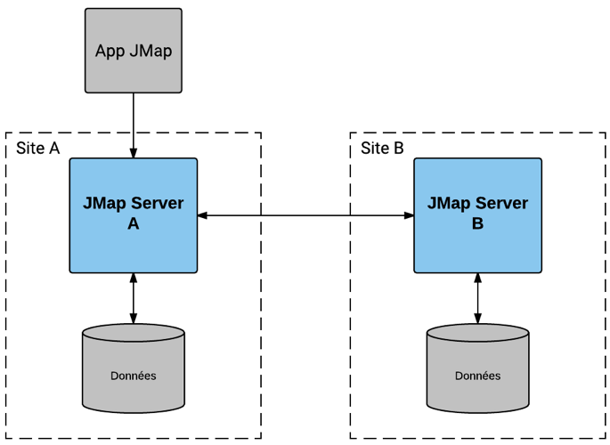
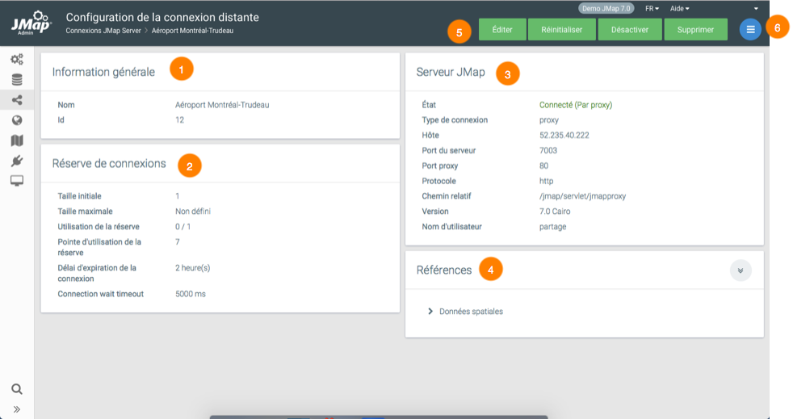

# Connexions JMap Server à JMap Server

Il est possible d'établir des connexions d'un JMap Server vers un autre JMap Server. Ces connexions peuvent ensuite être utilisées pour partager des couches et des sources de données spatiales entre différents JMap Server, tout en évitant la duplication des données originales. Elles peuvent aussi être utilisées par certaines extensions de JMap Server qui requièrent une communication de serveur à serveur. Les connexions entre instances JMap Server sont notamment utilisées lors de la création de sources de données de types [JMap Server vectorielles](04 SDS.md) ou [JMap Server matricielles](04 SDS.md), et lors de l'utilisation de couches partagées.

JMap Server gère les connexions vers d'autres JMap Server en les plaçant dans des réserves. 

Notez que votre licence d'utilisation de JMap doit permettre les sessions serveur pour qu'un autre JMap Server puisse se connecter à votre JMap Server. Pour plus d'information, reportez‑vous à la section [État de JMap Server](11 Gestion de JMap Server.md).

Le diagramme suivant représente la connexion entre 2 JMap Server (A et B) où l'application JMap, connectée au serveur A, accède à des données spatiales servies par une autre instance de JMap Server (serveur B).

## Création de connexions vers JMap Server

Pour amorcer la création d'une nouvelle connexion, appuyez sur le bouton **Créer** dans la page listant les connexions et suivez les étapes requises.

| **Identification** |                                                              |
| ------------------ | ------------------------------------------------------------ |
| Nom                | Entrez un nom pour la nouvelle connexion. Le nom choisi doit être unique. |

| **Configuration** |                                                              |
| ----------------- | ------------------------------------------------------------ |
| Type de connexion | Sélectionnez la méthode de connexion à utiliser pour se connecter au serveur distant, directe ou par proxy. Le choix peut dépendre de la configuration du réseau du côté du serveur distant. Les connexions par proxy utilisent le protocole HTTP et passent donc plus facilement à travers les pare‑feux.Selon le type de connexion sélectionné, les paramètres à saisir sont différents. |
| Hôte              | Entrez le nom ou l'adresse IP du serveur distant avec lequel vous souhaitez établir la connexion. |
| Port du serveur   | (Connexion directe) Dans le cas où le type de connexion est directe, entrez le port utilisé pour établir la connexion à JMap Server. |
| Protocole         | (Connexion proxy) Dans le cas où le type de connexion est par proxy, sélectionnez le protocole HTTP ou HTTPS (sécurisé) utilisé par la connexion. |
| Chemin relatif    | (Connexion proxy) Dans le cas où le type de connexion est par proxy, entrez le chemin relatif pour atteindre le proxy JMap. |
| Port proxy        | (Connexion proxy) Dans le cas où le type de connexion est par proxy, entrez le port utilisé pour la connexion HTTP ou HTTPS. |
| Nom d'utilisateur | Entrez le nom d'utilisateur pour la connexion vers l'autre JMap Server. Celui-ci doit avoir un compte utilisateur qui correspond. |
| Mot de passe      | Entrez le mot de passe pour la connexion vers l'autre JMap Server. |

| **Paramètres avancés**             |                                                              |
| ---------------------------------- | ------------------------------------------------------------ |
| Nombre de connexions               | Entrez la taille initiale de la réserve de connexions afin de déterminer le nombre de connexions vers l'autre JMap Server qui demeureront ouvertes. |
| Maximum de connexions              | Entrez le nombre maximal de connexions permises pour cette réserve. Le nombre entré doit être égal ou supérieur au nombre initial de connexions. Si la réserve doit s'agrandir, de nouvelles connexions seront automatiquement créées jusqu'à ce que la valeur maximale soit atteinte. La valeur maximale peut être désactivée, afin de permettre d'agrandir la réserve au besoin. |
| Délai d'expiration de la connexion | Le délai d'inactivité est utilisé pour fermer et ouvrir à nouveau les connexions qui demeurent inactives pendant une période prolongée. Ce mécanisme permet d'assurer que le serveur distant ne ferme pas les connexions inactives. Assurez‑vous que cette valeur est inférieure au délai d'attente de connexion de votre serveur. La valeur par défaut de 2 heures convient la plupart du temps. |
| Connection wait timeout            | Le délai d'attente maximal lors de l'ouverture d'une connexion réseau vers le serveur distant. Ce paramètre sert à prévenir les blocages dans l’éventualité où le serveur JMap distant ne répond plus. |

### Réinitialisation des connexions

La réinitialisation d'une réserve de connexions vers JMap Server ferme toutes les connexions ouvertes et en crée de nouvelles. Cette action peut être utile pour forcer le rétablissement de la connexion à un JMap Server.

### Désactivation d'une connexion distante

Vous pouvez désactiver une connexion distante sans supprimer la configuration de la connexion. Le serveur local ne peut plus interroger le serveur distant. La désactivation est utile lorsque le serveur distant ne répond plus et entraîne des délais dans le serveur local.

### Suppression des connexions

La suppression d'une connexion vers JMap Server supprime toute la configuration de cette connexion. 

### États des connexions

Chaque connexion possède un état. Celui‑ci indique la condition de la connexion vers JMap Server. Le tableau suivant décrit les états possibles pour une connexion.

| **États** |                                                              |
| --------- | ------------------------------------------------------------ |
| Connecté  | Les connexions à JMap Server ont été créées avec succès et sont prêtes à être utilisées. |
| Erreur    | Les connexions à JMap Server sont rompues. La connexion ne peut être utilisée tant que l'erreur n'a pas été corrigée et que les connexions n'ont pas été ouvertes de nouveau. La réinitialisation de la connexion corrige parfois ce problème. Vous pouvez obtenir une description de l'erreur en cliquant sur le mot Erreur en rouge. |

### Permissions pour la connexion distante

Cette section comporte deux onglets : **Permissions** et **Propriétaires**. Les propriétaires sont les seuls à pouvoir gérer les permissions d'administration pour la connexion, gérer la liste des propriétaires et la supprimer.

| **Permissions**                   |                                                              |
| --------------------------------- | ------------------------------------------------------------ |
| Administrer la connexion distante | Permet de modifier la connexion et de gérer les permissions des utilisateurs sur la connexion. Ne permet pas de supprimer la connexion ni d'en gérer les permissions d'administration. |
| Accéder à la connexion distante   | Permet de voir les informations détaillées de la connexion et permet d'utiliser la connexion, sans pouvoir la modifier. |

## Configuration des connexions JMap Server à JMap Server

Lorsque vous cliquez sur le nom d'une connexion, l'interface **Configuration de la connexion distante** s'affiche.

|  |                                                              |
| ----- | ------------------------------------------------------------ |
| **1** | Informations générales de la connexion. |
| **2** | Réserve de connexions configurée lors de la création de la connexion. |
| **3** | Informations sur la connexion et sur le serveur distant, configurées lors de la création de la connexion. |
| **4** | Références. Cette section indique les sources de données spatiales qui utilisent cette connexion. Un clic sur leur nom vous amène à leur page de configuration. |
| **5** | Boutons pour éditer, [réinitialiser](#Réinitialisation-des-connexions), [désactiver](#Désactivation d'une connexion distante) ou [supprimer](#Suppression-des-connexions) la connexion. |
| **6** | Le menu permet d'accéder à la section [Permissions](#Permissions-pour-la-connexion-distante) de la connexion distante. |

