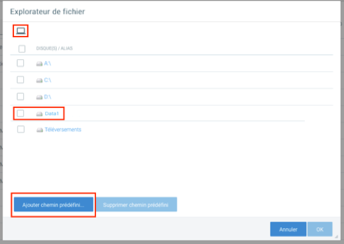
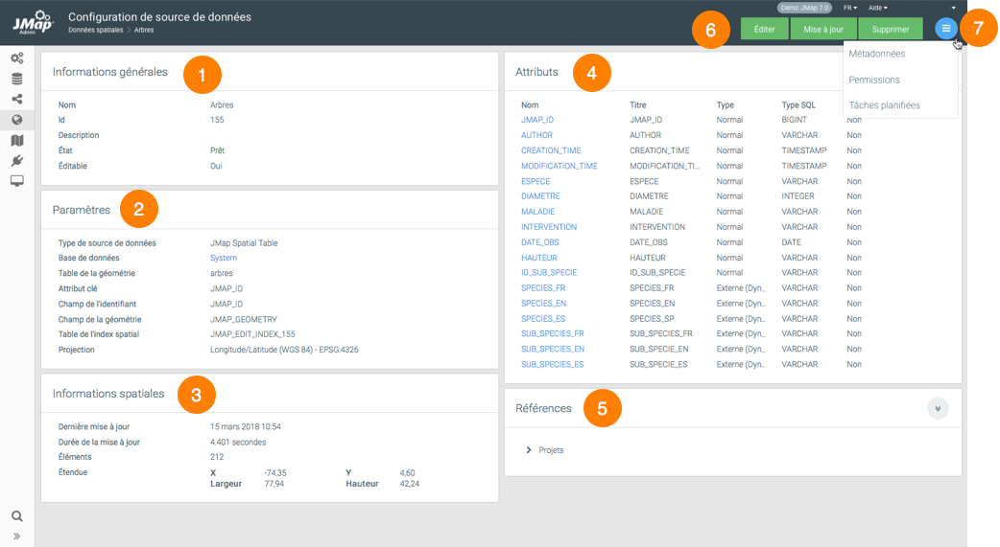
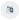
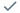

# Sources de données spatiales

Comme l'indique son nom, une source de données spatiales dans JMap correspond à toute source pouvant fournir des données spatiales. Les sources de données spatiales sont séparées en deux familles : les sources de données **vectorielles** et les sources de données **matricielles**. Les sources de données vectorielles fournissent des données vectorielles ainsi que leurs attributs, tandis que les sources de données matricielles fournissent des données matricielles (images). La configuration des sources de données constitue généralement la première étape menant à la publication de données spatiales avec JMap.

Certaines sources de données spatiales fonctionnent avec un lecteur de fichier qui permet de charger des données spatiales à partir de fichiers de divers formats (p. ex. fichiers images TIFF, fichiers MIF, fichiers Shape, etc.). D'autres sources de données accèdent aux données stockées sur des serveurs de données spatiales à distance (p. ex. PostGIS, Oracle Spatial/Locator, ArcSDE, serveurs WMS/WFS, etc.).

Lorsqu'une source de données spatiales est créée, elle doit être mise à jour avant d'être utilisée. La mise à jour d'une source de données spatiales signifie la préparation de celle‑ci pour qu'elle soit utilisée par JMap Server. Concrètement, cette opération comporte différentes tâches, selon le type de source de données en question. De façon générale, pour les sources de données qui accèdent à des données stockées dans des fichiers, le contenu est lu par JMap Server et inséré dans les tables de la base de données System de JMap. Un index spatial est ensuite créé pour permettre un accès rapide et les statistiques des attributs sont calculées. Pour les sources de données qui accèdent aux données stockées sur des serveurs de données spatiales, tels que Oracle Spatial/Locator ou les systèmes WFS, le processus de mise à jour est simplifié, se réduisant au simple calcul des statistiques des attributs. La mise à jour des sources de données de fichiers nécessite plus de temps que la mise à jour des sources de données de serveurs.

Les sources de données spatiales sont présentées dans la section Sources de données spatiales de JMap Admin. La table affichée y présente les informations de base sur chaque source de données. Lorsque vous cliquez sur le nom d'une source de données, une section détaillée s'affiche. Cette section présente des informations utiles sur la source de données spatiales et donne accès à certaines fonctions de gestion de celle-ci.

## Concepts de base

### Sources de données éditables

Certaines sources de données spatiales supportent l'édition des données (écriture) par JMap. C'est le cas de la majorité des sources de données de type SGBD (PostGIS, Oracle Spatial, etc.). Chaque section de ce manuel qui se rapporte à un type de source de données indique si celle-ci supporte la lecture seulement ou la lecture et l'écriture.

Les sources de données de type fichier (SHP, GML, etc.) ne supportent pas l'édition des données. Il existe cependant une option qui permet de transformer une telle source de données en source de données de type **JMap Spatial** qui pourra ensuite permettre l'édition des données spatiales et descriptives dans JMap. Une fois la transformation effectuée, la source de données ne sera plus liée aux fichiers originaux. Toutes les modifications sur les données devront être faites directement avec les outils d'édition de JMap.

### Inclusion de plusieurs fichiers

Il est possible d'inclure plusieurs fichiers à la fois dans la plupart des sources de données qui lisent des fichiers. Cela permet de former des cartes continues. Une pratique courante de CAD consiste à séparer le territoire en tuiles rectangulaires. En lisant tous les fichiers de tuiles ensemble, les administrateurs de JMap peuvent recréer des cartes continues, à la seule condition que les fichiers contiennent la même structure de données (géométrie, couches et types d'attributs).

### Navigation dans le système de fichiers

JMap Admin comporte un navigateur de fichiers qui permet de naviguer dans le système de fichiers du serveur où JMap Server est exécuté afin de sélectionner les fichiers à inclure dans les sources de données. Les unités de stockage local et en réseau peuvent être utilisés, à condition que le processus de JMap Server y ait accès.

Vous avez aussi la possibilité de créer des chemins prédéfinis. Ces chemins constituent des raccourcis qui permettent d'économiser du temps lors de la navigation. Ils peuvent également être utilisés pour écrire des chemins propres à un système d'exploitation, tel que Windows UNC (p. ex. \\myserver\data). Pour créer un chemin prédéfini, vous devez aller à la racine du système de fichier et appuyez sur **Ajouter chemin prédéfini..**.

### Téléversement de fichiers

Accessible à travers l'explorateur de fichiers, le répertoire **Téléversements** contient les fichiers téléversés par tous les utilisateurs directement vers JMap Server à partir de JMap Admin. Si vous désirez téléverser un fichier pour l'utiliser comme source de données spatiales, ouvrez sur ce dossier pour accéder à l'interface de téléversement.

Saisissez un nom pour le fichier et appuyez sur **Téléverser**. Le fichier sera téléversé dans un répertoire créé automatiquement pour votre compte utilisateur. Les fichier est accessible à toutes les comptes utilisateur.

### Mise à jour des sources de données spatiales

Avant qu'une source de données spatiales puisse être utilisée pour créer des couches, il faut qu'elle soit mise à jour. Dans JMap, la mise à jour d'une source de données implique généralement la collecte d'informations au sujet des données spatiales et de leurs attributs et la préparation des données de façon à ce qu'elles soient accessibles rapidement et efficacement. Ce processus peut être très court ou peut prendre plusieurs minutes, selon le type de source et la quantité de données.

Dans JMap Admin, vous pouvez mettre à jour une source de données en appuyant sur **Mise à jour** dans sa section d'information. Vous pouvez aussi mettre à jour plusieurs sources de données simultanément en les sélectionnant dans la section présentant la liste des sources de données et en appuyant sur **Mise à jour**.

### Planification de la mise à jour automatique des sources de données

Vous pouvez planifier la mise à jour automatique des sources de données spatiales. Cette action peut s'avérer utile si vous utilisez des sources de données qui lisent des fichiers de données. Si les fichiers sont fréquemment modifiés, vous pouvez planifier des mises à jour automatiques qui s'exécuteront sur une base régulière (chaque jour à minuit, par exemple) pour ces sources de données. Chaque source de données peut posséder une planification qui lui est propre.

Afin de planifier les mises à jour pour une source de données en particulier, appuyez sur **Tâches planifiées** dans sa section de détails ou depuis la liste des sources de données. Ensuite, vous n'avez qu'à suivre l'assistant afin de définir les moments précis auxquels auront lieu les mises à jour. Les options de planification sont très flexibles.

Une fois les tâches planifiées, vous pouvez visualiser la planification en cours pour une source de données en regardant sa section d'information.

À tout moment, vous pouvez accéder à la liste de toutes les mises à jour planifiées pour les sources de données en cliquant sur **Tâches planifiées** dans la section JMap Server.

### Suppression de sources de données spatiales

Vous pouvez supprimer des sources de données spatiales en appuyant sur **Supprimer** à partir de la section d'information de la source de données. Vous pouvez également supprimer les sources de données en les sélectionnant dans la section listant les sources et en appuyant sur **Supprimer**. Lorsqu'une source de données est supprimée, sa configuration en entier est éliminée de façon définitive. Les données elles-mêmes (le fichier ou la base de données) ne sont pas affectées.

### États des sources de données spatiales

Un état est attribué à chaque source de données spatiales. L'état indique la condition de la source de données, c'est‑à‑dire si elle est prête à être utilisée, si une erreur est survenue, etc. L'état d'une source de données nouvellement créée est toujours **non initialisé** (à moins que vous ayez activé le démarrage de la mise à jour automatique), ce qui signifie que la source de données ne peut pas encore être utilisée. Afin de pouvoir être utilisée, toute source de données doit être mise à jour au moins une fois.

Les sources de données peuvent être mises à jour en lots. Un maximum de trois sources de données peuvent être mises à jour simultanément. Les autres sources de données devant être mises à jour sont placées en attente jusqu'à ce que leur mise à jour puisse être exécutée.

Le tableau suivant décrit les états possibles pour une source de données spatiales :

| **États**           |                                                              |
| ------------------- | ------------------------------------------------------------ |
| Erreur              | Une erreur est survenue. La source de données ne peut pas recevoir de requêtes. Visualisez le message d'erreur afin de connaître la source de l'erreur. |
| Tâche en attente    | La source de données est en attente d'être mise à jour. Un maximum de trois sources de données peuvent être mises à jour simultanément. La source de données peut toujours recevoir les requêtes si elle a été mise à jour au moins une fois auparavant. |
| Mise à jour requise | La configuration de la source de données a été modifiée et doit être mise à jour avant que les changements ne deviennent applicables. La source de données peut toujours recevoir des requêtes. |
| Non initialisé      | La source de données n'est pas prête à recevoir de requêtes. Cet état est généralement attribué à une source de données qui vient d'être créée mais qui n'a pas encore été mise à jour. |
| Prêt                | La source de données est prête à recevoir des requêtes.      |
| Mise à jour         | La source de données est en cours de mise à jour. Selon le type de source de données et la quantité de données, le processus peut être très rapide ou peut prendre un certain temps. La source de données peut toujours recevoir les requêtes si elle a été mise à jour au moins une fois auparavant. |

### Sources de données spatiales Système

Les sources de données spatiales dite Système sont des sources de données créées automatiquement par JMap pour supporter le partage de sources de données et de couches JMap. Normalement, il n'y a aucun besoin de gestion pour ces ressources et elles ne sont pas montrées par défaut dans la liste des sources de données spatiales. Si vous souhaitez les afficher, vous pouvez sélectionner l'option **Afficher les sources de données système** dans les paramètres d'affichage de la liste des sources de données.

## Création de sources de données spatiales

Pour débuter la création d'une nouvelle source de données spatiales, affichez la section **Données spatiales** et appuyez sur **Créer**. Certains paramètres sont communs à toutes les sources de données tandis que d'autres sont propres à chaque type de source de données.

| **Identification** |                                                              |
| ------------------ | ------------------------------------------------------------ |
| Nom                | Entrez un nom pour la nouvelle source de données spatiales. Le nom doit être unique. |
| Type               | Sélectionnez le type de source de données qui correspond au type de données à lire. Tous les types de sources de données pris en charge sont présentés dans la liste. Vous pouvez aussi rechercher dans la liste en écrivant quelques lettres dans le champ de recherche. |
| Description        | (Optionnel) Entrez une description pour la nouvelle source de données spatiales. Cette description n'est visible que par l'administrateur JMap. |

Notez que des types de sources de données personnalisés peuvent aussi être présents. Ces nouveaux types de sources de données sont développés à des fins particulières en utilisant JMap SDK.

Les étapes suivantes de la configuration dépendront du type de source de données que vous avez sélectionné. Pour plus de détails sur la configuration d'un type de source de données spatiales, consultez la section correspondante dans ce manuel.

### Projections        

La projection de la source de données doit être sélectionnée afin de correspondre à la projection des données. Si ce paramètre n'est pas correctement défini, il se peut que les données affichées ne soient pas valides. 

| **Projections**      |                                                              |
| -------------------- | ------------------------------------------------------------ |
| Projection d'origine | La projection ou le système de coordonnées spatiales des données de la source de données. |

## Configuration de sources de données spatiales

L'interface de configuration d'une source de données spatiales (SDS) vous permet d'accéder aux informations sur la source ainsi qu'à des fonctions de configuration de paramètres tels que les métadonnées, les permissions et les attributs.

| |  |
| ----- | ------------------------------------------------------------ |
|  **1** | Informations générales configurées lors de la création de la SDS. |
| **2** | Paramètres de la SDS configurés lors de sa création. L'hyperlien vous permet d'accéder à la BD qui contient les données. |
| **3** | Informations spatiales. L'étendue correspond à l'étendue géographique des éléments contenus dans la SDS. Lorsque celle-ci n'a pas d'éléments les valeurs sont égales à 0. |
| **4** | Attributs. Cette section présente une liste des attributs de la SDS. Cliquez sur le [nom d'un attribut](#Attributs) pour ouvrir la fenêtre de configuration de ses propriétés. |
| **5** | Références. Cette section indique les projets et les couches qui utilisent cette SDS. |
| **6** | Ces boutons permettent d'éditer la configuration de la SDS, de la mettre à jour ou de la supprimer. |
| **7** | Le menu permet d'accéder aux sections [Métadonnées](#Métadonnées), [Permissions](#Permissions des sources de données spatiales) et [Tâches planifiées](#Planification de la mise à jour automatique des sources de données). |

### Attributs

La fenêtre de configuration d'un attribut contient deux onglets : **Métadonnées** et **Échantillon de l'attribut**. Le bouton permet de mettre à jour les statistiques de la SDS.

| **Métadonnées**                                              |                                                              |
| ------------------------------------------------------------ | ------------------------------------------------------------ |
| Type                                                         | Indique le type de données de l'attribut.                    |
| Type SQL                                                     | Indique le type SQL de données de l'attribut.                |
| Indexé                                                       | Cochez cette case pour que l'attribut soit indexé.           |
| Titre                                                        | Vous pouvez modifier le titre de l'attribut. L'icône  vous permet de fournir le titre en plusieurs langues. |
| Modèle de format                                             | Spécifiez un modèle de format pour l'affichage des éléments de la SDS. Le modèle doit suivre les normes Java. Cet article offre des détails sur le sujet : [https://docs.oracle.com/javase/tutorial/i18n/format/decimalFormat.html](https://docs.oracle.com/javase/tutorial/i18n/format/decimalFormat.html). |
| Lors de la sauvegarde, appliquer de manière récursive aux couches associées... | En cochant les cases appropriées vous appliquez le titre et/ou le modèle de format de l'attribut à toutes les couches qui sont associées à la SDS. |

L'onglet **Échantillon de l'attribut** affiche la valeur de l'attribut pour un échantillon d'éléments de la SDS.

## Sources de données vectorielles

Les sources de données vectorielles servent à accéder à des données spatiales vectorielles (points, lignes, polygones, etc.). Consultez les sections suivantes pour de l'information sur les différents types de sources de données vectorielles supportés.

|                                                              |                                                              |                                                              |
| ------------------------------------------------------------ | ------------------------------------------------------------ | ------------------------------------------------------------ |
| [Lecteur de fichier ADF/E00 Arc/Info](#Lecteur de fichier ADF / E00 Arc/Info) | [Lecteur de fichier KML](#Lecteur de fichier KML)            | [JMap Server](#JMap Server)                                  |
| [Lecteur de fichier CSV](#Lecteur de fichier CSV)            | [Lecteur de fichier MID/MIF](#Lecteur de fichier MID/MIF)    | [MySQL Spatial](#MySQL Spatial)                              |
| [Lecteur de fichier DGN V7/V8](#Lecteur de fichier DGN V7 / V8) | [Lecteur de fichier SHP](#Lecteur de fichier SHP)            | [Oracle Spatial/Locator](#Oracle Spatial/Locator)            |
| [Lecteur de Fichier DWG/DXF](#Lecteur de Fichier DWG / DXF)  | [Lecteur de fichier TAB](#Lecteur de fichier TAB)            | [PostGIS](#PostGIS)                                          |
| [Lecteur de fichier EDIGEO](#Lecteur de fichier EDIGEO)      | [Annotations dans une base de données](#Annotations dans une base de données) | [Serveur WFS](#Serveur WFS)                                  |
| [Lecteur de fichier GeoJSON](#Lecteur de fichier GeoJSON)    | [ArcGIS REST](#ArcGIS REST)                                  | [SQL Server Spatial](#SQL Server Spatial)                    |
| [Lecteur de fichier GML](#Lecteur de fichier GML)            | [Coordonnées dans une base de données](#Coordonnées dans une base de données) | [Table JMap Spatial](#Table JMap Spatial)                    |
| [Lecteur de fichier GPX](#Lecteur de fichier GPX)            | [Géodatabase ArcSDE](#Géodatabase ArcSDE (ESRI ArcGIS 10.0 et antérieurs)) | [WKB ou WKT dans une base de données](#WKB ou WKT dans une base de données) |
| [Lecteur de fichier Géodatabase fichier (ESRI)](#Lecteur de fichier Géodatabase fichier (ESRI)) | [Géodatabase d'entreprise (ESRI)](#Géodatabase d'entreprise (ArcGIS 10.1 et postérieures)) | [Géodatabase personnelle (ESRI)](#Géodatabase personnelle (ESRI)) |
| [Lecteur de fichier IFC](#Lecteur de fichier IFC)            |                                                              |                                                              |

### Attributs des sources de données vectorielles

Durant la configuration d'une source de données spatiales vectorielles, vous devez configurer des attributs pour la source de données. Tous les attributs disponibles sont présentés dans une table. Par défaut, tous les attributs sont inclus. Cependant, certains peuvent être exclus. Dans ce cas, JMap Server les ignorera complètement. Il est également possible de spécifier les attributs pour lesquels JMap Server devrait créer un index afin d'optimiser les performances lors de l'exécution de requêtes sur ces attributs (l'absence d'un index n'affecte pas le temps de téléchargement et d'affichage des cartes). Ces index sont utilisés lorsque des requêtes par attributs sont effectuées sur ces champs.

Cette section comporte également des paramètres pour configurer les attributs externes. Consultez la section [Attributs externes](#Attributs externes) pour plus de détails à ce sujet.

| **Attributs** |                                                              |
| ------------- | ------------------------------------------------------------ |
| Attribut clé  | L'attribut clé est un attribut qui est utilisé quand JMap a besoin d'établir des relations entre certaines données et vos données spatiales. Il est important de choisir un attribut dont les valeurs ne changeront jamais. Si vous n'avez pas besoin de ce paramètre, vous pouvez laisser la valeur par défaut. |
| Inclure       | Les attributs inclus sont traités par JMap Server. Ils peuvent être utilisés dans des rapports, pour la production de cartes thématiques, pour l'étiquetage, etc. JMap Server ignore complètement les attributs exclus. Par défaut, tous les attributs disponibles sont inclus. |
| Indexé        | JMap Server peut indexer un attribut afin d'accélérer les requêtes qui utiliseront cet attribut. Si vous prévoyez utiliser un attribut pour effectuer des requêtes par attributs, celui-ci devrait être indexé, surtout si la source de données comporte un grand nombre d'éléments. |

### Lecteur de fichier ADF / E00 Arc/Info

|   |   |
| -------- | ---- |
| Lecture | Oui  |
| Écriture | Non  |

 JMap Server peut lire les fichiers ADF et E00 en tant que source de données spatiales. Ces fichiers sont généralement produits par le logiciel Arc/Info d'ESRI.

| **Paramètres**   |                                                              |
| ---------------- | ------------------------------------------------------------ |
| Fichiers choisis | Sélectionnez un ou plusieurs fichiers ADF ou E00 devant être lus. Si vous sélectionnez plus d'un fichier, ceux-ci doivent tous posséder la même liste d'attributs. |
| Couches          | Sélectionnez une ou plusieurs couches devant être incluses dans la source de données. Les données sur d'autres couches ne seront pas lues. |

###   Lecteur de fichier CSV

|   |   |
| -------- | ---- |
| Lecture | Oui  |
| Écriture | Non  |

 JMap Server peut lire les fichiers CSV ou tout autre fichier texte avec des valeurs séparées qui contiennent des coordonnées x et y. Ces coordonnées peuvent être utilisées pour des couches de points. La première rangée doit contenir les noms des champs. Les séparateurs permis sont la virgule (,), le point-virgule (;) et la tabulation. Les champs de texte peuvent être entourés ou non de guillemets. Les coordonnées X et Y doivent être des valeurs numériques.

| **Paramètres**   |                                                              |
| ---------------- | ------------------------------------------------------------ |
| Fichiers choisis | Sélectionnez un ou plusieurs fichiers CSV devant être lus. Si vous sélectionnez plus d'un fichier, ceux‑ci doivent tous posséder la même liste d'attributs. |
| Séparateur       | Sélectionnez le séparateur utilisé dans les fichiers devant être lus. |
| Type de données  | Sélectionnez le type de données approprié pour chaque champ. |
| Champ X          | Sélectionnez le champ qui contient les valeurs X. Seuls les champs numériques sont listés. |
| Champ Y          | Sélectionnez le champ qui contient les valeurs Y. Seuls les champs numériques sont listés. |

### Lecteur de fichier DGN V7 / V8

|   |   |
| -------- | ---- |
| Lecture | Oui  |
| Écriture | Non  |

 JMap Server peut lire les fichiers DGN V7 et V8 en tant que source de données spatiales. Sélectionnez le type de source de données qui correspond à la version de vos fichiers DGN. En général, les fichiers DGN sont produits par Bentley MicroStation.

Les fichiers DGN sont souvent accompagnés d'une base de données d'attributs. Il peut s'agir d'une base de données MS Access ou de tout autre système de bases de données. Si les fichiers DGN possèdent des attributs stockés dans une base de données séparée, vous devez d'abord configurer une réserve de connexions pour cette base de données avant de procéder. Reportez‑vous à la section [Création de bases de données](02 Bases de données.md) pour plus d'informations sur la configuration des connexions de bases de données.

| **Paramètres**                    |                                                              |
| --------------------------------- | ------------------------------------------------------------ |
| Fichiers choisis                  | Sélectionnez un ou plusieurs fichiers DGN devant être lus. Si vous sélectionnez plus d'un fichier, ceux-ci doivent tous posséder la même liste d'attributs, et les géométries doivent être du même type. |
| Convertir les polygones en lignes | Sélectionnez cette option si vous souhaitez que les polygones soient lus en tant que lignes. |
| Base de données des attributs     | (Optionnel) Sélectionnez la base de données qui contient les attributs. Cette base de données doit déjà être configurée dans JMap Admin. |
| Couches                           | Sélectionnez une ou plusieurs couches devant être incluses dans la source de données. Les données sur les autres couches ne seront pas lues. |

###  Lecteur de Fichier DWG / DXF

|   |   |
| -------- | ---- |
| Lecture | Oui  |
| Écriture | Non  |

 JMap Server peut lire, en tant que source de données spatiales, les fichiers DWG et DXF produits par Autodesk Autocad, versions 12 à 2018. Les blocs‑attributs sont lus et convertis en attributs des éléments.

| **Paramètres**                  |                                                              |
| ------------------------------- | ------------------------------------------------------------ |
| Fichiers choisis                | Sélectionnez un ou plusieurs fichiers DWG ou DXF devant être lus. Si vous sélectionnez plus d'un fichier, ceux‑ci doivent tous posséder la même liste d'attributs, et les géométries doivent être du même type. |
| Source                          | Le fichier Autocad comporte un espace objet et un espace papier. L'espace papier contient des éléments supplémentaires destinés à l'impression. Sélectionnez l'espace à utiliser pour la lecture des données par JMap (typiquement l'espace objet). |
| Options des lignes et polygones | **Pas de conversion** : Aucune conversion ne sera faite. **Convertir les lignes fermées en polygones** : Les objets de type lignes fermées seront lus comme des polygones par JMap. **Convertir les polygones en lignes** : Les objets de type polygones seront lus comme des lignes par JMap. |
| Options des références de blocs | **Pas de conversion** : Aucune conversion ne sera faite. Les différents types d'objets (lignes, polygones, ...) seront traitées séparément par JMap. **Convertir les références de blocs en éléments complexes** : Les différents types d'objets (lignes, polygones, ...) qui composent les blocs seront lus ensemble et traités en éléments complexes par JMap. **Convertir les références de blocs en points** : JMap remplacera les références de blocs par des points. Ceci a pour effet d'alléger considérablement les données lorsque les blocs sont composés d'une multitude d'objets. |
| Couches                         | Sélectionnez une ou plusieurs couches devant être incluses dans la source de données. Les données sur les autres couches ne seront pas lues. |

###  Lecteur de fichier EDIGEO

|   |   |
| -------- | ---- |
| Lecture | Oui  |
| Écriture | Non  |

JMap Server peut lire les fichiers EDIGEO en tant que source de données spatiales.

| **Paramètres**   |                                                              |
| ---------------- | ------------------------------------------------------------ |
| Fichiers choisis | Sélectionnez un ou plusieurs fichiers EDIGEO devant être lus. Si vous sélectionnez plus d'un fichier, ceux-ci doivent tous posséder la même liste d'attributs. |
| Couches          | Sélectionnez une ou plusieurs couches devant être incluses dans la source de données. Les données sur les autres couches ne seront pas lues. |

###  Lecteur de fichier GeoJSON

|   |   |
| -------- | ---- |
| Lecture | Oui  |
| Écriture | Non  |

 JMap Server peut lire les fichiers GeoJSON en tant que source de données spatiales.

| **Paramètres**   |                                                              |
| ---------------- | ------------------------------------------------------------ |
| Fichiers choisis | Sélectionnez un ou plusieurs fichiers GeoJSON devant être lus. Si vous sélectionnez plus d'un fichier, ceux-ci doivent tous posséder la même liste d'attributs. |
| Couches          | Sélectionnez une ou plusieurs couches devant être incluses dans la source de données. Les données sur d'autres couches ne seront pas lues. |

###  Lecteur de fichier GML

|   |   |
| -------- | ---- |
| Lecture | Oui  |
| Écriture | Non  |

 JMap Server peut lire les fichiers GML en tant que source de données spatiales. Les fichiers GML doivent être jumelés aux fichiers de schéma (.XSD). Si un fichier GML contient des occurrences de plus d'un type de données, seul un de ces types peut être choisi en tant que type de base de la source de données. JMap peut lire les fichiers GML des versions 2.x et 3.x.

| **Paramètres**   |                                                              |
| ---------------- | ------------------------------------------------------------ |
| Fichier choisi   | Sélectionnez un fichier GML devant être lu.                  |
| Types de données | Sélectionnez le type de données devant être lu. Les fichiers GML doivent être accompagnés d'un fichier de schéma (XSD). |
| Version GML      | Indiquez la version du fichier GML (2.x ou 3.x).             |

### Lecteur de fichier GPX

|   |   |
| -------- | ---- |
| Lecture | Oui  |
| Écriture | Non  |

 Le format GPX est un format d'échange de données GPS basé sur XML. JMap Server peut lire les fichiers GPX en tant que source de données spatiales.

| **Paramètres**   |                                                              |
| ---------------- | ------------------------------------------------------------ |
| Fichiers choisis | Sélectionnez un ou plusieurs fichiers GPX devant être lus. Si vous sélectionnez plus d'un fichier, ceux-ci doivent tous posséder la même liste d'attributs. |
| Couches          | Sélectionnez une ou plusieurs couches devant être incluses dans la source de données. Les données sur d'autres couches ne seront pas lues. |

### Lecteur de fichier Géodatabase fichier (ESRI)

|   |   |
| -------- | ---- |
| Lecture | Oui  |
| Écriture | Non  |

 JMap Server peut lire les géodatabases fichier de ESRI en tant que source de données spatiales.

| **Paramètres**   |                                                              |
| ---------------- | ------------------------------------------------------------ |
| Fichiers choisis | Sélectionnez le répertoire qui contient la structure de la géodatabase. |
| Couches          | Sélectionnez une ou plusieurs couches devant être incluses dans la source de données. Les données sur d'autres couches ne seront pas lues. |

### Lecteur de fichier IFC

|   |   |
| -------- | ---- |
| Lecture | Oui  |
| Écriture | Non  |

 JMap Server peut lire les fichiers de format IFC (Industry Foundation Classes) en tant que source de données spatiales. L'IFC est le format d'échange standard utilisé communément par les logiciels permettant le travail en BIM (Building Information Modeling).

### Lecteur de fichier KML 

|   |   |
| -------- | ---- |
| Lecture | Oui  |
| Écriture | Non  |

 JMap Server peut lire les fichiers KML en tant que source de données spatiales.

| **Paramètres**   |                                                              |
| ---------------- | ------------------------------------------------------------ |
| Fichiers choisis | Sélectionnez un ou plusieurs fichiers KML devant être lus. Si vous sélectionnez plus d'un fichier, ceux-ci doivent tous posséder la même liste d'attributs. |
| Couches          | Sélectionnez une ou plusieurs couches devant être incluses dans la source de données. Les données sur d'autres couches ne seront pas lues. |

### Lecteur de fichier MID/MIF

|   |   |
| -------- | ---- |
| Lecture | Oui  |
| Écriture | Non  |

 JMap Server peut lire les fichiers MID/MIF en tant que source de données spatiales. Ces fichiers sont généralement produits par les applications MapInfo.

| **Paramètres**   |                                                              |
| ---------------- | ------------------------------------------------------------ |
| Fichiers choisis | Sélectionnez un ou plusieurs fichiers MIF devant être lus. Si vous sélectionnez plus d'un fichier, ceux‑ci doivent tous posséder la même liste d'attributs, et les géométries doivent être du même type. En outre, chaque fichier MIF doit être accompagné d'un fichier MID. |

### Lecteur de fichier SHP

|   |   |
| -------- | ---- |
| Lecture | Oui  |
| Écriture | Non  |

 JMap Server peut lire les fichiers SHP en tant que source de données spatiales. Ceux‑ci sont généralement produits par des applications ESRI.

| **Paramètres**                   |                                                              |
| -------------------------------- | ------------------------------------------------------------ |
| Fichiers choisis                 | Sélectionnez un ou plusieurs fichiers SHP devant être lus. Si vous sélectionnez plus d'un fichier, ceux‑ci doivent tous posséder la même liste d'attributs, et les géométries doivent être du même type. En outre, chaque fichier SHP doit être accompagné d'un fichier DBF et d'un fichier SHX. |
| Jeu de caractères du fichier DBF | Sélectionnez le jeu de caractères utilisé pour les attributs stockés dans le fichier DBF. Si ce paramètre n'est pas défini correctement, il se peut que certains caractères ne s'affichent pas correctement. La valeur par défaut est CP437. Cette valeur est adéquate la plupart du temps. |

### Lecteur de fichier TAB

|   |   |
| -------- | ---- |
| Lecture | Oui  |
| Écriture | Non  |

 JMap Server peut lire les fichiers TAB en tant que source de données spatiales. Ces fichiers sont généralement produits par les applications MapInfo.

| **Paramètres**   |                                                              |
| ---------------- | ------------------------------------------------------------ |
| Fichiers choisis | Sélectionnez un ou plusieurs fichiers TAB devant être lus. Si vous sélectionnez plus d'un fichier, ceux-ci doivent tous posséder la même liste d'attributs, et les géométries doivent être du même type. |
| Couches          | Sélectionnez une ou plusieurs couches devant être incluses dans la source de données. Les données sur d'autres couches ne seront pas lues. |

### Annotations dans une base de données

|   |   |
| -------- | ---- |
| Lecture | Oui  |
| Écriture | Non  |

 JMap possède son propre format de stockage d'annotations dans des tables de bases de données. Si vous avez des annotations dans un tel format, JMap Server peut les utiliser comme source de données spatiales. Les tables d'annotations en format JMap possèdent un certain nombres de champs requis, tel qu'expliqué dans le tableau plus bas. Une requête SQL doit être fournie. La requête sera exécutée afin de lire les données et elle peut accéder à plus d'une table à la fois.

La connexion à la base de données doit déjà être configurée. Reportez‑vous à la section [Création de bases de données](02 Bases de données.md) pour plus de détails à ce sujet.

| **Paramètres**         |                                                              |
| ---------------------- | ------------------------------------------------------------ |
| Base de données        | Sélectionnez la base de données à partir de laquelle les données doivent être lues. Cette base de données doit déjà être configurée dans JMap Admin. |
| Requête SQL            | Entrez la requête SQL utilisée pour extraire les annotations de la base de données. |
| Table de la géométrie  | Sélectionnez la table physique qui contient les géométries. En appuyant sur **Charger**, vous obtiendrez la liste des champs retournés par la requête. Cette action est nécessaire pour effectuer le reste de la configuration. |
| Champ X                | Sélectionnez le champ qui contient la coordonnée X du point inférieur gauche du texte. |
| Champ Y                | Sélectionnez le champ qui contient la coordonnée Y du point inférieur gauche du texte. |
| Champ de l'identifiant | Sélectionnez un champ qui contient des identifiants uniques. Seuls les champs contenant des nombres entiers sont listés. |
| Champ du texte         | Sélectionner le champ qui contient le texte de l'annotation. |
| Champ de la hauteur    | Sélectionnez le champ qui contient la hauteur de l'annotation, exprimée en unités des données. |
| Champ de l'angle       | Sélectionnez le champ qui contient l'angle de rotation de du texte de l'annotation. L'angle est en degrés et croissant dans le sens horaire. Un angle de zéro signifie que le texte est horizontal. |

### ArcGIS REST

|   |   |
| -------- | ---- |
| Lecture | Oui  |
| Écriture | Non  |

 JMap Server peut se connecter à des services REST d'ArcGIS Server et ArcGIS Online pour accéder des données vectorielles publiées par ce type de services. Les géométries et les attributs sont disponibles mais les autres informations (style, échelles, ...) sont ignorées et doivent être configurées dans les couches du projet JMap.

Notez qu'il est aussi possible de créer un projet JMap en important une configuration de couches existante d'un service ArcGIS REST. Voir la section [Création de projets](03 Projets.md) pour plus d'information.

| **Paramètres** |                                                              |
| -------------- | ------------------------------------------------------------ |
| URL            | URL du service REST d'une couche *ArcGIS*.p. ex. [http://sampleserver1.arcgisonline.com/ArcGIS/rest/services/Demographics/ESRI_Census_USA/MapServer/5](http://sampleserver1.arcgisonline.com/ArcGIS/rest/services/Demographics/ESRI_Census_USA/MapServer/5) |
| Utilisateur    | Entrez le nom d'utilisateur pour vous authentifier et vous connecter au service REST d'ArcGIS. |
| Mot de passe   | Entrez le mot de passe pour vous authentifier et vous connecter au service REST d'ArcGIS. |

### Coordonnées dans une base de données

|   |   |
| -------- | ---- |
| Lecture | Oui  |
| Écriture | Oui  |

 JMap Server peut se connecter à n'importe quelle base de données relationnelle afin d'extraire des coordonnées X et Y pouvant être utilisées en tant que source de données spatiales pour ainsi créer des couches de points. La base de données doit au moins contenir des champs de coordonnées (valeurs numériques) ainsi qu'un champ contenant des valeurs de nombres entiers uniques à être utilisées en tant qu'identifiants d'éléments. Une requête SQL doit être fournie. La requête sera exécutée afin de lire les données et elle peut accéder à plus d'une table à la fois.

La connexion à la base de données doit déjà être configurée. Reportez‑vous à la section [Création de bases de données](02 Bases de données.md) pour plus de détails à ce sujet.

| **Paramètres**                   |                                                              |
| -------------------------------- | ------------------------------------------------------------ |
| Base de données                  | Sélectionnez la base de données à partir de laquelle les données doivent être lues. Cette base de données doit déjà être configurée dans JMap Admin. |
| Requête SQL                      | Entrez la requête SQL utilisée pour extraire les coordonnées et attributs de la base de données. |
| Table de la géométrie            | Sélectionnez la table physique qui contient les valeurs de coordonnées x et y. En appuyant sur **Charger**, vous obtiendrez la liste des champs retournés par la requête. Cette action est nécessaire pour effectuer le reste de la configuration. |
| Champ X                          | Sélectionnez le champ contenant les valeurs X. Seuls les champs numériques sont listés. |
| Champ Y                          | Sélectionnez le champ contenant les valeurs Y. Seuls les champs numériques sont listés. |
| Champ de l'identifiant           | Sélectionnez un champ qui contient des identifiants uniques. Seuls les champs contenant des nombres entiers sont listés. |
| Champ de la date de création     | (Optionnel) Si vous souhaitez rendre cette source de données éditable par JMap, ce champ contiendra la date de création de chaque objet. Si aucun champ n'est sélectionné, les données pourront quand même être éditables mais cette information ne sera pas conservée. |
| Champ de la date de modification | (Optionnel) Si vous souhaitez rendre cette source de données éditable par JMap, ce champ contiendra la date de la dernière modification de chaque objet. Si aucun champ n'est sélectionné, les données pourront quand même être éditables mais cette information ne sera pas conservée. |
| Champ de l'auteur                | (Optionnel) Si vous souhaitez rendre cette source de données éditable par JMap, ce champ contiendra le nom de l'utilisateur qui a créé chaque objet, ou celui qui a fait la dernière modification. Si aucun champ n'est sélectionné, les données pourront quand même être éditables mais cette information ne sera pas conservée. |

### Géodatabase ArcSDE (ESRI ArcGIS 10.0 et antérieurs)

|   |   |
| -------- | ---- |
| Lecture | Oui  |
| Écriture | Oui  |

 JMap Server peut lire les géodatabases d'entreprise qui utilisent le service ArcSDE (ArcGIS version 10.1 et précédentes) afin d'extraire les données spatiales et les données des attributs devant être utilisées en tant que source de données spatiales (SDS). La connexion au service ArcSDE doit déjà être configurée. Reportez‑vous à la section [Création de bases de données](02 Bases de données.md) pour plus de détails à ce sujet.

| **Paramètres**                   |                                                              |
| -------------------------------- | ------------------------------------------------------------ |
| Connexion SDE                    | Sélectionnez la connexion au service SDE devant être utilisée pour extraire les données spatiales et les attributs. La connexion utilise le pilote ArcSDE et elle doit déjà être configurée dans JMap Admin. |
| Couche                           | Sélectionnez la feature class devant être lue. Chaque table dans la base de données SDE correspond à une feature class différente. |
| Champ de l'identifiant           | Sélectionnez le champ qui contient des identifiants uniques. Seuls les champs contenant des nombres entiers sont listés. Le champ se nomme généralement OBJECT_ID. |
| Champ de la date de création     | Ce paramètre est optionnel. Si vous souhaitez rendre cette source de données éditable par JMap, ce champ contiendra la date de création de chaque objet. Si aucun champ n'est sélectionné, les données pourront quand même être éditables mais cette information ne sera pas conservée. |
| Champ de la date de modification | (Optionnel) Si vous souhaitez rendre cette source de données éditable par JMap, ce champ contiendra la date de la dernière modification de chaque objet. Si aucun champ n'est sélectionné, les données pourront quand même être éditables mais cette information ne sera pas conservée. Ce champ est utilisé pour gérer les conflits de transaction et doit être présent dans les attributs des couches éditables pour que cette fonctionnalité soit activée. |
| Champ de l'auteur                | (Optionnel) Si vous souhaitez rendre cette source de données éditable par JMap, ce champ contiendra le nom de l'utilisateur qui a créé chaque objet, ou celui qui a fait la dernière modification. Si aucun champ n'est sélectionné, les données pourront quand même être éditables mais cette information ne sera pas conservée. |
| Base des données des métadonnées | (Optionnel) Ce champ sert à définir la base de données contenant les domaines de valeurs et les relations à utiliser. [Celles-ci doivent préalablement avoir été exportées de ArcSDE dans une structure de tables précise.](#Exportation des domaines ArcSDE) |

Il existe une configuration spéciale pour les attributs qui n'est disponible que pour les sources de données ArcSDE possédant des domaines d'attributs.

| **Attributs**      |                                                              |
| ------------------ | ------------------------------------------------------------ |
| Source des données | Déterminez si les valeurs des attributs doivent être utilisées directement (Attribut) ou si elles doivent être substituées par les valeurs spécifiées dans le domaine (Domaine). |

#### Exportation des domaines ArcSDE

Afin que JMap puisse utiliser les domaines d'attributs ArcSDE, ceux‑ci doivent être exportés vers des tables d'une base de données pouvant être interprétée par JMap. Il existe un outil intégré à ArcCatalog pour créer ces tables. Veuillez communiquer avec K2 Geospatial pour plus de détails à ce sujet.

### Géodatabase d'entreprise (ArcGIS 10.1 et postérieures)

|   |   |
| -------- | ---- |
| Lecture | Oui  |
| Écriture | Oui  |

 JMap Server peut lire les géodatabases d'entreprise de ESRI (ArcGIS version 10.0 et postérieures) afin d'extraire les données spatiales et les données des attributs devant être utilisées en tant que source de données spatiales (SDS). La connexion à la base de données doit déjà être configurée. Reportez-vous à la section [Création de bases de données](02 Bases de données.md) pour plus de détails à ce sujet.

La source de données spatiales supporte les domaines de valeurs. Les relations définies dans la géodatabase d'entreprise (EGDB) sont aussi supportées mais elles ne peuvent être exploitées qu'à l'aide d'outils externes.

Les attributs de la source de données correspondent aux colonnes de la table. Pour associer les données d'autres tables, une vue peut être créée dans la base de données et configurée comme une couche dans JMap. Les attributs de la source de données correspondront alors aux colonnes retournées par la vue.

| **Paramètres**                   |                                                              |
| -------------------------------- | ------------------------------------------------------------ |
| Base de données                  | Sélectionnez la connexion devant être utilisée pour extraire les données spatiales et les attributs. La connexion est une base de données standard (Oracle, SQL Serveur, etc.). Cette base de données doit déjà être configurée dans JMap Admin. |
| Schéma des tables système        | Sélectionnez le schéma dans la base de données dans lequel se localisent les tables de métadonnées. |
| Schéma                           | Sélectionnez le schéma dans la base de données dans lequel sera lue la table (ou la vue) contenant la feature class. |
| Couche                           | Sélectionnez la feature class devant être lue. Chaque table dans la base de données correspond à une couche différente. |
| Champ de l'identifiant           | Sélectionnez le champ qui contient des identifiants uniques. Seuls les champs contenant des nombres entiers sont listés. Le champ se nomme généralement OBJECT_ID. |
| Champ de la géométrie            | Sélectionnez le champ qui contient les géométries.           |
| Champ de la date de création     | (Optionnel) Si vous souhaitez rendre cette source de données éditable par JMap, ce champ contiendra la date de création de chaque objet. Si aucun champ n'est sélectionné, les données pourront quand même être éditables mais cette information ne sera pas conservée. |
| Champ de la date de modification | (Optionnel) Si vous souhaitez rendre cette source de données éditable par JMap, ce champ contiendra la date de la dernière modification de chaque objet. Si aucun champ n'est sélectionné, les données pourront quand même être éditables mais cette information ne sera pas conservée. Ce champ est utilisé pour gérer les conflits de transaction et doit être présent dans les attributs des couches éditables pour que cette fonctionnalité soit activée. |
| Champ de l'auteur                | (Optionnel) Si vous souhaitez rendre cette source de données éditable par JMap, ce champ contiendra le nom de l'utilisateur qui a créé chaque objet, ou celui qui a fait la dernière modification. Si aucun champ n'est sélectionné, les données pourront quand même être éditables mais cette information ne sera pas conservée. |

### Géodatabase personnelle (ESRI)

|   |   |
| -------- | ---- |
| Lecture | Oui  |
| Écriture | Non  |

 JMap Server peut lire les géodatabases personnelles ESRI afin d'extraire les données spatiales et les données des attributs devant être utilisées en tant que source de données spatiales. Ce format utilise les fichiers Microsoft Access afin de stocker les données. La connexion à la base de données Access doit déjà être configurée en utilisant le pilote MS Access. Reportez‑vous à la section [Création de bases de données](02 Bases de données.md) pour plus de détails à ce sujet.

| **Paramètres**         |                                                              |
| ---------------------- | ------------------------------------------------------------ |
| Base de données        | Sélectionnez la base de données à partir de laquelle les données doivent être lues. Cette base de données doit connecter à un fichier MS Access. La base de données doit déjà être configurée dans JMap Admin. |
| Requête SQL            | Entrez la requête SQL utilisée pour extraire les géométries et attributs de la base de données. |
| Table de la géométrie  | Sélectionnez la table physique qui contient les géométries. En appuyant sur **Charger**, vous obtiendrez la liste des champs retournés par la requête. Cette action est nécessaire pour effectuer le reste de la configuration. |
| Champ de l'identifiant | Sélectionnez un champ qui contient des identifiants uniques. Seuls les champs contenant des nombres entiers sont listés. Le champ se nomme généralement OBJECT_ID. |

### JMap Server 

|   |   |
| -------- | ---- |
| Lecture | Oui  |
| Écriture | Oui  |

 JMap Server peut exploiter une source de données spatiales vectorielles qui provient d'une autre instance de JMap Server. Pour ce faire, pour devez d'abord configurer une connexion vers l'autre JMap Server. Reportez‑vous à la section [Connexions JMap Server à JMap Server](03 Connexions JMap Server à JMap Server.md) pour plus de détails à ce sujet.

| **Paramètres**              |                                                              |
| --------------------------- | ------------------------------------------------------------ |
| Serveur JMap                | Sélectionnez la connexion vers une autre instance de JMap Server devant être utilisée pour extraire les données spatiales et attributs. La connexion doit déjà être configurée dans JMap Admin. |
| Source de données spatiales | Sélectionnez la source de données spatiales vectorielles existante sur l'autre instance de JMap Server à laquelle vous voulez accéder. Cette source de données doit être partagée par l'autre serveur. |

### MySQL Spatial

|   |   |
| -------- | ---- |
| Lecture | Oui  |
| Écriture | Oui  |

 JMap Server peut se connecter aux bases de données MySQL Spatial afin d'extraire des données spatiales et des attributs devant être utilisés en tant que source de données spatiales. L'unique exigence particulière est la présence d'une colonne numérique avec des valeurs de nombres entiers uniques devant être utilisées en tant qu'identifiants d'éléments. Une requête SQL doit être fournie. La requête sera exécutée afin de lire les données et elle peut accéder à plus d'une table à la fois.

La connexion à la base de données doit déjà être configurée. Reportez‑vous à la section [Création de bases de données](02 Bases de données.md) pour plus de détails à ce sujet.

| **Paramètres**                   |                                                              |
| -------------------------------- | ------------------------------------------------------------ |
| Base de données                  | Sélectionnez la base de données MySQL à partir de laquelle les données doivent être lues. Cette base de données doit déjà être configurée dans JMap Admin. |
| Requête SQL                      | Entrez la requête SQL utilisée pour extraire des géométries et attributs de la base de données. |
| Table de la géométrie            | Sélectionnez la table physique qui contient les géométries. En appuyant sur **Charger**, vous obtiendrez la liste des champs retournés par la requête. Cette action est nécessaire pour effectuer le reste de la configuration. |
| Champ de la géométrie            | Sélectionnez le champ qui contient les géométries.           |
| Champ de l'identifiant           | Sélectionnez un champ qui contient des identifiants uniques. Seuls les champs contenant des nombres entiers sont listés. |
| Champ de la date de création     | (Optionnel) Si vous souhaitez rendre cette source de données éditable par JMap, ce champ contiendra la date de création de chaque objet. Si aucun champ n'est sélectionné, les données pourront quand même être éditables mais cette information ne sera pas conservée. |
| Champ de la date de modification | (Optionnel) Si vous souhaitez rendre cette source de données éditable par JMap, ce champ contiendra la date de la dernière modification de chaque objet. Si aucun champ n'est sélectionné, les données pourront quand même être éditables mais cette information ne sera pas conservée. |
| Champ de l'auteur                | (Optionnel) Si vous souhaitez rendre cette source de données éditable par JMap, ce champ contiendra le nom de l'utilisateur qui a créé chaque objet, ou celui qui a fait la dernière modification. Si aucun champ n'est sélectionné, les données pourront quand même être éditables mais cette information ne sera pas conservée. |

### Oracle Spatial/Locator

|   |   |
| -------- | ---- |
| Lecture | Oui  |
| Écriture | Oui  |

 JMap Server peut se connecter aux bases de données Oracle Spatial ou Locator afin d'extraire des attributs et des données spatiales pour les utiliser en tant que source de données spatiales. L'unique exigence particulière est la présence d'une colonne numérique avec des valeurs de nombres entiers uniques devant être utilisées en tant qu'identifiants d'éléments. Une requête SQL doit être fournie. La requête sera exécutée afin de lire les données et elle peut accéder à plus d'une table à la fois.

La connexion à la base de données doit déjà être configurée. Reportez‑vous à la section [Création de bases de données](02 Bases de données.md) pour plus de détails à ce sujet.

| **Paramètres**                   |                                                              |
| -------------------------------- | ------------------------------------------------------------ |
| Base de données                  | Sélectionnez la base de données Oracle à partir de laquelle les données doivent être lues. Cette base de données doit déjà être configurée dans JMap Admin. |
| Requête SQL                      | Entrez la requête SQL utilisée pour extraire des géométries et des attributs de la base de données. |
| Table de la géométrie            | Sélectionnez la table physique qui contient les géométries. En appuyant sur **Charger**, vous obtiendrez la liste des champs retournés par la requête. Cette action est nécessaire pour effectuer le reste de la configuration. |
| Champ de la géométrie            | Sélectionnez le champ qui contient les géométries.           |
| Champ de l'identifiant           | Sélectionnez un champ qui contient des identifiants uniques. Seuls les champs contenant des nombres entiers sont listés. |
| Champ de la date de création     | (Optionnel) Si vous souhaitez rendre cette source de données éditable par JMap, ce champ contiendra la date de création de chaque objet. Si aucun champ n'est sélectionné, les données pourront quand même être éditables mais cette information ne sera pas conservée. |
| Champ de la date de modification | (Optionnel) Si vous souhaitez rendre cette source de données éditable par JMap, ce champ contiendra la date de la dernière modification de chaque objet. Si aucun champ n'est sélectionné, les données pourront quand même être éditables mais cette information ne sera pas conservée. |
| Champ de l'auteur                | (Optionnel) Si vous souhaitez rendre cette source de données éditable par JMap, ce champ contiendra le nom de l'utilisateur qui a créé chaque objet, ou celui qui a fait la dernière modification. Si aucun champ n'est sélectionné, les données pourront quand même être éditables mais cette information ne sera pas conservée. |

### PostGIS

|   |   |
| -------- | ---- |
| Lecture | Oui  |
| Écriture | Oui  |

 JMap Server peut se connecter à des bases de données PostGIS afin d'extraire des données spatiales et des attributs pouvant être utilisés en tant que source de données spatiales. L'unique exigence particulière est la présence d'une colonne numérique avec des valeurs de nombres entiers uniques devant être utilisées en tant qu'identifiants d'éléments. Une requête SQL doit être fournie. La requête sera exécutée afin de lire les données et elle peut accéder à plus d'une table à la fois.

La connexion à la base de données doit déjà être configurée. Reportez‑vous à la section [Création de bases de données](02 Bases de données.md) pour plus de détails à ce sujet.

| **Paramètres**                   |                                                              |
| -------------------------------- | ------------------------------------------------------------ |
| Base de données                  | Sélectionnez la base de données PostGIS à partir de laquelle les données doivent être lues. Cette base de données doit déjà être configurée dans JMap Admin. |
| Requête SQL                      | Entrez la requête SQL utilisée pour extraire des géométries et des attributs de la base de données. |
| Table de la géométrie            | Sélectionnez la table physique qui contient les géométries. En appuyant sur **Charger**, vous obtiendrez la liste des champs retournés par la requête. Cette action est nécessaire pour effectuer le reste de la configuration. |
| Champ de la géométrie            | Sélectionnez le champ qui contient les géométries.           |
| Champ de l'identifiant           | Sélectionnez un champ qui contient des identifiants uniques. Seuls les champs contenant des nombres entiers sont listés. |
| Champ de la date de création     | (Optionnel) Si vous souhaitez rendre cette source de données éditable par JMap, ce champ contiendra la date de création de chaque objet. Si aucun champ n'est sélectionné, les données pourront quand même être éditables mais cette information ne sera pas conservée. |
| Champ de la date de modification | (Optionnel) Si vous souhaitez rendre cette source de données éditable par JMap, ce champ contiendra la date de la dernière modification de chaque objet. Si aucun champ n'est sélectionné, les données pourront quand même être éditables mais cette information ne sera pas conservée. |
| Champ de l'auteur                | (Optionnel) Si vous souhaitez rendre cette source de données éditable par JMap, ce champ contiendra le nom de l'utilisateur qui a créé chaque objet, ou celui qui a fait la dernière modification. Si aucun champ n'est sélectionné, les données pourront quand même être éditables mais cette information ne sera pas conservée. |

### Serveur WFS

|   |   |
| -------- | ---- |
| Lecture | Oui  |
| Écriture | Oui  |

 Web Feature Service (WFS) est une norme proposée par l'[Open Geospatial Consortium](http://www.opengeospatial.org/) qui précise comment les applications client doivent effectuer des requêtes en vue d'obtenir des données vectorielles et leurs attributs à partir d'un serveur compatible avec WFS. Le protocole utilisé est HTTP, et les données retournées sont généralement en format GML (« Geography Markup Language »). Les capacités des serveurs WFS sont publiées dans un document XML qui spécifie les types de requêtes prises en charge et fournit une description des fonctions disponibles.

JMap Server peut lire les données des serveurs WFS, versions 1.0.0 et 1.1.0 en les utilisant comme sources de données spatiales.

| **Paramètres**   |                                                              |
| ---------------- | ------------------------------------------------------------ |
| URL              | Entrez l'URL pour la requête GetCapabilities qui retournera les capacités du serveur WFS. L'URL devrait être semblable à celle‑ci : [http://www.server.com/wfs?SERVICE=WFS&VERSION=1.0.0&REQUEST=GetCapabilitie](http://www.server.com/wfs?SERVICE=WFS&VERSION=1.0.0&REQUEST=GetCapabilitie) |
| Types de données | La liste des types de données est retournée par le serveur WFS après que vous appuyez sur le bouton **Charger**. Sélectionnez un type de données devant être lu. |

### SQL Server Spatial

|   |   |
| -------- | ---- |
| Lecture | Oui  |
| Écriture | Oui  |

 JMap Server peut se connecter à des bases de données Microsoft SQLServer Spatial afin d'extraire des données spatiales et des attributs pouvant être utilisés en tant que source de données spatiales. L'unique exigence particulière est la présence d'une colonne numérique avec des valeurs de nombres entiers uniques devant être utilisées en tant qu'identifiants d'éléments. Une requête SQL doit être fournie. La requête sera exécutée afin de lire les données et elle peut accéder à plus d'une table à la fois.

La connexion à la base de données doit déjà être configurée. Reportez‑vous à la section [Création de bases de données](02 Bases de données.md) pour plus de détails à ce sujet.

| **Paramètres**                                |                                                              |
| --------------------------------------------- | ------------------------------------------------------------ |
| Base de données                               | Sélectionnez la base de données SQLServer Spatial à partir de laquelle les données doivent être lues. Cette base de données doit déjà être configurée dans JMap Admin. |
| Requête SQL                                   | Entrez la requête SQL utilisée pour extraire des géométries et des attributs de la base de données. |
| Table de la géométrie                         | Sélectionnez la table physique qui contient les géométries. En appuyant sur **Charger**, vous obtiendrez la liste des champs retournés par la requête. Cette action est nécessaire pour effectuer le reste de la configuration. |
| Champ de la géométrie                         | Sélectionnez le champ qui contient les géométries.           |
| Champ de l'identifiant                        | Sélectionnez un champ qui contient des identifiants uniques. Seuls les champs contenant des nombres entiers sont listés. |
| Automatiquement convertir en géométrie valide | Lorsque cette option est activée, les géométries sont automatiquement converties en géométries valides en utilisant la fonction SQL MakeValid(). À noter que cette fonction modifie les géométries non-valides et le résultat risque de ne pas correspondre exactement à la géométrie initiale.Cette fonction nécessite l'usage du SRID, ce qui implique qu'une projection doit être spécifiée pour la source de données. Aussi, la fonction MakeValid n'est pas supportée dans toutes les versions de SQL Server. Veuillez consulter l'aide de SQL Server pour connaître la compatibilité de la fonction avec les géométries ou géographies. L'activation de cette fonction sans ces critères résultera en une erreur lors de l'insertion ou l'édition de données. |
| Champ de la date de création                  | (Optionnel) Si vous souhaitez rendre cette source de données éditable par JMap, ce champ contiendra la date de création de chaque objet. Si aucun champ n'est sélectionné, les données pourront quand même être éditables mais cette information ne sera pas conservée. |
| Champ de la date de modification              | (Optionnel) Si vous souhaitez rendre cette source de données éditable par JMap, ce champ contiendra la date de la dernière modification de chaque objet. Si aucun champ n'est sélectionné, les données pourront quand même être éditables mais cette information ne sera pas conservée. |
| Champ de l'auteur                             | (Optionnel) Si vous souhaitez rendre cette source de données éditable par JMap, ce champ contiendra le nom de l'utilisateur qui a créé chaque objet, ou celui qui a fait la dernière modification. Si aucun champ n'est sélectionné, les données pourront quand même être éditables mais cette information ne sera pas conservée. |

Note : Le système de projection sélectionné pour la source de données spatiales doit correspondre exactement à l'identifiant de référence spatiale (SRID, ex. EPSG) des éléments de la table, pour que les éléments s'affichent.

### ==DOC-246 Table JMap Spatial==

|   |   |
| -------- | ---- |
| Lecture | Oui  |
| Écriture | Oui  |

 Le format JMap Spatial est le format de stockage des données spatiales et descriptives de JMap. Il est basé sur une le format WKB ([http://en.wikipedia.org/wiki/Well-known_binary](http://en.wikipedia.org/wiki/Well-known_binary)).

Il est possible d'utiliser une table existante JMap Spatial comme source de données spatial ou d'en créer une nouvelle qui pourra recevoir des données.

| **Paramètres** |                                                              |
| -------------- | ------------------------------------------------------------ |
| Table          | Sélectionnez la table JMap Spatial à utiliser comme source de données. Si la table n'existe pas, vous pouvez la créer en appuyant sur **Ajouter table**. |

**Ajouter ou modifier une table**

Vous pouvez appuyer sur **Ajouter table** pour créer une nouvelle table au format JMap Spatial. Vous pouvez aussi sélectionner une table existante et appuyer sur **Éditer table** pour modifier son nom ou sa structure. Lors de la création ou de la modification d'une table, vous pouvez ajouter de nouveaux champs à la table dans l'onglet **Attributs de l'utilisateur** en appuyant sur  et en enlever en appuyant sur. ==Un message d'alerte apparaît si vous utilisez un mot réservé SQL comme nom d'un attribut. Vous devez modifier le nom de l'attribut.== Notez qu'il existe d'autres champs dans la table, affichées dans l'onglet **Attributs du système**. Ceux-ci comprennent des champs de la géométrie (varient en fonction du type de géométrie), des champs d'index spatial, etc. Ces champs sont créés et peuplés de manière automatique par JMap.

Une fois la table créée ou modifiée, elle peut être utilisée pour la source de données spatiales.

### WKB ou WKT dans une base de données

|   |   |
| -------- | ---- |
| Lecture | Oui  |
| Écriture | Oui  |

 JMap Server peut se connecter à des bases de données contenant des géométries encodées selon les standards WKB et WKT ([http://en.wikipedia.org/wiki/Well-known_text](http://en.wikipedia.org/wiki/Well-known_text)).

En plus de la colonne contenant la géométrie, il doit obligatoirement y avoir une colonne numérique avec des valeurs de nombres entiers uniques utilisées en tant qu'identifiants d'éléments. Aussi, 4 colonnes doivent être présentes et contenir les valeurs de plus petits rectangles englobants (MBR). 

Une requête SQL doit être fournie. La requête sera exécutée afin de lire les données et elle peut accéder à plus d'une table à la fois.

La connexion à la base de données doit déjà être configurée. Reportez‑vous à la section [Création de bases de données](02 Bases de données.md) pour plus de détails à ce sujet.

| **Paramètres**                   |                                                              |
| -------------------------------- | ------------------------------------------------------------ |
| Base de données                  | Sélectionnez la base de données à partir de laquelle les données doivent être lues. Cette base de données doit déjà être configurée dans JMap Admin. |
| Requête SQL                      | Entrez la requête SQL utilisée pour extraire des géométries et des attributs de la base de données. |
| Table de la géométrie            | Sélectionnez la table physique qui contient les géométries. En appuyant sur **Charger**, vous obtiendrez la liste des champs retournés par la requête. Cette action est nécessaire pour effectuer le reste de la configuration. |
| Champ de la géométrie            | Sélectionnez le champ qui contient les géométries.           |
| Type de la géométrie             | Sélectionnez le format des données à lire, WKB ou WKT.       |
| Encodage (pour le WKB)           | Si le format des données est WKB, vous devez indiquer le type d'encodage utilisé par les données, Little Endian ou Big Endian. |
| MBR X1                           | Valeur X minimum du plus petit rectangle englobant (MBR) de la géométrie. |
| MBR Y1                           | Valeur Y minimum du plus petit rectangle englobant (MBR) de la géométrie. |
| MBR X2                           | Valeur X maximum du plus petit rectangle englobant (MBR) de la géométrie. |
| MBR Y2                           | Valeur Y maximum du plus petit rectangle englobant (MBR) de la géométrie. |
| Champ de l'identifiant           | Sélectionnez un champ qui contient des identifiants uniques. Seuls les champs contenant des nombres entiers sont listés. |
| Champ de la date de création     | (Optionnel) Si vous souhaitez rendre cette source de données éditable par JMap, ce champ contiendra la date de création de chaque objet. Si aucun champ n'est sélectionné, les données pourront quand même être éditables mais cette information ne sera pas conservée. |
| Champ de la date de modification | (Optionnel) Si vous souhaitez rendre cette source de données éditable par JMap, ce champ contiendra la date de la dernière modification de chaque objet. Si aucun champ n'est sélectionné, les données pourront quand même être éditables mais cette information ne sera pas conservée. |
| Champ de l'auteur                | (Optionnel) Si vous souhaitez rendre cette source de données éditable par JMap, ce champ contiendra le nom de l'utilisateur qui a créé chaque objet, ou celui qui a fait la dernière modification. Si aucun champ n'est sélectionné, les données pourront quand même être éditables mais cette information ne sera pas conservée. |

 

## Sources de données matricielles

Les sources de données matricielles servent à accéder à des données spatiales matricielles (images). Consultez les sections suivantes pour de l'information sur les différents types de sources de données matricielles supportés.

|                              |    |
| ----------------------------------------------- | ------------------ |
| [ECW / JPG2000](#ECW / JPG2000) | [JMap Server](#JMap Server) |
| [GDAL (Geospatial Data Abstraction Library)](#GDAL (Geospatial Data Abstraction Library)) | [OpenStreetMap](#OpenStreetMap) |
| [TIFF / GEOTIFF](#TIFF / GEOTIFF)               | [Serveur WMS](#Serveur WMS) |
| [ArcGIS REST](#ArcGIS REST) | [Serveur WMTS](#Serveur WMTS) |

### ECW / JPG2000

Ce type de source de données vous permet de lire des fichiers images ECW ou JPG2000 ou d'établir une connexion à un serveur ECWP (Image Web Server d'[ERDAS](http://www.erdas.com/)) afin d'obtenir des images. Il n'est pas possible de configurer les 2 en même temps.

| **Paramètres**   |                                                              |
| ---------------- | ------------------------------------------------------------ |
| Fichiers choisis | Sélectionnez un ou plusieurs fichiers ECW ou JPG2000 devant être lus. Si plusieurs fichiers sont sélectionnés, ils seront traités comme une mosaïque. Les fichiers doivent être géoréférencés. |

### GDAL (Geospatial Data Abstraction Library)

Ce type de source de données spatiales permet de lire une grande variété de formats de données matricielles. [GDAL](http://www.gdal.org/) (Geospatial Data Abstraction Library) est une librairie open source spécialisée dans la conversion et le traitement de données matricielles.

Il peut y avoir un ou plusieurs fichiers images sources (mosaïque d'images). Les images de la mosaïque peuvent se chevaucher et il peut y avoir des trous dans la mosaïque.

Lorsque la source de données est mise à jour, si l'option est activée, une pyramide d'images à plus basse résolution est créée par JMap Server et est stockée dans le cache de l'image. Le cache de l'image est alors utilisé pour produire des images à la volée avec des résolutions précises de manière très performante. Selon les tailles et les paramètres initiaux des images, le cache de l'image peut devenir volumineux. En général, la mémoire cache totale est environ de la même taille que les images originales. Vous devez disposer d'un espace disque suffisant avant de mettre à jour cette source de données. Il est possible que le format de données sélectionné ne nécessite pas la création d'une pyramide. Dans ces cas, le paramètre sera ignoré.

| **Paramètres**                          |                                                              |
| --------------------------------------- | ------------------------------------------------------------ |
| Fichiers choisis                        | Sélectionnez un ou plusieurs fichiers images devant être lus. Si plusieurs fichiers sont sélectionnés, ils seront traités comme une mosaïque. Les fichiers doivent être géoréférencés. |
| Répertoire du cache                     | Le répertoire où JMap Server stockera les fichiers images générés pour les différentes résolutions. Le répertoire par défaut est JMAP_HOME/cache/raster. |
| Interpolation des images                | Méthode utilisée pour produire des images à résolution réduite à partir d'images à haute résolution. La valeur par défaut est « Cubique », et cette méthode donne généralement les meilleurs résultats. |
| Calculer les statistiques               | Les statistiques sur les pixels des images permettent de faciliter l'analyse de ces dernières. Des extensions comme JMap Imagery utilisent ces statistiques pour fonctionner. Le calcul des statistiques peut prendre plusieurs minutes et cette option devrait être activée seulement lorsque nécessaire. Si vous n'avez pas besoin des statistiques, n'activez pas cette option. |
| Créer une pyramide                      | Activer la création d'une pyramides d'images à plusieurs résolutions. Cela permet d'améliorer grandement les performances pour la production des images à la volée. |
| Interpolation des images de la pyramide | Méthode utilisée pour produire des images de la pyramide. La valeur par défaut est « Cubique », et cette méthode donne généralement les meilleurs résultats. |

### TIFF / GEOTIFF

Ce type de source de données spatiales peut lire les fichiers images TIFF géoréférencés. JMap supporte deux types d'images TIFF géoréférencées : les fichiers TIFF avec fichiers TFW (les fichiers TFW contiennent les données géoréférencées) ou les fichiers GEOTIFF (données de géoréférence à l'intérieur du fichier image).

Il peut y avoir un ou plusieurs fichiers images sources (mosaïque d'images). Les images de la mosaïque peuvent se chevaucher et il peut y avoir des trous dans la mosaïque. Lorsque la source de données est mise à jour, des images à plus basse résolution sont créées par JMap Server et sont stockées dans le cache de l'image (pyramide d'images). Le cache de l'image est alors utilisé pour produire des images à la volée avec des résolutions précises avec des performances optimales. Selon les tailles et les paramètres initiaux des images, le cache de l'image peut devenir volumineux. En général, l'espace utilisé par le cache est de la même taille que les images originales. Vous devez disposer d'un espace disque suffisant avant de mettre à jour cette source de données.

Note : Ce type de données peut aussi être lu par la source de données GDAL avec des performances équivalentes. Cette source de données est conservée pour la compatibilité avec les configurations existantes.

| **Paramètres**   |                                                              |
| ---------------- | ------------------------------------------------------------ |
| Fichiers choisis | Sélectionnez un ou plusieurs fichiers images devant être lus. Si plusieurs fichiers sont sélectionnés, ils seront traités comme une mosaïque. Les fichiers doivent être géoréférencés. |

En règle générale, les autres paramètres ne doivent pas être modifiés.

| **Options du lecteur** |                                                              |
| ---------------------- | ------------------------------------------------------------ |
| Répertoire du cache    | Le répertoire où JMap Server stockera les fichiers images générés pour les différentes résolutions. Le répertoire par défaut est JMAP_HOME/cache/raster. |
| Type d'interpolation   | Méthode utilisée pour produire des images à résolution réduite à partir d'images à haute résolution. La valeur par défaut est « Bicubique », et cette méthode donne généralement les meilleurs résultats. |
| Type de compression    | Type de compression des images à basse résolution dans le cache. Par défaut, la valeur définie est **None**. Ce choix offre la meilleure performance, mais utilise une plus grande quantité d'espace disque. |

| **Résolutions** |                                                              |
| --------------- | ------------------------------------------------------------ |
| Résolutions     | Nombre d'images à plus basse résolution devant être préparées et taux de résolution par rapport aux images à haute résolution. La valeur par défaut est 8, chaque résolution d'image étant divisée par 2. Toutes ces résolutions constituent la pyramide d'images. |

### ArcGIS REST

JMap Server peut se connecter à des services REST d'ArcGIS Server et ArcGIS Online pour accéder des données matricielles de type WMTS publiées par ce type de services.

| **Paramètres** |                                                              |
| -------------- | ------------------------------------------------------------ |
| URL            | URL du service d'une couche de type OGC WMTS ArcGIS REST. p. ex. [http://sampleserver6.arcgisonline.com/arcgis/rest/services/WorldTimeZones/MapServer/WMTS](http://sampleserver6.arcgisonline.com/arcgis/rest/services/WorldTimeZones/MapServer/WMTS) |
| Utilisateur    | Entrez le nom d'utilisateur pour vous authentifier et vous connecter au service REST d'ArcGIS. |
| Mot de passe   | Entrez le mot de passe pour vous authentifier et vous connecter au service REST d'ArcGIS. |

### JMap Server

JMap Server peut exploiter une source de données spatiales matricielles qui provient d'une autre instance de JMap Server. Pour ce faire, pour devez d'abord configurer une connexion vers l'autre JMap Server. Reportez‑vous à la section [Connexions JMap Server à JMap Server](03 Connexions JMap Server à JMap Server.md) pour plus de détails à ce sujet.

| **Paramètres**              |                                                              |
| --------------------------- | ------------------------------------------------------------ |
| Serveur JMap                | Sélectionnez la connexion vers une autre instance de JMap Server devant être utilisée pour extraire les données spatiales et attributs. La connexion doit déjà être configurée dans JMap Admin. |
| Source de données spatiales | Sélectionnez la source de données spatiales matricielles existante sur l'autre instance de JMap Server à laquelle vous voulez accéder. La source de données doit être partagée par l'autre serveur. |

### OpenStreetMap

JMap Server peut utiliser la carte de OpenStreetMap comme source de données matricielles. Il n'y a pas de paramètres à configurer pour ce type de source de données.

### Serveur WMS

Web Map Service (WMS) est une norme proposée par l'[Open Geospatial Consortium](http://www.opengeospatial.org/) qui détermine comment les applications client doivent effectuer des requêtes en vue d'obtenir des cartes d'un serveur compatible avec WMS. Le protocole utilisé est HTTP, et les cartes retournées sont généralement des images dans des formats populaires (PNG, GIF, JPEG, etc.). Les capacités des serveurs WMS sont publiées dans un document XML qui spécifie les types de requêtes prises en charge de même que les métadonnées (listes de couches, projections prises en charge, etc.).

En configurant les sources de données WMS, vous permettez à JMap de se connecter à des serveurs compatibles avec WMS (versions 1.0 à 1.3) et d'interroger ceux‑ci. Vous pouvez alors créer des couches matricielles basées sur les sources de données WMS à l'intérieur des projets.

| **Paramètres**                                     |                                                              |
| -------------------------------------------------- | ------------------------------------------------------------ |
| Obtenir les capacités du serveur (GetCapabilities) | Entrez l'URL GetCapabilities qui retournera les capacités du serveur WMS. L'URL devrait être semblable à celle‑ci : [http://www.server.com/wms?SERVICE=WMS&VERSION=1.3.0&REQUEST=GetCapabilities](http://www.server.com/wms?SERVICE=WMS&VERSION=1.3.0&REQUEST=GetCapabilities) |
| Activer l'authentification HTTP                    | Activez cette option si le serveur WMS contrôle l'accès au service WMS par une authentification HTTP. Dans ce cas, saisissez le nom d'utilisateur et le mot de passe à utiliser. |

Une fois les capacités obtenues, il est possible de paramétrer les autres types de requêtes du protocole WMS. JMap Admin propose automatiquement des requêtes par défaut qui fonctionnent normalement très bien. Elles sont générées à partir de la requête GetCapabilities. Si vous voulez modifier ces requêtes par défaut, vous devez sélectionner l'option **Outrepasser la requête par défaut** et entrer des nouvelles requêtes. Pour chaque type de requête, il est aussi possible d'activer l'authentification HTTP et de fournir les paramètres d'authentification.

| **Paramètres**                                           |                                                              |
| -------------------------------------------------------- | ------------------------------------------------------------ |
| Obtenir une carte (GetMap)                               | Cette requête est utilisée pour obtenir une carte du serveur WMS. |
| Obtenir les informations sur un élément (GetFeatureInfo) | Cette requête est utilisée pour obtenir les attributs d'un élément de la carte. |

### Serveur WMTS

Web Map Tile Service (WMTS) est un standard proposé par l'[Open Geospatial Consortium](http://www.opengeospatial.org/) qui détermine comment les applications client doivent effectuer des requêtes en vue d'obtenir des données cartographiques sous forme de tuiles prédéfinies à partir d'un serveur de données. 

En configurant les sources de données WMTS, vous permettez à JMap de se connecter à des serveurs compatibles avec WMTS (version 1.0.0) et d'interroger ceux‑ci. Vous pouvez alors créer des couches matricielles basées sur les sources de données WMTS à l'intérieur des projets.

| **Paramètres**                      |                                                              |
| ----------------------------------- | ------------------------------------------------------------ |
| URL                                 | Entrez l'URL GetCapabilities qui retournera les capacités du serveur WMTS. L'URL devrait être semblable à celle‑ci : http://[www.server.com/wmts?SERVICE=WMTS&VERSION=1.0.0&REQUEST=GetCapabilities](www.server.com/wmts?SERVICE=WMTS&VERSION=1.0.0&REQUEST=GetCapabilities).  Exemples : [https://basemap.nationalmap.gov/arcgis/rest/services/USGSHydroCached/MapServer/WMTS/1.0.0/WMTSCapabilities.xml](https://doc.k2geospatial.com/jmap/doc/7.0/admin/fr/doc-181-serveur-wmts.html)  et [http://cite.deegree.org/deegree-webservices-3.4-RC3/services/wmts100?service=WMTS&request=GetCapabilities](https://doc.k2geospatial.com/jmap/doc/7.0/admin/fr/doc-181-serveur-wmts.html).  Appuyez sur **Suivant** pour continuer la configuration de la source de données. |
| Projection d'origine                | Indiquez la projection des données cartographiques.          |
| Démarrer la mise à jour automatique | Cochez cette case pour mettre à jour automatiquement cette source de données. |

## Permissions des sources de données spatiales

À partir de la section de détails d'une source de données spatiales, appuyez sur **Permissions** afin d'accéder à la section des permissions. Vous pouvez aussi modifier les permissions en lots en sélectionnant plusieurs sources de données à partir de la liste et en appuyant sur **Permissions**.

Une liste des utilisateurs et groupes ayant des permissions s'affiche. Appuyez sur **Ajouter** afin d'ajouter de nouveaux utilisateurs ou groupes. Les utilisateurs et groupes disponibles sont configurés dans la section JMap Server de JMap Admin. Reportez‑vous à la section [Gestion d'utilisateurs et de groupes](10 Sécurité.md) pour plus d'informations sur la gestion des utilisateurs dans JMap.

Il existe uniquement des permissions administrateur pour les sources de données spatiales.

| **Permissions des sources de données spatiales** |                                                              |
| ------------------------------------------------ | ------------------------------------------------------------ |
| Accéder à distance                               | Permet à un utilisateur d'accéder à cette source de données spatiales à travers une connexion JMap Server à JMap Server. Cette permission doit être accordée au compte utilisateur utilisé pour établir la connexion sécurisée entre 2 JMap Server. Pour plus d'information à ce sujet, consultez les sections [Connexions JMap Server à JMap Server](03 Connexions JMap Server à JMap Server.md) et [Partage de sources de données spatiales](#Partage de sources de données spatiales). |
| Administrer la source de données                 | Permet à un administrateur de modifier la configuration de la source de données spatiales. |
| Accéder à la source de données                   | Permet à un administrateur de créer des couches qui prennent leurs données dans cette source de données. |

## Partage de sources de données spatiales

Les sources de données spatiales peuvent être partagées afin d'être accédées par d'autres instances de JMap Server. Cela permet de conserver les données à un endroit unique, mais d'y accéder depuis plusieurs JMap Server.

Dans JMap Admin, vous pouvez partager une source de données spatiales en attribuant sur celle-ci la permission **Accéder à distance** à un ou plusieurs utilisateurs. Ce choix doit correspondre à l'utilisateur utilisé pour établir la connexion à partir du JMap Server qui doit accéder aux sources de données spatiales partagées.

Consultez les sections [Permissions des sources de données spatiales](10 Sécurité.md) et [Connexions JMap Server à JMap Server](03 Connexions JMap Server à JMap Server.md) pour plus d'information à ce sujet.

Une fois qu'une source de données spatiales est partagée, une icône apparaît dans la liste des sources de données, dans la colonne Partagée.

## Attributs externes

Les attributs externes d'une source de données spatiales sont ceux qui sont obtenus à partir d'une base de données externe (base de données qui est séparée de la source de données elle-même). Les attributs externes sont ajoutés à la liste d'attributs existants et peuvent ensuite être utilisés de la même façon que tout autre attribut dans les rapports, requêtes, infobulles, thématiques, etc.

Les attributs externes sont uniquement disponibles pour les sources de données vectorielles qui lisent les données à partir de fichiers (shp, mif, tab, dwg, dgn, etc.) et les tables JMap Spatial. Lorsque vous travaillez avec des sources de données vectorielles qui accèdent à des données à l'intérieur de bases de données spatiales existantes (PostGIS, MySQL Spatial, Oracle Spatial/Locator, etc.), cette option n'est pas disponible. Dans ce cas, toutefois, il est souvent facile d'inclure tous les attributs requis en créant des liaisons SQL normales avec d'autres tables ou en créant des vues.

Les attributs externes sont créés à partir de l'assistant de création de sources de données spatiales.

Afin de créer un attribut externe, appuyez sur **Éditer** dans la section **Attributs** de l'assistant. Appuyez sur **Ajouter** et choisissez l'une des 2 méthodes suivantes : **Sélectionner des champs** ou **Requête SQL**.

Sélectionner des champs

Choisissez cette option afin de sélectionner un ou plusieurs champs d'une table spécifique de la base de données à partir desquels vous souhaitez obtenir les valeurs. Cette option constitue la méthode la plus simple et permet de créer plusieurs attributs à la fois.

| **Paramètres**          |                                                              |
| ----------------------- | ------------------------------------------------------------ |
| Base de données         | Sélectionnez la base de données à partir de laquelle les valeurs des attributs proviendront. Cette base de données doit déjà être configurée dans JMap Admin. |
| Schéma                  | Sélectionnez le schéma contenant la table.                   |
| Table                   | Sélectionnez la table contenant les champs à utiliser comme attributs externes. |
| Inclure                 | La liste des champs disponibles est affichée. Sélectionnez ceux à inclure comme attributs externes. |
| Extraire la valeur de   | Indique le nom du champ.                                     |
| Nom de l'attribut       | Vous pouvez donner un nom différent à l'attribut externe qui sera différent du nom du champ. |
| Attribut dynamique      | Sélectionnez cette option pour que l'attribut soit dynamique. Les attributs dynamiques sont lus directement à la source de manière dynamique. Les attributs non dynamiques sont importés dans la base de données système de JMap et ne sont relus qu'à la mise à jour de la source de données.Les attributs dynamiques peuvent réduire les performances dans certains cas. |
| Jointure sur les champs | Sélectionnez les paramètres de la jointure entre les données externes et la source de données de JMap. |
| Type d'agrégation       | Cette option n'est disponible que si un seul champ est sélectionné. Sélectionnez la méthode d'agrégation devant être utilisée si plus d'une valeur est trouvée pour la même géométrie : **Garder le premier élément** : Conservez uniquement la première valeur trouvée. **Moyenne** : Calculez la valeur moyenne devant être utilisée en tant que valeur de l'attribut. Disponible uniquement pour les attributs numériques. **Somme** : Calculez la somme devant être utilisée en tant que valeur de l'attribut. Disponible uniquement pour les attributs numériques. **Concaténation avec le séparateur suivant** : Construisez une chaîne contenant toutes les valeurs séparées par le caractère spécifié. Disponible uniquement pour les attributs de texte. |

### Requête SQL

Choisissez cette option afin de fournir une requête SQL qui fera l'extraction des valeurs de l'attribut dans la base de données. Cette méthode est plus flexible mais est limitée à un seul attribut à la fois.

| **Paramètres**          |                                                              |
| ----------------------- | ------------------------------------------------------------ |
| Nom de l'attribut       | Donnez un nom à l'attribut externe.                          |
| Attribut dynamique      | Sélectionnez cette option pour que l'attribut soit dynamique. Les attributs dynamiques sont lus directement à la source de manière dynamique. Les attributs non dynamiques sont importés dans la base de données système de JMap et ne sont relus qu'à la mise à jour de la source de données.Les attributs dynamiques peuvent réduire les performances dans certains cas. |
| Base de données         | Sélectionnez la base de données à partir de laquelle les valeurs de l'attribut proviendront. Cette base de données doit déjà être configurée dans JMap Admin. |
| Requête SQL             | Entrez la requête SQL devant être exécutée dans la base de données externe qui retourne les valeurs à utiliser pour l'attribut externe, de même que le champ utilisé pour effectuer une jointure avec la source de données. Appuyez sur **Exécuter** afin de tester la requête et d'initialiser les autres parties de l'interface. |
| Extraire la valeur de   | Sélectionnez la table et le champ à partir desquels vous souhaitez obtenir les valeurs. Seuls les éléments retournés par la requête SQL sont disponibles. |
| Jointure sur les champs | Sélectionnez les paramètres de la jointure entre les données externes et la source de données de JMap. |
| Type d'agrégation       | Sélectionnez la méthode d'agrégation devant être utilisée si plus d'une valeur est trouvée pour la même géométrie : **Garder le premier élément** : Conservez uniquement la première valeur trouvée. **Moyenne** : Calculez la valeur moyenne devant être utilisée en tant que valeur de l'attribut. Disponible uniquement pour les attributs numériques. **Somme** : Calculez la somme devant être utilisée en tant que valeur de l'attribut. Disponible uniquement pour les attributs numériques. **Concaténation avec le séparateur suivant** : Construisez une chaîne contenant toutes les valeurs séparées par le caractère spécifié. Disponible uniquement pour les attributs de texte. |

## Métadonnées 

### Métadonnées d'une source de données

Il est possible d'associer des métadonnées aux sources de données spatiales dans JMap. Les métadonnées pourraient être composées d'informations telles que le producteur des données, la date de mise à jour, une description, etc. Les utilisateurs pourront consulter ces informations dans les applications JMap, pour les couches correspondantes. Les métadonnées peuvent être entrées directement ans JMap Admin, selon des modèles prédéterminés, ou alors provenir d'un système externe de gestion des métadonnées. Consultez la section [Modèles de métadonnées](#Modèles de métadonnées) pour plus d'information sur la création des modèles.

Pour accéder à la configuration des métadonnées pour une source de données spatiales, appuyez sur **Métadonnées** depuis la section des détails d'une source de données spatiales. Les options sont les suivantes.

| **Métadonnées** |                                                              |
| --------------- | ------------------------------------------------------------ |
| Type            | Il existe 3 cas possibles : **Aucune** : Aucune métadonnée n'est associée à cette source de données. **Externe** : Les métadonnées proviennent d'un système de gestion des métadonnées externe à JMap et qui accédé par une URL. L'URL doit être renseignée dans le paramètre URL plus bas. **Modèle** : Les métadonnées sont renseignées directement dans cette section, en utilisant le modèle sélectionné. |
| URL             | Si le type de métadonnées est externe, ce paramètre définit l'URL à ouvrir pour consulter les métadonnées associées à cette source de données spatiales. |
| Modèle          | Si le type de métadonnées est modèle, sélectionnez le modèle à utiliser pour cette source de données. Le formulaire de saisie des métadonnées pour ce modèle s'affiche. Saisissez les métadonnées en remplissant les différents champs. |

Les couches qui puisent leurs données dans des sources de données spatiales comportant des métadonnées héritent automatiquement de ces métadonnées. Les métadonnées peuvent être visualisées par les utilisateurs des applications JMap Web et JMap Pro.

### Modèles de métadonnées

JMap permet de définir des modèles de métadonnées afin de documenter les sources de données spatiales directement dans JMap Admin. Une fois le modèle défini, vous pouvez associer ce modèle à certaines sources de données et saisir toutes les informations que les utilisateurs pourront ensuite consulter facilement dans les applications JMap. Si vous utilisez déjà un système de gestion des métadonnées qui peut être accédé dans un navigateur, vous pouvez aussi créer un lien direct entre certaines couches et ce système.

Vous pouvez créer autant de modèles de métadonnées que vous le souhaitez. 

La section de gestion des modèles de métadonnées est accessible en appuyant sur **Modèles métadonnées** depuis la section **Données spatiales**.

### **Création d'un modèle de métadonnées**

Appuyez sur **Créer** pour créer un nouveau modèle. L'interface montre les options suivantes.

| **Modèle de métadonnées** |                                                              |
| ------------------------- | ------------------------------------------------------------ |
| Nom                       | Entrez un nom pour ce modèle. Les noms de modèles doivent être uniques. |
| Langue par défaut         | Parmi les langues disponibles pour le modèle de métadonnées, sélectionnez celle qui sera utilisée par défaut lorsque la langue demandée n'est pas disponible ou que des traductions sont manquantes. |
| Langues supportées        | Sélectionnez une ou plusieurs langues qui seront supportées pour ce modèle de métadonnées. Tous les éléments textuels de la configuration du modèle (noms des sections, noms des champs, valeurs des champs) devront être traduits dans chacune des langues supportées. Il est obligatoire de sélectionner au moins une langue. |
| Nom de la section         | Vous pouvez définir une ou plusieurs sections de métadonnées. Saisissez un nom pour la section courante. Appuyez sur  pour ajouter une nouvelle section. Appuyez sur pour supprimer une section. |
| Étiquette                 | Entrez une étiquette pour le champ. Le texte de l'étiquette sera affiché dans la fenêtre de saisie des métadonnées et dans l'interface de consultation. Appuyez sur  pour ajouter un nouveau champ. Appuyez sur pour supprimer un champ. |
| Type                      | Sélectionnez le type de champ. Le type peut être : **TEXT** : Champ de saisie alpha-numérique sur une seule ligne.  **TEXTAREA** : Champ de saisie multi-lignes permettant d'entrer un texte plus long. |
| Infobulle                 | Sélectionnez cette option afin que la valeur du champ s'affiche dans l'infobulle en pointant sur une couche dans la barre des couches des applications JMap. Cette bulle présente un résumé des métadonnées d'une couche. |

 

