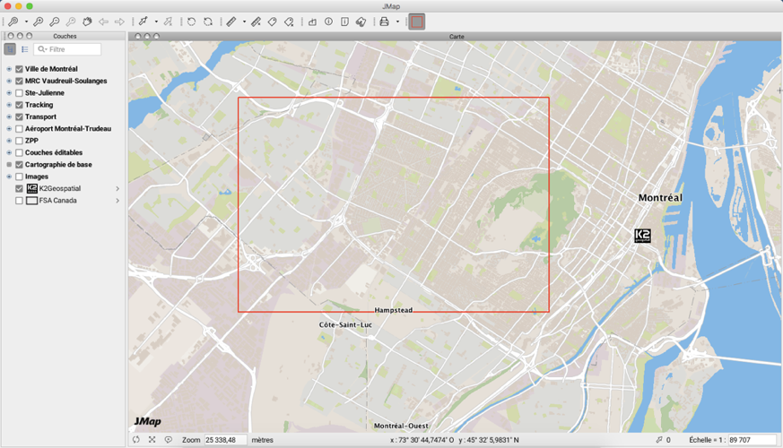

# Projets

Dans JMap, les données des cartes sont organisées sous forme de projets. Un projet est composé d'une liste ordonnée de couches. En général, lorsqu'une application JMap se connecte à JMap Server, l'application ouvre un projet et affiche les couches du projet. Vous pouvez créer autant de projets que vous le souhaitez.

Chaque couche d'un projet est associée à une source de données spatiales. La source de données fournit les données de la couche. Différents projets peuvent contenir des couches partageant les mêmes sources de données, ce qui permet d'avoir une variété de styles, de liaisons, etc. pour les mêmes données. Il est aussi possible que plusieurs couches d'un même projet partagent la même source de données, ce qui s'avère utile lorsque vous utilisez des filtres de couches afin de présenter différentes données d'une même source sur plusieurs couches.

Un projet est une ressource sécurisée, ce qui signifie que des permissions y sont associées afin de contrôler l'accès par les utilisateurs. Il est ainsi possible d'exercer un contrôle précis des utilisateurs et groupes qui seront autorisés à ouvrir chaque projet. Un contrôle d'accès similaire est aussi disponible pour chaque couche du projet.

## ==Doc-237 Création de projets==

Afin de créer un nouveau projet, appuyez sur **Créer** dans la section dressant la liste des projets. Les projets sont créés à partir d'un assistant. 

| **Identification**                            |                                                              |
| --------------------------------------------- | ------------------------------------------------------------ |
| Nom                                           | Entrez un nom pour votre nouveau projet. Ce nom doit être unique. |
| Description                                   | (Optionnel) Entrez une description pour le nouveau projet. Celle-ci sera utilisée à des fins administratives. |
| Langue par défaut                             | Parmi les langues disponibles, sélectionnez celle qui sera utilisée par défaut lorsque la langue demandée n'est pas disponible ou que des traductions sont manquantes. Pour plus d'information, consultez la section [Projets multilingues](#Projets multilingues). |
| Langues disponibles                           | Sélectionnez une ou plusieurs langues qui seront supportées par le projet. Tous les éléments textuels de la configuration du projet (nom du projet, noms des couches, infobulles, etc.) devront être traduits dans chacune des langues supportées. Il est obligatoire de sélectionner au moins une langue. Pour plus d'information, consultez la section [Projets multilingues](#Projets multilingues). |
| Statistiques d'utilisation                    | Cochez cette option si vous souhaitez obtenir des statistiques d'utilisation de ce projet, des couches qu'il contient ainsi que des contextes publics qui sont créés dans les applications JMap Pro déployées à partir du projet. |
| ==Invalider automatiquement le cache Mapbox== | ==Cochez cette option si vous souhaitez invalider automatiquement le cache de Mapbox. Mapbox est utilisé pour produire un cache vectoriel et augmenter ainsi la performance de JMap surtout en ce qui a trait à JMap Survey. Le cache Mapbox est supprimé automatiquement lorsque :==  ==une couche est publiée, une couche publiée est supprimée, des attributs liées à une couche sont ajoutés ou supprimés, le filtre de base d'une couche change, la source de données spatiales d'une couche change, le projet est supprimé. Le cache Mapbox n'est pas supprimé automatiquement lorsque : une couche non publiée est ajouté au projet, une couche non publiée est supprimée d'un projet, il y a des changements mineurs dans une couche (style, thématique, infobulle), l'ordre des attributs liés à une couche change.== |

| **Paramètres**                  |                                                              |
| ------------------------------- | ------------------------------------------------------------ |
| Projection cartographique       | Détermine la façon dont les données seront affichées dans les applications client. Toutes les données utilisant une projection différente seront converties à la volée vers cette projection. Notez qu'en changeant la projection d'une carte dans un projet, vous rendez le cache des couches invalide. Cela peut réduire temporairement les performances des applications. |
| Unité cartographique            | L'unité cartographique est automatiquement sélectionnée en fonction de la projection cartographique sélectionnée. |
| Unité d'affichage               | Unité utilisée pour afficher les coordonnées de la carte.    |
| Mesures                         | **Géodésiques** : Les mesures de distance et de superficie seront faites en utilisant des calculs sphériques basés sur l'ellipsoïde de la projection. **Cartésiennes avec** : Les mesures de distance et de superficie seront faites en utilisant des calculs sur le plan en 2 dimensions en utilisant la projection spécifiée. |
| Unité de distance               | Unité utilisée pour afficher les distances (mesures, niveaux de zoom, etc.). |
| Échelle minimale                | Échelle minimale de la carte. Les utilisateurs ne peuvent plus effectuer de zoom arrière lorsque la limite est atteinte. |
| Échelle maximale                | Échelle maximale de la carte. Les utilisateurs ne peuvent plus effectuer de zoom avant lorsque la limite est atteinte. |
| Couleur de fond                 | Couleur de fond par défaut de la carte.                      |
| Couleur de sélection par défaut | Couleur des objets sélectionnés sur la carte. Ce paramètre peut aussi être défini pour chaque couche. |

### Source du projet

Lors de la création d'un projet, vous pouvez opter pour la création d'un nouveau projet vide, ou vous pouvez choisir d'importer une configuration de projet existante provenant d'une autre source. En utilisant une configuration existante, vous pouvez automatiser la création des couches du projet et éviter de refaire toute la configuration dans JMap Admin. Il existe une seule option actuellement : l'importation de projets en provenance de ESRI ArcGIS REST Service.

#### Importation de projets de ArcGIS REST

Vous pouvez choisir d'importer la configuration des couches d'un service ESRI ArcGIS REST. JMap importera les paramètres du projet, les couches et leur symbologie, les paramètres d'échelles, les étendues, etc.

Sélectionnez l'option **ArcGIS REST** et appuyez sur **Suivant**.

| **ArcGIS REST** |                                                              |
| --------------- | ------------------------------------------------------------ |
| URL             | Entrez l'URL du service REST d'ArcGIS Server.Ex. : [http://sampleserver1.arcgisonline.com/ArcGIS/rest/services](http://sampleserver1.arcgisonline.com/ArcGIS/rest/services/Locators/ESRI_Geocode_USA/GeocodeServer) Appuyez ensuite sur **Charger** pour afficher la liste des couches disponibles. |
| Utilisateur     | Entrez le nom d'utilisateur pour vous authentifier et vous connecter au service REST d'ArcGIS. |
| Mot de passe    | Entrez le mot de passe pour vous authentifier et vous connecter au service REST d'ArcGIS. |
| Couches         | Sélectionnez les couches pour lesquelles vous voulez importer les configurations. JMap crée une couche dans le projet pour chaque couche importée. La configuration de la couche JMap est similaire à la couche originale mais des différences peuvent exister. |

JMap supporte l'importation de couches matricielles OGC WMTS.

Dans l'interface d'importation des couches du service REST, des icônes indiquent les couches dont le format n'est pas compatible avec JMap.

##  ==Doc-237 Configuration de projets==

 L'interface de configuration d'un projet vous permet d'accéder aux information sur le projet ainsi qu'à des fonctions de configuration de paramètres tels que la vue initiale du projet dans les applications.

|  |  |
| ----- | ------------------------------------------------------------ |
| **1** | Information générale configurée lors de la création du projet. |
| **2** | Paramètres du projet. Ils sont configurés lors de la création du projet. L'étendue du projet correspond à l'étendue des couches qui composent le projet. Lorsque le projet n'a pas de couches, les valeurs sont égales à 0. |
| **3** | Paramètres d'affichage initial. Ces paramètres sont spécifiés lors de la création du projet. La vue initiale est définie en appuyant sur  dans la section **Aperçu**. Par défaut elle correspond à l'étendue du projet. Lorsque le projet n'a pas de couches, les valeurs sont égales à 0. |
| **4** | Références. Cette section indique les applications déployées qui utilisent ce projet. |
| ==**5**== | ==Mapbox cache. Cette section présente des informations sur le cache des composantes vectorielles du projet effectué avec Mapbox.== |
| **6** | Aperçu. Cette section s'affiche lorsque le projet contient au moins une couche. Elle offre un aperçu de la carte, dans lequel vous pouvez zoomer avant et arrière.  Appuyez sur  pour ouvrir un [Aperçu JMap Web](#Aperçu JMap Web) dans une fenêtre séparée ou un [Aperçu JMap Pro](#Aperçu JMap Pro) dans lequel établir la vue initiale et tester les configurations du projet. ==Vous pouvez sélectionner une carte de base pour l'aperçu JMap Web : Aucune, OpenStreetMaps, MapBox, MapBox lumineux et MapBox route.== |
| **7** | Couches. Cette section présente une liste des couches du projet avec leur état. Des raccourcis permettent d'accéder aux interfaces d'ajout et d'organisation des couches. |
| **8** | Ces boutons permettent d'éditer la configuration du projet ou de le supprimer. |
| **9** | Le menu permet d'accéder aux sections de [Couches](06 Couches.md), [Requêtes](#Requêtes par attributs), [Permissions](#Permissions des projets) et [Producteur d'images](#Producteur d'images). |

### Aperçu JMap Web

L'aperçu JMap Web ouvre une application JMap Web dans une nouvelle fenêtre du navigateur.

L'aperçu offre toutes les fonctionnalités des applications JMap Web et permet de valider la configuration du projet. Il permet aussi d'établir la vue initiale du projet lorsqu'il est ouvert dans les applications JMap Web. Pour ce faire, appuyez sur  et ensuite sur  **Étendue initiale**. Un rectangle s'affiche pour délimiter l'étendue initiale. Appuyez sur  **Étendue maximale** pour afficher l'étendue maximale. Lorsque vous fermez l'aperçu, les coordonnées géographiques de l'étendue initiale s'enregistrent de manière automatique.

### Aperçu JMap Pro

L'aperçu JMap Pro ouvre une application JMap Pro qui offre toutes les fonctionnalités des applications JMap Pro. Vous pouvez valider la configuration du projet.

Vous pouvez aussi délimiter la vue initiale du projet lorsqu'il est ouvert dans les applications JMap Pro. Appuyez sur . Un rectangle s'affiche pour délimiter la vue initiale. Lorsque vous fermez l'aperçu, les coordonnées géographiques de la vue initiale s'enregistrent de manière automatique.

## Producteur d'images

Le producteur d'images d'un projet JMap est responsable de produire des images du projet sur demande. Ces images sont utilisées pour les applications JMap Web et JMap Mobile. Lorsqu'un utilisateur utilise JMap Pro, le producteur d'images n'est pas sollicité car les données sont transférées en format vectoriel (sauf pour les photos).

Normalement, il n'est pas nécessaire de modifier la configuration du producteur d'images car la configuration par défaut est généralement adéquate. Le tableau suivant décrit les paramètres du producteur d'images.

| **Paramètres de la mémoire**                       |                                                              |
| -------------------------------------------------- | ------------------------------------------------------------ |
| Taille maximale                                    | Quantité maximale de mémoire allouée au producteur d'images du projet. Cette mémoire est utilisée pour stocker les des donnée vectorielles du projet afin d'accélérer la production des image. Pour de très gros projets, ce paramètre peut être augmenté. |
| Pourcentage libéré                                 | Détermine le pourcentage de la mémoire à libérer lorsque la mémoire du producteur d'images est saturée. |
| **Paramètres du gestionnaire de fils d'exécution** |                                                              |
| Nombre initial de fils d'exécution                 | Le nombre de fils d'exécution détermine le nombre d'images qui peuvent être produites simultanément. |
| Taille maximale                                    | Si le nombre de fils d'exécution croît en raison d'une forte demande, il est limité par cette valeur. |
| Délai maximal de la vue                            | Délai maximal avant expiration d'une requête d'image. Cette option n'est normalement pas activée. |

## Gestion des projets

La section **Projets** dans JMap Admin affiche une liste de projets existants. À partir de cette section, vous pouvez créer, cloner ou supprimer des projets.

### Modification d'un projet existant

Vous pouvez modifier un projet en appuyant sur **Éditer** dans la section de détails de celui-ci. Vous modifiez un projet en suivant les mêmes étapes que lors de sa création. Si vous changez la projection d'un projet, le cache des données vectorielles des couches est supprimé.

### Duplication de projets

Vous pouvez cloner un projet existant en le sélectionnant dans la table et en appuyant sur **Dupliquer**. Toutes les couches à l'intérieur du projet sont copiées vers le nouveau projet. Notez que les sources de données spatiales et bases de données subjacentes ne sont pas copiées, mais elles sont plutôt partagées entre les couches du nouveau projet et les couches de l'ancien projet.

### Suppression de projets

Vous pouvez supprimer un projet existant en le sélectionnant dans la table et en appuyant sur **Supprimer**. Vous pouvez aussi supprimer un projet à partir de sa section de configuration. En supprimant un projet, vous supprimez définitivement toutes les configurations de couches qu'il comprend. Les sources de données spatiales ne sont pas affectées.

##  Permissions des projets

À partir de la section de détails d'un projet, appuyez sur **Permissions** afin d'accéder à la section des permissions du projet. Une liste des utilisateurs et groupes autorisés s'affiche. Appuyez sur **Ajouter** afin d'ajouter de nouveaux utilisateurs ou groupes et de leur donner automatiquement la permission Ouvrir ce projet. Les utilisateurs et groupes disponibles sont configurés dans la section JMap Server de JMap Admin. Reportez‑vous à la section [Gestion d'utilisateurs et de groupes](10 Sécurité.md) pour plus d'informations sur la gestion des utilisateurs dans JMap.

Les permissions sur les projets sont divisées en 2 catégories : les **permissions administrateur** et les **permissions utilisateur**.

### Permissions administrateur

Les permissions administrateur des projets définissent les droits d'administration du projet par les utilisateurs autorisés à utiliser JMap Admin. Pour plus d'information sur les concepts de permissions et rôles d'administration dans JMap Admin, consultez la section [Gestion des permissions](10 Sécurité.md).

| **Permissions**       |                                                              |
| --------------------- | ------------------------------------------------------------ |
| Administrer le projet | Permet à un administrateur de modifier le projet et son contenu. |
| Accéder au projet     | Permet à un administrateur d'accéder au projet pour voir le contenu et l'utiliser lors du déploiement d'applications JMap. |

### Permissions utilisateur

Les permissions utilisateur des projets définissent quels utilisateurs et groupes peuvent ouvrir un projet. L'accès sera refusé aux utilisateurs ne détenant pas les permissions requises. La sécurité peut aussi être définie au niveau des couches. Consultez la section [Permissions des couches](06 Couches.md) pour plus de détails à ce sujet.

| **Permissions**  |                                                              |
| ---------------- | ------------------------------------------------------------ |
| Ouvrir ce projet | Permet à un utilisateur d'ouvrir un projet à partir d'une application JMap. |

**Utilisateur Anonymous**

L'ajout de l'utilisateur **Anonymous** à la liste des utilisateurs autorisés à ouvrir le projet permet aux utilisateurs d'ouvrir le projet sans s'authentifier, ce qui revient à supprimer toute sécurité pour l'ouverture du projet. Cette option est utile pour les applications publiques, lorsqu'aucune restriction d'accès n'est nécessaire.

**Utilisateur Everyone**

L'ajout de l'utilisateur **Everyone** à la liste des utilisateurs autorisés à ouvrir le projet permet à tous les utilisateurs qui s'authentifient d'ouvrir le projet. Cette option s'avère utile pour les applications privées où tous les utilisateurs sont autorisés à ouvrir un projet, mais en s'authentifiant.

## Projets multilingues

Vous pouvez configurer les projets JMap pour supporter plusieurs langues. Ainsi, chaque utilisateur pourra consulter le projet dans sa langue, si celle-ci est disponible pour le projet et que les traductions sont fournies. Quand une application JMap est démarrée, celle-ci peut détecter automatiquement la langue du système d'exploitation de l'utilisateur et utiliser cette langue pour les interfaces graphiques et pour le projet. Ce comportement dépend des options sélectionnées lors du déploiement de l'application.

Pour un projet supportant de multiples langues, chaque élément textuel visible par les utilisateurs peut être traduit dans chacune des langues. Par exemple, vous pouvez fournir les traductions pour le nom du projet, les noms des couches, les étiquettes, les infobulles, les formulaires, etc.

Pour activer le support multilingue, vous devez choisir au moins deux langues lors de la création ou la modification du projet, et vous devez sélectionner la langue qui sera utilisée par défaut.

| **Langues**         |                                                              |
| ------------------- | ------------------------------------------------------------ |
| Langues disponibles | Sélectionnez les langues disponibles pour le projet. Au moins une langue doit être sélectionnée. |
| Langue par défaut   | Parmi les langues disponibles, choisissez celle qui sera utilisée comme langue par défaut. Lorsque vous saisissez les textes dans les différentes sections de configuration du projet et des couches, vous devez les entrer dans la langue par défaut. Si la langue de l'utilisateur n'est pas supportée pour le projet, ou si des traductions sont manquantes, JMap utilisera automatiquement la langue par défaut. |

Par la suite, vous pouvez saisir les traductions aux endroits indiqués par le symbole  lors de la configuration du projet et des couches.

Si pour certains textes, des traductions ne sont pas fournies dans toutes les langues disponibles, le texte de la langue par défaut sera affiché automatiquement.

## Organisation des couches

L'organisation des couches d'un projet comporte deux volets. D'abord, l'ordre d'affichage des couches sur la carte doit être défini. Les couches situées dans les positions inférieures sont dessinées en premier, et celles qui sont situées dans les positions supérieures sont dessinées à la fin. Les couches supérieures peuvent cacher des éléments des couches inférieures. L'autre volet consiste à créer une hiérarchie logique basée sur la nature des couches. En d'autres mots, cette tâche permet de créer des groupes (et sous‑groupes) de couches possédant des relations logiques. Par exemple, vous pourriez avoir un groupe de couches associé aux routes, un autre associé à l'hydrographie et un autre associé au recensement. L'organisation des couches en groupes facilite leur utilisation.

Afin d'organiser les couches, ouvrez la section **Couches**.

### Définition de l'ordre des couches

Afin de définir l'ordre des couches d'un projet, ouvrez l'onglet intitulé **Liste**. Cette section présente les couches dans leur ordre d'apparition sur la carte. La position la plus basse est la première qui est dessinée sur la carte. Afin de changer l'ordre, vous devez utiliser le menu **Modifier** localisé en haut de la colonne qui affiche la position de chaque couche. Il est possible de sélectionner une ou plusieurs couches et, en utilisant les options disponibles (déplacer vers le haut, déplacer vers le bas, déplacer vers une position précise, etc.). Il est aussi possible d'ouvrir une fenêtre montrant toutes les couches et de les réordonner par glisser-déposer.

 

### Groupement des couches

Afin d'organiser les couches en groupes, ouvrez l'onglet intitulé **Hiérarchie**. Cette section présente la hiérarchie actuelle des couches. Par défaut, toutes les couches du projet se trouvent dans un groupe unique nommé **Layers**. Afin de créer un nouveau groupe, appuyez sur **Nouveau groupe**. Remplissez les paramètres du groupe de couches comme suit : 

| **Groupe de couches** |                                                              |
| --------------------- | ------------------------------------------------------------ |
| Nom                   | Entrez un nom pour le nouveau groupe. Le nom doit être unique. |
| Description           | (Optionnel) Entrez une description pour le nouveau groupe. Celle-ci sera visible par les utilisateurs. |
| Visible               | Cette option rend le groupe visible au départ, lorsque le projet est ouvert. Toutes les couches visibles à l'intérieur du groupe seront affichées. |
| Toujours listé        | Cette option assure que le groupe est toujours présent dans la liste (affiché dans le gestionnaire de couches sur le client) même s'il ne contient aucune couche. Par défaut, les groupes vides ne sont pas affichés dans la liste. Un groupe peut être vide s'il ne contient pas de couche, si toutes les couches qu'il contient ne sont pas listées ou si l'utilisateur ne dispose pas des permissions pour visualiser les couches du groupe. |

Une fois que des groupes sont créés, vous pouvez déplacer des couches vers ces groupes en utilisant le menu Modifier localisé en haut de la colonne qui affiche la position de chaque couche.

## Requêtes par attributs

Les requêtes par attributs permettent de rechercher et de sélectionner des éléments d'une couche de la carte en utilisant les valeurs de leurs attributs, ou en utilisant une base de données liée à la couche. Dans JMap Admin, les administrateurs JMap créent les requêtes ainsi que les formulaires qui leurs sont associés. Les utilisateurs JMap utilisent ensuite ces formulaires pour saisir des valeurs d'attributs pour faire la recherche. Tous les éléments dont les valeurs d'attributs correspondent aux valeurs saisies sont alors sélectionnés ou présentés dans l'explorateur d'éléments. 

Vous pouvez accéder à la section de configuration de requêtes en appuyant sur **Requêtes** depuis la section **Projets**.

### Créer une nouvelle requête par attributs

Pour créer une nouvelle requête, appuyez sur **Créer une requête** requête depuis la section **Requêtes par attributs**. Cela ouvrira l'interface de configuration de requêtes. Les paramètres varient selon le type de requête sélectionné.

| **Requête par attributs** |                                                              |
| ------------------------- | ------------------------------------------------------------ |
| Titre                     | Entrez un titre pour la requête. Les utilisateurs verront ce titre dans la liste des requêtes. |
| Couche                    | Sélectionnez la couche sur laquelle la requête sera exécutée. Une plage de recherche facilite la sélection de la couche. |
| Échelle maximale          | Entrez l'échelle maximale utilisée pour l'affichage des résultats sur la carte. Ceci est utile afin d'éviter des zooms trop rapprochés sur les résultats. |
| Max. valeurs retournées   | Entrez le nombre maximal d'éléments pouvant être retournés par la requête. La requête refusera de s'exécuter si la taille du résultat est supérieure à cette limite. Ceci est utilisé afin d'éviter l'exécution de requêtes trop longues qui pourraient ralentir le système. |
| Type de requête           | **Sur la couche** : Avec ce type de requête, la recherche s'effectue uniquement sur les attributs de la couche. C'est le type de requête le plus simple. **Externe** : Avec ce type de requête, la recherche s'effectue dans une base de données externe qui possède un champ faisant le lien avec un attribut de la couche. Ce type de requête est plus complexe à paramétrer mais offre plus de flexibilité pour les recherches. |

#### Requêtes sur la couche

| **Requêtes sur la couche** |                                                              |
| -------------------------- | ------------------------------------------------------------ |
| WHERE                      | Clause WHERE de la requête SQL exécutée pour faire la recherche. C'est ici que sont définis tous les critères de recherche. Typiquement, cette clause contient des paramètres numérotés (`$param1`, `$param2`, etc.) qui seront remplacés par les valeurs entrées par l'utilisateur dans le formulaire.   **Exemples** :   `COUNTRY='$param1'`   Sélectionne les éléments de la couche qui ont la valeur de l'attribut COUNTRY égale à la valeur saisie par l'utilisateur. La valeur de l'attribut doit correspondre parfaitement à la valeur saisie (`$param1`).   `lower(COUNTRY) like lower('$param1')`   Sélectionne les éléments de la couche qui ont la valeur de l'attribut COUNTRY similaire à la valeur saisie par l'utilisateur. La valeur de l'attribut doit débuter par la valeur saisie (`$param1`). Grâce à l'opérateur *lower* la recherche n'est pas sensible à la case.   `POP2000> = $param1 and POP2000 < $param2`   Sélectionne les éléments de la couche qui ont la valeur de l'attribut POP2000 à l'intérieur de la plage définie par les deux valeurs saisies (`$param1` et `$param1`). |
| Disposition du formulaire  | Appuyez sur ce bouton pour configurer le formulaire de la requête. Consultez la section [Formulaires](07 Formulaires.md) pour plus d'information à ce sujet. |

#### Requêtes externes

Ce type de requête est utilisé lorsque la recherche doit se faire dans des données contenues dans une base de données externe. La base de données externe doit contenir un champ permettant de faire le lien avec un attribut de la couche. Une requête SQL de type SELECT est d'abord exécutée dans la base de données externe et les valeurs retournées sont ensuite associées aux éléments de la couche en utilisant le champ de liaison.

| **Requêtes externe**s     |                                                              |
| ------------------------- | ------------------------------------------------------------ |
| Base de données           | Sélectionnez la base de données dans laquelle vous voulez effectuer la requête. |
| Requête SQL               | Entrez la requête SQL qui sera exécutée dans la base de données pour rechercher les éléments. Exemple :   `select * from cities where CITY_LANGUAGE='$param1'`  Recherche dans la base de données sélectionnée plus haut, dans la table cities. Retourne tous les champs des enregistrements qui ont la valeur du champ CITY_LANGUAGE égale à la valeur saisie par l'utilisateur (`$param1`). |
| Attribut de la couche     | Parmi les attributs de la couches, spécifiez celui qui sert à faire le lien avec la base de données. |
| Champ                     | Parmi les champs retournés par la requête SQL, spécifiez celui qui sert à faire le lien avec la couche. |
| Disposition du formulaire | Appuyez sur ce bouton pour configurer le formulaire de la requête. Consultez la section [Formulaires](07 Formulaires.md) pour plus d'information à ce sujet. |

#### Paramètres requis et optionnels

Bien que ce soit dans la conception du formulaire de recherche que les champs sont marqués requis ou optionnels, la clause WHERE de la requête doit être ajustée afin de supporter cette option. Pour ce faire, toute partie de la requête qui est associée à des paramètres optionnels doit être incluse à l'intérieur d'une paire d'accolades ( { } ).

Exemple de clause WHERE :

`CITY = '$param1' AND { COUNTRY = '$param2' }`

Cet exemple fait la recherche des villes qui ont la valeur de leur attribut CITY égale à la valeur du paramètre 1 (`$param1`) saisie par l'utilisateur et qui, optionnellement, ont la valeur de leur attribut COUNTRY égale à la valeur du paramètre 2 (`$param1`) saisie par l'utilisateur. Si le paramètre 2 est non-renseigné, tout le bloc `{ COUNTRY = '$param2' }` est enlevé de la requête ainsi que l'opérateur and devenu orphelin. Notez que l'administrateur doit absolument définir `$param1` comme optionnel lors de la conception du formulaire. Consultez la section [Formulaires](07 Formulaires.md) pour plus d'information sur la conception des formulaires.

#### Valeurs multiples pour un même paramètre

Des valeurs multiples peuvent être saisis avec un champ de type Liste (choix multiples) dans les formulaires. Les valeurs sont séparées par le caractère délimiteur ; (point-virgule). C'est dans la clause WHERE de la requête que cette option peut être activée. La syntaxe est la suivante :

`$multiple{true} {\$delimiter{;}}`

Exemple :

`CITY = '$param1{$multiple{true} $delimiter{;}}'`

Recherche les villes qui ont la valeur de leur attribut CITY égale à une des valeurs saisies dans le paramètre 1. Les valeurs sont séparées par des points-virgule.

### Gestion des requêtes par attributs

Les requêtes par attributs peuvent être modifiées par les administrateurs. À partir de JMap Dakar, lorsque les requêtes d'un projet sont modifiées, les applications qui diffusent le projet ne nécessitent pas d'être redéployées car les changements se reflètent de manière directe.

#### Suppression des requêtes par attributs

La suppression d'une requête par attributs supprime définitivement la requête et le formulaire qui lui est associé. Pour supprimer une requête, sélectionnez-la dans la liste et appuyez sur **Supprimer**.

#### Organisation des requêtes par attributs

Les requêtes par attributs peuvent être groupées. Ceci est particulièrement utile pour les projets qui comportent un nombre élevé de requêtes. 

Pour créer un nouveau groupe, appuyez sur le bouton **Créer un groupe**. Pour modifier l'ordre des groupes, appuyez sur le bouton **Modifier** et sélectionnez **Réorganiser les groupes**. La fenêtre qui s'affiche permet de glisser-déposer les groupes afin d'en modifier l'ordre. Pour renommer une groupe, appuyez sur . Pour supprimer un groupe, sélectionnez-le dans la liste et appuyez sur **Supprimer**.

## Modèles de style

Les modèles de style sont des styles prédéfinis qui peuvent être réutilisés pour de nombreux projets et couches. Ils épargnent du temps, car vous pouvez configurer un style une seule fois et l'utiliser à de nombreux endroits. Les modèles de style vous aident également à créer des cartes standardisées.

Une fois qu'un modèle de style a été configuré, il peut être utilisé à tout endroit où un style est requis (styles de couches, styles de sélection, thématiques, etc.). Un modèle de style peut être utilisé en tant que référence ou en tant que copie. Lorsqu'un modèle de style de type référence est modifié, toutes les couches qui s'y rapportent subissent la modification de style. Lorsqu'un style est utilisé en tant que copie, il est détaché du modèle de style et peut être modifié de façon indépendante par la suite.

Les modèles de style sont associés à un seul type d'élément de carte (point, ligne, polygone, etc.) et ne peuvent pas être utilisés pour d'autres types d'éléments.

Afin d'utiliser un modèle de style, cliquez sur **Utiliser un modèle de style** à partir de toute interface de configuration du style. Reportez‑vous à [Style](06 Couches.md) pour plus de détails à ce sujet.

Vous pouvez accéder à la section de configuration des modèles de style en sélectionnant **Modèles de style** depuis la section **Projets**.

### Création de modèles de style

Afin de créer un nouveau modèle de style, appuyez sur **Créer**.

| **Modèles de style** |                                                              |
| -------------------- | ------------------------------------------------------------ |
| Nom                  | Entrez un nom unique pour le modèle de style.                |
| Type                 | Sélectionnez le type d'élément associé au nouveau modèle de style. L'interface de configuration du style sera différente selon le type sélectionné. |
| Description          | (Optionnel) Entrez une description pour le modèle de style.  |

Le reste de la configuration dépend du type d'élément sélectionné et est identique à la configuration normale du style. Reportez‑vous à la section [Style](06 Couches.md) pour plus de détails à ce sujet. Appuyez sur **Terminer** pour compléter la création du modèle de style.

### Suppression de modèles de style

Afin de supprimer un modèle de style, sélectionnez‑le dans la liste et appuyez sur **Supprimer.**

 

## Couches personnelles

Les couches personnelles sont des couches de données créées et peuplées par les utilisateurs. Lors de la création d'une nouvelle couche personnelle, l'utilisateur définit un nom, un type de géométrie et un ensemble d'attributs. La configuration de la couche et les données (géométries et attributs) sont stockées dans la base de données **System** de JMap Server. Une fois créées, les couches personnelles peuvent être partagées entre les utilisateurs avec un système de permissions. Elles peuvent aussi être converties en couches normales insérées dans un projet par l'administrateur. Les utilisateurs doivent avoir une permission spéciale accordée par l'administrateur afin de créer des couches personnelles.

Vous pouvez accéder à la section des couches personnelles en sélectionnant **Couches personnelles** depuis la section **Projets**.

Dans JMap Admin, l'administrateur peut voir la liste des couches personnelles existantes. Les données peuvent être présentées par couche personnelle ou par utilisateur. Lorsque vous sélectionnez une couche personnelle, vous pouvez voir les utilisateurs qui y ont accès. Lorsque vous sélectionnez un utilisateur, vous pouvez voir les couches personnelles auxquelles il a accès. Vous pouvez aussi sélectionner une couche personnelle dans la liste afin d'ouvrir sa section détaillée.

### Suppression d'une couche personnelle

Afin de supprimer une couche personnelle, sélectionnez‑la dans la liste et appuyez sur **Supprimer**. Notez que la suppression d'une couche personnelle supprime aussi sa configuration et toutes ses données. Cette action ne peut pas être annulée.

### Publication d'une couche personnelle

La publication d'une couche personnelle transforme celle-ci en une couche régulière de projet. Une fois publiée, une couche personnelle ne peut plus être gérée par les utilisateurs. Elle pourra cependant encore être éditée si l'administrateur accorde la permission à des utilisateurs. Afin de publier une couche personnelle, sélectionnez‑la dans la liste, appuyez sur **Publier** et sélectionnez le projet dans lequel vous désirez insérer la couche.

 