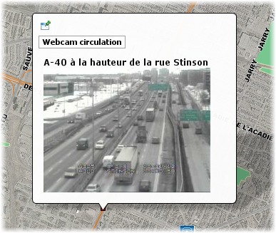

# Couches

Un projet est constitué d'une liste ordonnée de couches. Les couches sont utilisées pour afficher des données extraites de sources de données spatiales. Chaque couche est associée à une source de données spatiales spécifique. Les couches vectorielles sont associées aux sources de données vectorielles et affichent des données vectorielles, tandis que les couches matricielles se rapportent aux sources de données matricielles. La configuration des couches détermine l'apparence des données (style de la couche), les seuils de visibilité, l'information rattachée aux données spatiales (attributs), etc. Chaque couche possède ses propres paramètres de configuration pour l'étiquetage, les rapports, les thématiques, etc.

Les couches sont créées dans le projet auquel elles appartiennent. Des permissions spécifiques peuvent être configurées pour chaque couche. Ainsi, certaines couches peuvent être accessibles uniquement à un sous-ensemble des utilisateurs autorisés à ouvrir le projet.

Les couches d'un projet peuvent être organisées selon une hiérarchie ou une structure arborescente logique. Ceci est utile lorsque vous travaillez avec des projets comportant un grand nombre de couches. L'information est alors mieux organisée. Dans les applications client, les utilisateurs peuvent contrôler en un seul clic la visibilité des couches appartenant à un même groupe. Consultez la section [Organisation des couches](05 Projets.md) pour plus d'information sur le sujet.

Il est possible de copier des couches d'un projet vers un autre ou même de partager des couches entre différents projets localisés sur le même JMap Server, ou sur un autre JMap Server. Consultez la section [Partage de couches](05 Projets.md) pour plus d'information sur le sujet.

Les couches d'un projet sont présentées dans la section **Couches**, accessible à partir de l'interface de configuration du projet de JMap Admin. Dans l'onglet **Liste**, la table présente des informations de base sur chaque couche du projet. Lorsque vous cliquez sur le nom d'une couche, une section détaillée s'affiche. Dans l'onglet **Hiérarchie** s'affichent les groupes et sous-groupes avec les couches qui les composent. Les tâches que vous pouvez effectuer à partir de cet onglet sont détaillés dans la section [Organisation des couches](05 Projets.md).

Dans l'onglet **Liste** de la section **Couches** d'un projet vous pouvez effectuer les tâches décrites dans le tableau. Pour certaines tâches vous devez sélectionner plus d'une couche.

| **Couches/Liste**                    |                                                              |
| ------------------------------------ | ------------------------------------------------------------ |
| Ajouter - Créer                      | Débute la création d'une nouvelle couche. Voir [Création de couches](#Création de couches). |
| Ajouter - Dupliquer / Référencer     | Permet de dupliquer ou de référencer une couche d'un autre projet sur le même serveur ou sur un autre JMap Server. Voir [Partage des couches](#Partage des couches). |
| Ajouter - Importer...                | Permet d'importer les couches une à une à partir d'un projet exporté d'un autre serveur JMap. Voir [Importation de couches](#Importation de couches). |
| Mise à jour - Mise à jour SDS        | Démarre la mise la mise à jour des sources de données spatiales associées aux couches sélectionnées. Voir [Sources de données spatiales](04 SDS.md). |
| Mise à jour - Mise à jour caches     | Démarre la préparation du cache de données vectorielles pour les couches sélectionnées. Voir [Création de couches](#Création de couches). |
| Mise à jour - Modification en lot... | Permet de modifier en lot certains paramètres des couches. La section [Modification en lot des couches](#Modification en lot d'un ensemble de couches) offre les détails sur le sujet. |
| Supprimer                            | Supprime les couches sélectionnées.                          |

Le bouton  donne accès à **Permissions** qui permet de configurer les permissions des couches sélectionnées. Voir [Permissions des couches](#Permissions des couches) pour plus de détails.

### Importation de couches

Vous pouvez ajouter une couche à un projet en l'important à partir d'un projet qui a été exporté d'un autre serveur JMap. La section [Exportation et importation](11 Gestion de JMap Server.md) offre des détails sur l'exportation et l'importation de ressources d'un serveur JMap. L'importation d'une couche dans un projet implique également la création dans JMap Server d'une source de données qui contient les données de la couche importée.

Lorsque vous appuyez sur **Ajouter / Importer...** l'**Assistant d'importation** vous guide pour importer une ou plusieurs couches à partir du projet dans lequel elles se trouvent :

1. Pour commencer le processus sélectionnez le **Fichier d'importation**. Appuyez sur **Parcourir** pour accéder à l'**Explorateur de fichiers**. 

2. Sélectionnez le fichier *.properties* qui contient le projet dont vous souhaitez importer les couches.

3. Appuyez sur **Suivant**.

4. Sélectionnez le **Projet** qui contient la couche que vous souhaitez importer. 

5. Sélectionnez les **Couches** à importer.

6. Appuyez sur **Suivant**.

7. Si le projet dans lequel vous importez la couche contient une couche avec le même nom que celle qui vous importez, sélectionnez le critère à appliquer pour résoudre le conflit entre couches : **Créer une nouvelle couche avec un nom différent**, **Remplacer la couche existante** ou **Utiliser la couche existante**. 

8. Appuyez sur **Suivant**.

9. Si le serveur JMap Server dans lequel vous importez la couche contient une source de données spatiales avec le même nom que la source de données de la couche que vous êtes en train d'importer, sélectionnez le critère pour résoudre le conflit entre sources de données : **Créer une nouvelle source de données spatiales avec un nom différent**, **Remplacer la source de données spatiales existante** ou **Utiliser la source de données spatiales existante**.

10. Appuyez sur **Suivant**.

11. Un résumé liste le nombre de ressources importées du projet : couches, bases de données, connexions à distance, sources de données spatiales, modèles de style, modèles de métadonnées.

12. Appuyez sur **Importer**. La couche est ajoutée dans le projet et une nouvelle source de données spatiales est créée dans JMap Server.

### Modification en lot d'un ensemble de couches

Vous pouvez modifier différents paramètres pour un ensemble de couches. Vous devez sélectionner les couches à modifier dans l'onglet **Liste** de la section **Couches** du projet. Ensuite appuyez sur le bouton **Mise à jour** et sur la section **Modification en lot...** pour ouvrir l'interface pertinente.

| **Mise à jour - Modification en lot...** |                                                              |
| ---------------------------------------- | ------------------------------------------------------------ |
| Changer Anticrénelage                    | Cochez si vous désirez modifier ce paramètre. Cochez **Nouvelle valeur** pour activer la fonction anticrénelage. Décochez **Nouvelle valeur** pour désactiver la fonction anticrénelage. La section [Style](#Style) offre de détails de ce paramètre. |
| Changer Échelle minimale                 | Cochez pour changer l'échelle minimale d'affichage des couches. Cochez **Infini** ou **1:** et indiquez dans ce cas, l'échelle. La section [Paramètres généraux](#Paramètres généraux) offre des détails sur ce sujet. |
| Changer Échelle maximale                 | Cochez pour changer l'échelle maximale d'affichage des couches. Cochez **Zéro** ou **1:** et indiquez dans ce cas, l'échelle. La section [Paramètres généraux](#Paramètres généraux) offre des détails sur ce sujet. |
| Changer Mode de chargement               | Cochez pour changer le mode de chargement des données. Cochez votre choix. La section [Création de couches](#Création de couches) présente des détails de ce thème. |
| Changer Description                      | Vous pouvez écrire une nouvelle description pour les couches. |

  

## Création de couches

Dans JMap, chaque couche d'un projet prend ses données d'une source de données spatiales. Ainsi, avant qu'une couche ne puisse être créée, la source de données pour la couche doit exister (consultez la section [Création de sources de données spatiales](04 SDS.md) pour plus de détails à ce sujet).

### Création d'une nouvelle couche

Pour créer une nouvelle couche, appuyez sur **Créer** dans le menu **Ajouter** de la section **Couches** d'un projet. Notez que par défaut, la nouvelle couche possédera le même nom que la source de données. Le nom peut être changé plus tard.

| **Source de données spatiales**             |                                                              |
| ------------------------------------------- | ------------------------------------------------------------ |
| Sélection de la source de données spatiales | Sélectionnez la source de données spatiales qui fournira les données de la couche. Sélectionnez une source de données vectorielles pour créer une couche vectorielle ou sélectionnez une source de données matricielles afin de créer une couche matricielle. |
| Nom                                         | Entrez un nom pour votre nouvelle couche. Ce nom doit être unique. Par défaut, la couche prend le même nom que la source de données sélectionnée. |
| Description                                 | (Optionnel) Entrez une description pour la nouvelle couche. Celle-ci sera utilisée à des fins administratives. |

Les étapes suivantes diffèrent pour les couches vectorielles et matricielles. Notez que la création d'une couche matricielle diffère aussi pour chaque type de source de données matricielles. Passez directement à la section qui s'applique.

#### Création d'une couche vectorielle

| **Type de géométrie** |                                                              |
| --------------------- | ------------------------------------------------------------ |
| Type de géométrie     | Si la source de données peut fournir plus d'un type, sélectionnez le type de géométrie unique pour la couche. |

| **Attributs**  |                                                              |
| -------------- | ------------------------------------------------------------ |
| Attributs liés | Par défaut, lorsque des éléments d'une couche (points, lignes, polygones, etc.) sont servis par JMap Server, les attributs des éléments (ou données descriptives) ne le sont pas, car les attributs ne sont pas « liés » aux éléments. La liaison des attributs associe les données des attributs aux éléments de la couche. Seuls les attributs liés peuvent être utilisés pour les fonctions suivantes : étiquetage, infobulles, cartographie thématique et affichage des attributs dans l'explorateur d'éléments ou de sélection. Sélectionnez et ajoutez les attributs à la liste de droite afin de les lier à la couche. Les autres attributs demeureront disponibles pour d'autres fonctions, telles que les requêtes par attributs et les rapports d'information. Notez que le nombre d'attributs liés a une incidence sur l'utilisation du réseau et de la mémoire et peut ainsi réduire les performances globales. Par conséquent, les attributs ne devraient être liés que lorsque qu'ils sont requis. |

| **Angle de la géométrie (couches de points seulement)** |                                                              |
| ------------------------------------------------------- | ------------------------------------------------------------ |
| Attribut de l'angle                                     | Cette section n'est disponible que pour les couches de points. Dans cette section, sélectionnez un attribut numérique qui contient des angles de rotation pour les symboles représentant les points de la couche. Si vous sélectionnez un attribut de l'angle, les symboles seront affichés avec une rotation suivant la valeur de cet attribut. |
| Unité de mesure angulaire                               | Choisissez l’unité de rotation à appliquer : degrés ou radiants. |
| Direction                                               | Choisissez la direction de la rotation. Les valeurs des angles peuvent être interprétées dans le sens horaire ou antihoraire. |
| Origine de la rotation                                  | Choisissez l’origine de la rotation appliquée : géographique (nord) ou Arithmétique (est). |

Le mode de chargement détermine la façon dont les données vectorielles sont gérées par JMap Server et peut grandement influencer les performances générales.

| **Mode de chargement** |                                                              |
| ---------------------- | ------------------------------------------------------------ |
| Charger par tuile      | Les données sont chargées par zones rectangulaires (tuiles) définies par une grille fixe prédéterminée qui couvre toutes les données de la couche. La structuration des données de la couche en tuiles permet une gestion plus efficace des données, pour le transfert sur le réseau, la gestion de la mémoire et le stockage en cache. Une mauvaise configuration de la grille peut entraîner une diminution des performances du système ou un problème de fonctionnement. En appuyant sur le bouton **Estimer**, JMap effectue un calcul pour déterminer la configuration optimale de la grille. Vous pouvez accepter ces valeurs ou les modifier selon vos besoins. Ce mode offre la meilleure performance, car une fois qu'une tuile est extraite d'une source de données, elle peut être mise en cache pendant un certain temps et ainsi réutilisée efficacement. Il s'agit du mode recommandé pour la plupart des applications. |
| Charger par région     | Les données sont chargées par régions aléatoires, selon les actions de navigation sur la carte faites par l'utilisateur. Chaque fois que la couche doit être affichée dans l'application, une nouvelle demande est envoyée à JMap Server, et les données sont à nouveau extraites à partir de la source de données spatiales. Ce mode est très dynamique puisqu'il n'utilise aucun cache, et les utilisateurs peuvent voir les changements apportés aux données à chacune des manipulations de la carte (zoom, déplacement, etc.). Notez toutefois que ce mode est beaucoup plus exigeant pour JMap Server, et s'il n'est pas utilisé correctement, il peut affecter la performance générale du système. Ce mode doit être utilisé pour les données qui sont dynamiques. Typiquement, ce sont des données qui sont dans une base de données relationnelles et qui peuvent être modifiées de manière aléatoire. C'est le cas pour les couches éditables par JMap. |

##### Paramètres avancés

En règle générale, les paramètres avancés qui suivent ne doivent pas être modifiés.

| **Avancé (optionnel)** |                                                              |
| ---------------------- | ------------------------------------------------------------ |
| Transformation         | **Appliquer une translation** : Effectuer une translation de chaque géométrie de la couche de X unités horizontalement et Y unités verticalement. Les données d'origine ne sont pas affectées. **Généraliser les géométries** : Généraliser (simplifier) les géométries en utilisant la tolérance spécifiée. Pour une géométrie donnée, tous les nœuds qui sont plus rapprochés les uns des autres que la tolérance sont éliminés. De plus, tous les nœuds qui sont situés sur une même ligne droite sont éliminées. Les données d'origine ne sont pas affectées. **Réduire la précision (meilleure performance)** : Utiliser la compression des données pour de meilleures performances. Dans certains cas exceptionnels, cette option peut réduire la précision des données de façon perceptible. À partir de JMap Dakar cette option est décochée par défaut pour les nouvelles couches afin d'éviter des problèmes de performance. Les couches configurées dans les versions antérieures de JMap ne sont pas affectées. |
| Mise en cache          | Cette section vous permet de définir des règles relatives à la mise en cache sur le serveur pour les données vectorielles et leurs attributs. Ceci améliore la performance, car une fois que des données sont mises en cache, JMap Server n'a pas besoin de les charger de nouveau à partir de la source de données. **Activer la mise en cache serveur pour cette couche** : Choisissez cette option pour activer ou désactiver la mise en cache serveur pour cette couche. **Reconstruire après la mise à jour de la source de données** : Si la mise en cache est activée, cette option indique à JMap Server de vider et reconstruire le cache pour cette couche lorsque la source de données spatiales correspondante est mise à jour. Le fait de construire le cache à l'avance aide à prévenir les délais pour les utilisateurs. La construction du cache peut prendre un certain temps, selon la quantité de données présentes. **Échéance du cache** : Cette option indique à JMap Server de ne pas conserver les données en cache au-delà de la période de temps spécifiée. Lorsque l'échéance est atteinte, les données sont chargées de nouveau à partir de la source de données. Ceci s'avère surtout utile pour les sources de données spatiales qui obtiennent leurs données à partir de serveurs de données spatiales auxquels JMap Server est connecté (Oracle Spatial/Locator, géodatabases ESRI, PostGIS, MySQL Spatial etc.). **Mettre à jour après "Terminer"** : Sélectionnez cette option afin que le cache soit immédiatement construit pour cette couche. La construction du cache peut prendre un certain temps, selon la quantité de données présentes. |
| Filtre de base         | **Conditions SQL** : Des conditions SQL sont utilisées afin de filtrer les éléments de la source de données spatiales. Seuls les éléments qui satisfont les conditions SQL se retrouveront sur la couche. Ainsi, vous pouvez créer de nombreuses couches affichant différentes données en utilisant la même source de données spatiales. Les conditions SQL sont interprétées directement par le système de base de données, donc la syntaxe est identique à celle d'une clause WHERE en SQL. Le mot‑clé WHERE n'est pas requis. |

#### Création d'une couche matricielle à partir d'une source de données WMS

Pour créer une couche matricielle à partir d'une source de données spatiales WMS, vous devez indiquer à JMap quelles données doivent être chargées à partir du serveur WMS. Le serveur WMS publie la liste de toutes les couches qu'il peut servir ainsi que leurs propriétés. L'interface de création de couches WMS vous permet de sélectionner les couches à inclure dans la couche WMS que vous souhaitez créer.

| **Couche matricielle WMS**                                |                                                              |
| --------------------------------------------------------- | ------------------------------------------------------------ |
| Type de connexion (direct/serveur)                        | Le type de connexion détermine si les applications JMap Pro chargeront les images directement du serveur WMS ou si elles enverront les requêtes à JMap Server, qui à son tour interrogera le serveur WMS. Les applications JMap Web ne sont pas affectées par ce paramètre. Si la connexion directe est sélectionnée et qu'une application JMap Pro ne parvient pas à se connecter au serveur WMS, la connexion passera alors au mode serveur. Notez que si JMap Server est protégé par un pare‑feu ou un serveur mandataire (« proxy »), il se peut que des paramètres d'authentification soient requis pour accéder à Internet. Reportez‑vous à [Paramètres de JMap Server](11 Gestion de JMap Server.md) pour plus de détails à ce sujet. |
| Format de sortie                                          | La liste de formats de sortie offerts par le serveur WMS. Vous pouvez sélectionner le format à utiliser. |
| Couleur de fond                                           | Indique au serveur WMS la couleur de fond des images de la carte. Toute région ne contenant pas de données sera remplie de cette couleur. |
| Utiliser la couleur de fond comme couleur de transparence | Indique au serveur WMS d'utiliser la couleur de fond comme couleur transparente. La transparence permet de placer les images de la carte par‑dessus d'autres couches sans que celles‑ci soient entièrement cachées. |
| S.R.S.                                                    | La liste de Systèmes de Référence Spatiale offerts par le serveur WMS pour cette couche. Vous pouvez sélectionner celui que vous souhaitez utiliser.Assurez-vous que le SRS sélectionné correspond à la projection du projet car JMap ne peut pas reprojeter les images reçues des serveurs WMS. |
| Couches disponibles                                       | La liste de couches publiées par le serveur WMS. Si vous immobilisez votre pointeur de souris sur un nom de couche, la description de celle-ci s'affiche automatiquement, ainsi que ses attributs. Les attributs déterminent si la couche est interrogeable (prend en charge les requêtes GetFeatureInfo), en cascade (provient d'un autre serveur WMS) ou opaque (non transparente, c'est‑à‑dire que les couches qui se trouvent en dessous de celle‑ci ne seront pas visibles). |
| Couches sélectionnées                                     | Les couches sélectionnées parmi celles qui sont disponibles apparaissent dans cette liste. Appuyez sur  pour ajouter une nouvelle couche à cette liste. Vous pouvez sélectionner le style devant être utilisé. Un style par défaut est toujours fourni. Appuyez sur  pour effacer une couche sélectionnée. |

#### Création d'une couche matricielle à partir d'une source de données GDAL, TIFF/GEOTIFF, ECW/ECWP, WMTS

| **Couche matricielle**                                    |                                                              |
| --------------------------------------------------------- | ------------------------------------------------------------ |
| Format d'image                                            | Sélectionnez le format d'image à utiliser pour les transferts d'images entre JMap Server et les applications JMap Pro. Pour les photos aériennes, JPEG donne généralement les meilleurs résultats. |
| Paramètres du format d'image                              | Uniquement utilisé avec le format d'image JPEG pour spécifier le facteur de qualité (1 signifie une qualité excellente et une faible compression tandis que 0 signifie une basse qualité et une forte compression). Faites des essais afin de trouver la valeur qui correspond à vos besoins. La valeur 0.5 constitue généralement un bon compromis. Exemple : quality=0.6 |
| Couleur de fond                                           | Indique à JMap Server la couleur de fond des images. Cette couleur sera appliquée à toute région ne contenant pas de données. |
| Utiliser la couleur de fond comme couleur de transparence | Indique à JMap Server d'utiliser la couleur de fond comme couleur transparente. La transparence permet de placer les images de la carte par‑dessus d'autres couches sans que celles‑ci soient entièrement cachées. |

#### Création d'une couche matricielle à partir d'une source de données WMTS

| **Couche matricielle WMTS** |                                                              |
| --------------------------- | ------------------------------------------------------------ |
| Couche                      | Sélectionnez la couche du serveur WMTS que vous souhaitez utiliser pour créer la couche. Seules les couches dont la projection est la même que celle du projet sont sélectionnables. |
| Style                       | Sélectionnez le style de la couche.                          |

### Publication des couches

Une couche doit être publiée pour être accessible aux utilisateurs. Une couche qui n'est pas publiée ne fait pas partie du projet, et les utilisateurs ne peuvent aucunement la visualiser ou y accéder.

Lorsqu'une nouvelle couche est créée, elle n'est pas publiée par défaut, ce qui vous permet d'exécuter différentes tâches de configuration sur celle‑ci avant de la rendre disponible aux utilisateurs. Par exemple, il est important de configurer les seuils de visibilité en fonction de l'échelle de façon adéquate avant que la couche ne puisse être affichée aux utilisateurs.

Après la création d'une couche, vous devez appuyer sur le bouton **Publier** dans la page des détails de la couche.

Il peut aussi être utile d'annuler la publication d'une couche existante afin de la rendre indisponible aux utilisateurs sans toutefois la supprimer.

## Configuration de couches

L'interface de configuration d'une couche vous permet d'accéder aux informations sur la couche ainsi qu'à des fonctions de configuration de paramètres tels que le style, les étiquettes ou les rapports.

|   |  |
| ------ | ------------------------------------------------------------ |
| **1**  | Informations générales configurées lors de la création de la couche. Le bouton  permet d'accéder directement à l'interface de configuration des paramètres de la section. |
| **2**  | Paramètres de la couche configurés lors de sa création. L'hyperlien vous permet d'accéder à la source des données spatiales qui contient les données de la couche. |
| **3**  | Attributs liés. Cette section présente une liste des attributs liés à la couche. Cliquez sur le [nom d'un attribut](#Attributs) pour ouvrir la fenêtre de configuration de ses propriétés. Le bouton  permet de mettre à jour les statistiques des attributs. |
| **4**  | Limites de visibilité, entre l'échelle maximale et minimale d'affichage des éléments de la couche. |
| **5**  | [Thématiques](#Thématiques). Section qui présente les thématiques de la couche. Cliquez sur le nom de la thématique pour accéder à son interface de configuration. |
| **6**  | [Étiquettes](#Étiquettes). Section qui présente les informations sur les étiquettes. |
| **7**  | [Infobulles](#Infobulles). Section qui décrit l'infobulle configurée pour la couche. |
| **8**  | [Rapports](#Rapports d'information). Section qui présente les informations sur les rapports configurés pour la couche. |
| **9**  | [Formulaires](07 Formulaires.md). Section qui présente les informations sur les formulaires configurés pour la couche. Cliquez sur le nom du formulaire pour accéder à son interface de configuration. |
| **10** | Ces boutons permettent d'éditer la configuration de la couche ou de la supprimer. |
| **11** | Le menu permet d'accéder aux sections [Général](#Paramètres généraux), [Permissions](#Permissions des couches), [Filtres](#Filtres dynamiques), [Style](#Style), [Thématiques](#Thématiques), [Étiquettes](#Étiquettes), [Infobulles](#Infobulles), [Formulaires](07 Formulaires.md) et [Rapports](#Rapports d'information). |

L'interface de configuration des couches matricielles contient les sections **Information générale**, **Paramètres de la couche** et **Limites de visibilité** seulement.

### Attributs

La fenêtre de configuration d'un attribut contient trois onglets : **Métadonnées**, **Statistiques** et **Échantillon de l'attribut**.

| **Métadonnées**  |                                                              |
| ---------------- | ------------------------------------------------------------ |
| Type             | Indique le type de données de l'attribut.                    |
| Type SQL         | Indique le type SQL de données de l'attribut.                |
| Indexé           | Indique si l'attribut est indexé.                            |
| Titre            | Vous pouvez modifier le titre de l'attribut. L'icône  vous permet de fournir le titre en plusieurs langues. |
| Modèle de format | Spécifiez un modèle de format pour l'affichage des éléments de la SDS. Le modèle doit suivre les normes Java. Cet article offre des détails sur le sujet : [https://docs.oracle.com/javase/tutorial/i18n/format/decimalFormat.html](https://docs.oracle.com/javase/tutorial/i18n/format/decimalFormat.html). |

L'onglet **Statistiques** offre des statistiques simples sur l'attribut. L'onglet **Échantillon de l'attribut** affiche la valeur de l'attribut pour un échantillon d'éléments de la couche.

  

## Permissions des couches

Il existe différents types de permissions pour les couches d'un projet. Les tableaux suivants décrivent chacune d'elles.

### Permissions administrateur

| **Permissions**    |                                                              |
| ------------------ | ------------------------------------------------------------ |
| Accéder à distance | Permet à un utilisateur d'accéder à cette couche par une connexion JMap Server à JMap Server. Cette permission doit être accordée au compte utilisateur utilisé pour établir la connexion sécurisée entre 2 JMap Server. Pour plus d'information à ce sujet, consultez la section [Connexions JMap Server à JMap Server](03 Connexions JMap Server à JMap Server.md). |

### ==DOC-255 Permissions utilisateur==

| **Permissions**                    |                                                              |
| ---------------------------------- | ------------------------------------------------------------ |
| Visualiser cette couche            | Permet à un utilisateur de visualiser une couche dans les applications JMap. Par défaut, l'utilisateur Everyone (tout le monde qui a la permission d'ouvrir le projet) a la permission de visualiser toute nouvelle couche. Pour restreindre l'accès à cette couche, vous devez retirer cette permission à Everyone et l'ajouter uniquement aux utilisateurs voulus. |
| Ajouter des éléments               | Permet à un utilisateur d'ajouter des nouveaux éléments sur la couche et de saisir les valeurs des attributs à l'aide du formulaire associé à la couche. La couche doit permettre l'édition pour que cette permission soit disponible. |
| Modifier des éléments              | Permet à un utilisateur de modifier les géométries des éléments (déplacer, ajouter/enlever des nœuds, etc.) existants sur la couche. Permet également à l'utilisateur de modifier les valeurs des attributs à l'aide du formulaire associé à la couche La couche doit permettre l'édition pour que cette permission soit disponible. |
| Effacer des éléments               | Permet à un utilisateur d'effacer des éléments existants sur la couche. La couche doit permettre l'édition pour que cette permission soit disponible. |
| Modifier les valeurs des attributs | Permet à un utilisateur d'ouvrir le formulaire des attributs des éléments de la couche et de modifier leurs valeurs. La couche doit permettre l'édition pour que cette permission soit disponible. |
| Copier des données                 | Permet à l'utilisateur de JMap Pro de copier les données de la couche vers une autre couche ou de les exporter à l'aide de l'extension JMap Exportation. |
| ==**Options**==         |  |
| ==Éditer seulement ses propres éléments== | ==Permet à l'utilisateur d'une application JMap de modifier les géometries, les valeurs des attributs ou encore d'effacer seulement les éléments qu'il a créé dans la couche. L'utilisateur ne peut pas éditer les éléments de la couche qui ont été créés par les autres utilisateurs.== |

Afin de modifier les permissions des couches, appuyez sur  pour sélectionner les utilisateurs et groupes auxquels vous désirez octroyer les permissions. Seuls les utilisateurs et groupes qui ont déjà la permission d'ouvrir le projet contenant la couche peuvent se voir attribuer des permissions relatives à cette couche.

## Partage des couches

JMap permet de partager des couches entre des projets d'un même serveur ou provenant de serveurs distants qui sont connectés. Le partage de couches permet de faire une gestion plus efficace des données (moins de redondance, gains de temps) en réutilisant des couches existantes, plutôt qu'en créant de nouvelles couches dans chaque projet. Lorsque les couches originales sont modifiées, les changements sont automatiquement visibles dans tous les projets qui ont des couches par référence qui pointent vers ces couches partagées. Les couches par référence ne peuvent pas être modifiées directement, excepté pour quelques paramètres de base. Seule la couche originale partagée peut être modifiée.

La figure illustre le partage de couches entre projets d'un même serveur et de serveurs distincts. Les propriétés de la couche Rivers ne peuvent pas être modifiées dans les projets 1 et 3. La couche originale est celle du projet 2.

### Partage de couches entre projets d'un même JMap Server

Pour partager des couches entre les projets d'un même JMap Server, aucune action n'est requise. Les couches sont accessibles librement de n'importe quel projet sur le même serveur. Voir la section [Accès à des couches partagées](#Accès à des couches partagées) pour plus d'information.

### Partage de couches entre différents JMap Server

Pour partager des couches d'un projet en vue d'y accéder depuis un autre JMap Server, vous devez attribuer à un utilisateur une permission spéciale d'accès à distance pour ces couches. Pour ce faire, accédez à la section des couches du projet pour lequel vous souhaitez partager des couches.

1. Sélectionnez une ou plusieurs couches.

2. Appuyez sur **Permissions**.

3. Dans l'interface de gestion des permissions, sélectionnez le compte utilisateur, ou le groupe, à qui attribuer la permission d'accès à distance (vous pouvez ajouter des comptes utilisateurs et des groupes en appuyant sur ).

4. Sélectionnez la permission **Accéder à distance**. Le compte utilisé doit correspondre au compte utilisateur qui a servi pour établir la connexion vers ce JMap Server. S'il s'agit d'un groupe, celui-ci doit contenir le compte en question.

Une fois les couches ainsi partagées, elles pourront être sélectionnées à partir du JMap Server distant, et insérées dans les projets de ce serveur. Voir la section [Accès à des couches partagées](#Accès à des couches partagées) pour plus d'information.

Pour arrêter le partage des couches, simplement retirer la permission **Accéder à distance** sur ces couches.

### Accès à des couches partagées

Pour accéder à des couches existantes d'autres projets sur le même JMap Server, ou à des couches partagées sur d'autres JMap Server, vous devez appuyer sur **Ajouter** et choisir l'option **Dupliquer / Référencer**, depuis la section des couches d'un projet dans lequel vous souhaitez ajouter ces couches.

Dans la section **Dupliquer / Référencer** des couches :

1. Sélectionnez un JMap Server duquel vous souhaitez dupliquer ou référencer des couches. Si vous choisissez **Serveur local**, vous pourrez sélectionner les projets et les couches du serveur local, sans que celles-ci soient partagées. Les autres serveurs dans la liste sont les JMap Server pour lesquels il existe une connexion JMap Server à JMap Server. Voir la section [Connexions JMap Server à JMap Server](03 Connexions JMap Server à JMap Server.md) pour plus d'information sur la création de connexions JMap Server à JMap Server.

2. Sélectionnez le projet duquel vous souhaitez dupliquer ou référencer des couches. Une fois le projet sélectionné, la liste des couches disponibles s'affiche.

3. Sélectionnez les couches que vous souhaitez dupliquer ou référencer et déplacez-les vers la liste de droite.

4. Sélectionnez l'option **Dupliquer** ou l'option **Référencer**.

Si vous choisissez l'option **Dupliquer**, les couches sélectionnées seront dupliquées vers votre projet. Ce seront des copies conformes des couches originales mais il n'y aura plus de lien entre les copies et les originales. Vous pourrez modifier les copies des couches, sans affecter les couches originales. Si vous effacez une couche dupliquée, la couche originale n'est pas affectée. Si vous effacez la couche originale, les couches dupliquées ne sont pas affectées. Par contre, les couches dupliquées utilisent toujours la même source de données spatiales que la couche originale. Si cette source de données est modifiée ou effacée, cela va affecter les couches dupliquées. 

Si vous choisissez l'option **Référencer**, les couches originales seront accédées par référence. Cela signifie qu'un lien direct sera maintenu entre les couches de votre projet et les couches originales. Vous ne pourrez pas modifier ces couches dans votre projet. Si les couches originales sont modifiées, les changements seront visibles partout où des références vers ces couches existent, après un court délai. Si vous effacez une couche par référence, la couche originale n'est pas affectée. Si vous effacez la couche originale, les couches par référence vont cesser de fonctionner et devront être effacées manuellement.

  

## Paramètres généraux

La section des paramètres généraux d'une couche est accessible en appuyant sur le bouton déroulant Paramètres, puis Général, dans la section des détails de la couche. Cette section vous permet de spécifier des paramètres généraux pour la couche, qui sont décrits ci-dessous, ainsi que les seuils de visibilité par échelles.

### Général

| **Général**                     |                                                              |
| ------------------------------- | ------------------------------------------------------------ |
| Nom                             | Le nom de la couche. Les noms donnés aux couches d'un même projet doivent être uniques. Par défaut, le nom de la source de données spatiales associée est utilisé. |
| Description                     | (Optionnel)Texte décrivant la couche. Ce texte est visible par les utilisateurs dans les applications JMap par infobulle sur le nom de la couche. |
| Publiée                         | Détermine si la couche est publiée ou non. Reportez‑vous à la section [Publication des couches](#Publication des couches) pour plus de détails à ce sujet. |
| Visible                         | Détermine si la couche est visible ou non lorsque le projet est ouvert. Les utilisateurs peuvent rendre les couches visibles ou invisibles dans les applications JMap. |
| Sélectionnable                  | Détermine si les éléments de la couche peuvent être sélectionnés ou non à l'ouverture du projet. Les utilisateurs peuvent modifier les options de sélection dans les applications JMap. Par défaut, les éléments des nouvelles couches que vous créez sont non sélectionnables. |
| Inclure dans une vue d'ensemble | Détermine si la couche apparaîtra dans la vue d'ensemble de la carte, s'il y en a une. Cette vue d'ensemble facilite la navigation dans la carte. |
| Listée                          | Détermine si la couche apparaîtra dans le gestionnaire des couches des applications JMap. Une couche non listée apparaît de façon normale sur la carte. |

### Seuils de visibilité

Les limites de visibilité sont utilisées pour gérer la visibilité d'une couche en fonction de l'échelle de la carte affichée. Elles sont particulièrement utiles lorsque vous voulez cacher les éléments d'une couche, en particulier lorsque la carte est affichée au-dessus (ou en dessous) d'une échelle donnée. Par exemple, il se peut que vous ne vouliez pas afficher la couche de rues locales lorsque vous regardez le territoire complet d'un pays. En utilisant les seuils, vous pourriez spécifier que les rues locales ne seront visibles qu'en consultant une carte avec une échelle supérieure à 1 : 100 000. Dans ce cas, vous spécifieriez une échelle minimale de 1 : 100 000, sans spécifier d'échelle maximale.

| **Seuils de visibilité** |                                                              |
| ------------------------ | ------------------------------------------------------------ |
| Échelle minimale         | L'échelle minimale pour que la couche soit visible. Permet de rendre la couche invisible lorsqu'on s'éloigne trop. |
| Échelle maximale         | L'échelle maximale pour que la couche soit visible. Permet de rendre la couche invisible lorsqu'on s'approche trop. |
| Non modifiable           | (S'applique uniquement à JMap Pro) Détermine si les utilisateurs ont le droit de modifier ces valeurs. La modification de ces échelles du côté JMap Pro pour des couches contenant un nombre élevé d'éléments pourrait engendrer de très longues requêtes utilisant beaucoup de ressources ou même engendrer une réaction anormale de l'application JMap Pro ou de JMap Server. |

### Rafraîchissement dynamique

Le rafraîchissement dynamique de la couche permet de recharger automatiquement les données de la couche après un certain délai configurable, et ce, sans que l'utilisateur ait besoin de manipuler la carte. Cela peut être utile pour les couches dont les données changent régulièrement, comme les couches de données de suivi véhiculaire (AVL). Cela constitue une alternative à l'utilisation des couches par région pour avoir des données dynamiques.

| **Rafraîchissement dynamique** |                                                              |
| ------------------------------ | ------------------------------------------------------------ |
| Dynamique                      | Sélectionnez cette option pour activer le rafraîchissement dynamique. |
| Délai de rafraîchissement      | Spécifiez le délai entre chaque rafraîchissement.            |

## Filtres dynamiques

Les filtres dynamiques permettent d'afficher certains éléments de la couche qui correspondent aux critères de l'utilisateur. Les applications de type JMap Pro et ==JMap Survey== supportent les filtres dynamiques pour les couches qui se chargent par région ou par tuile. Les applications de type JMap Web supportent les filtres dynamiques pour les couches qui se chargent par région.

Les filtres dynamiques se définissent au moyen d'un attribut, d'un opérateur et des valeurs pour l'attribut. Les valeurs sont triées en ordre alphabétique. Un filtre peut être composé par plusieurs attributs. Les opérateurs varient en fonction du type d'attribut.

Les attributs de type texte offrent des opérateurs de correspondance complète ou partielle ainsi que de la présence de valeurs nulles. Jusqu'à 2048 valeurs uniques sont supportées en mode menu déroulant. Pour les attributs dont la quantité de valeurs uniques dépassent cette chiffre la sélection de valeurs se fait en les saisissant dans la plage.

Les attributs de type numérique offrent des opérateurs quantitatifs.

==Les attributs de type date et timestamp offrent des opérateurs temporels et des calendriers pour le choix des dates. La date et heure courante est supporté pour tous les attributs date et timestamp avec tous les opérateurs. La section [Filtres dynamiques par intervalle temporel](#Filtres dynamiques par intervalle temporel) offre des détails sur ce type d'opérateurs.== 

Pour créer un filtre dynamique :

1. Appuyez sur **Filtres dynamiques** dans le menu de paramètres de la couche.

2. Cliquez sur l'icône  pour ajouter un attribut.

3. Sélectionnez un opérateur et les valeurs dans les plages appropriées. Vous pouvez ajouter autant d'attributs que vous souhaitez. Pour enlever un attribut du filtre, sélectionnez-le et cliquez sur l'icône .

4. Cochez la case **Activé** pour que le filtre dynamique soit active à l'ouverture d'une application JMap Pro ou JMap Web.

5. Cliquez **Sauvegarder** pour garder le filtre.

   

### ==DOC-261/DOC-254 Opérateurs des filtres==

==**Égal à** : Cet opérateur permet de filtrer les éléments d'une couche pour afficher ceux dont la valeur de l'attribut (peu importe son type) est égale à une des valeurs sélectionnées par l'administrateur JMap.==

==**Pas égal à** : Cet opérateur permet de filtrer les éléments d'une couche pour afficher ceux dont la valeur de l'attribut (peu importe son type) est différente des valeurs sélectionnées par l'administrateur JMap.==

==**Plus grand que** : Cet opérateur permet de filtrer les éléments d'une couche pour afficher ceux dont la valeur de l'attribut (de type numérique ou date) est supérieure à la valeur sélectionnée par l'administrateur JMap.==

==**Plus grand ou égal à** : Cet opérateur permet de filtrer les éléments d'une couche pour afficher ceux dont la valeur de l'attribut (de type numérique ou date) est supérieure ou égale à la valeur sélectionnée par l'administrateur JMap.==

==**Plus petit que** : Cet opérateur permet de filtrer les éléments d'une couche pour afficher ceux dont la valeur de l'attribut (de type numérique ou date) est inférieure à la valeur sélectionnée par l'administrateur JMap.==

==**Plus petit ou égal à** : Cet opérateur permet de filtrer les éléments d'une couche pour afficher ceux dont la valeur de l'attribut (de type numérique ou date) est inférieure ou égale à la valeur sélectionnée par l'administrateur JMap.==

==**Contient** : Cet opérateur permet de filtrer les éléments d'une couche pour afficher ceux dont la valeur de l'attribut (de type texte) contient la valeur sélectionnée par l'administrateur JMap.==

==**Est vide** : Cet opérateur permet de filtrer les éléments d'une couche pour afficher ceux dont l'attribut (de type texte) n'a pas de valeur.==

==**N'est pas vide** : Cet opérateur permet de filtrer les éléments d'une couche pour afficher ceux dont l'attribut (de type texte) a une valeur.==

==**Est nul** : Cet opérateur permet de filtrer les éléments d'une couche pour afficher ceux dont la valeur de l'attribut (peu importe son type) est nulle.==

==**N'est pas nul** : Cet opérateur permet de filtrer les éléments d'une couche pour afficher ceux dont la valeur de l'attribut (peu importe son type) n'est pas nulle.==

==**Est entre** : Cet opérateur permet de filtrer les éléments d'une couche pour afficher ceux dont la valeur de l'attribut (de type numérique ou date) est dans l'intervalle défini par les deux valeurs entrées par l'administrateur JMap.==

==**N'est pas entre** : Cet opérateur permet de filtrer les éléments d'une couche pour afficher ceux dont la valeur de l'attribut (de type numérique ou date) est en dehors de l'intervalle défini par les  deux valeurs entrées par l'administrateur JMap.==

==**Derniers(ères)** : Cet opérateur permet de filtrer les éléments d'une couche pour afficher ceux dont la valeur de l'attribut de type date se situe dans la période (exprimée en années, mois, semaine(s), jour(s), heure(s) entrée par l'administrateur JMap.==

==**Intervalle** : Ce type d'opérateur permet de filtrer les données d'une couche sur la base d'intervalles de temps définis à partir d'une date de début, d'une date de fin et d'une date de référence. L'utilisateur dispose ainsi d'un outil pour afficher des données qui varient dans le temps.==

==La couche doit compter avec au moins deux attributs de type date et/ou timestamp, un des attributs étant la Date/Heure du début et l'autre la Date/Heure de fin. Les valeurs de ces dattes peuvent être NULL, indiquant une date très précoce ou infiniment ancienne dans le cas de la Date de début ou une date très tardive ou infiniment tardive dans le cas de la Date de fin.==

==Une date de référence est aussi nécéssaire. Cette date peut être une date précise (passée ou future) ou une Date/Heure courante, qui indique l'instant présent.==

==Seuls les éléments de la couche dont la date de référence est comprise entre la date de début et la date de fin sont affichés dans la carte.==

==La figure illustre ce filtre.==

====

## Style

Le style d'une couche définit la représentation graphique des éléments spatiaux sur la carte. Par exemple, le style d'une ligne est déterminé en fonction de son épaisseur, de sa couleur, de son type de trait, etc. Dans JMap, chaque couche peut posséder différents styles. Le style utilisé est fonction de plusieurs facteurs.

Différents styles peuvent être configurés pour différentes échelles. Par exemple, une couche peut posséder un style unique pour toutes les échelles tandis qu'une autre couche peut posséder un style pour les échelles supérieures à 1:20000 et un autre style pour les échelles inférieures ou égales à 1:20000.

Les couches possèdent également des styles de sélection. Ces styles sont utilisés pour afficher les éléments sélectionnés à différentes échelles. Les styles de sélection sont automatiquement générés à partir des styles des couches, mais ils peuvent être personnalisés pour chaque couche.

La présence de thématiques sur une couche aura prépondérance sur les styles de la couche. Lorsqu'une thématique est active sur une couche, le style de chaque élément est déterminé par la valeur de ses attributs et les paramètres de la thématique. Reportez‑vous à la section [Thématiques](#Thématiques) pour plus de détails à ce sujet.

### ==DOC-244 Gestion des styles d'une couche==

Vous pouvez définir un ou plusieurs styles pour une couche. Si une couche comporte plusieurs styles, chacun sera utilisé à l'intérieur d'un intervalle d'échelles donné. Par défaut, un seul style existe pour chaque couche et couvre l'étendue complète des échelles. Afin de gérer les styles d'une couche, appuyez sur **Style** dans le menu des paramètres de la couche.

Afin d'ajouter un nouveau style, appuyez sur . Dans l'interface de configuration des styles, vous devez définir l'échelle maximale à partir de laquelle le nouveau style sera utilisé. L'échelle minimale sera automatiquement fixée à l'infini ou à l'échelle maximale du prochain style.

Afin de supprimer un style, sélectionnez‑le dans la liste et appuyez sur. Notez que le style de l'échelle supérieure ne peut pas être supprimé. Lorsque vous supprimez des styles, ceux qui restent seront ajustés afin couvrir l'étendue complète des échelles possibles.

Une fois que vous avez configuré un ou plusieurs styles, vous pouvez cliquer sur **Nouveau modèle** (situé à la droite de chaque style) afin de créer un nouveau modèle de style à partir d'un style de la couche. Le modèle de style sera automatiquement lié à la couche. Reportez‑vous à la section [Gestion des modèles de style](05 Projets.md) pour plus de détails à ce sujet.

==Les utilisateurs des applications JMap Pro peuvent changer le style des couches et sauvegarder les modifications en créant des [contextes cartographiques](11 Gestion de JMap Server.md). Ils peuvent partager les contextes avec d'autres utilisateurs et les rendre publiques pour tous les utilisateurs qui accédent à l'application. Les utilisateurs des applications JMap Web, par leur part, peuvent sauver une carte en créant une carte personnalisée. Lorsque l'administrateur JMap modifie un style d'une couche, les utilisateurs des applications JMap Pro et JMap Web qui travaillent avec des contextes peuvent ne pas voir les modifications de style faites par l'administrateur JMap. Pour forcer la mise à jour du style de la couche dans les contextes, cliquez sur **Forcer mise à jour...** (situé à la droite de chaque style) pour que tous les contextes des applications JMap Pro et les cartes personnalisées de JMap Web qui contiennent la couche reflètent les modifications du style effectuées.==

### Création/Modification d'un style

Vous pouvez utiliser un modèle de style existant ou configurer votre propre style. Si vous désirez utiliser un modèle, cliquez sur **Utiliser un modèle de style....** Vous pouvez alors choisir d'utiliser le modèle par référence ou de le copier.

Si aucun modèle de style n'est utilisé, vous devez configurer les paramètres définissant le style. Les interfaces de configuration du style diffèrent selon le type d'élément (points, lignes, polygones, texte, etc.). Certains paramètres de style sont communs à beaucoup de types d'éléments, mais d'autres sont propres à certains types.

L'**anticrénelage** est une méthode servant à représenter des vecteurs parfaits et continus sur des dispositifs d'affichage imparfaits et discontinus afin que leur apparence soit aussi parfaite que possible. L'option d'anticrénelage est présente et activée par défaut dans toutes les sections de configuration du style de JMap Admin et permet d'améliorer l'apparence de vos cartes. L'anticrénelage réduit toutefois la performance lors de l'affichage (vous devez donc en faire une utilisation judicieuse.)

*Exemple d'une bordure de polygone sans anticrénelage (gauche) et avec anticrénelage (droite)*

La **transparence** partielle peut être utilisée pour tout élément de la carte. Un élément de la carte dont la valeur de transparence est de 0 % sera complètement opaque tandis qu'un élément possédant une valeur de 100 % sera invisible.

*Exemple de polygone avec une transparence de 50 % (gauche) et de 10 % (droite)*

#### Styles pour les points

| **Paramètres de style pour les points** |                                                              |
| --------------------------------------- | ------------------------------------------------------------ |
| Symbole                                 | Sélectionnez le symbole à utiliser pour représenter les éléments. Le symbole peut être soit un symbole vectoriel ou une image.Les symboles vectoriels sont fournis avec JMap et comportent des caractéristiques spéciales. Ils peuvent être redimensionnés sans distorsion. Leur couleur de remplissage et leur bordure peuvent être modifiées. Par contre, ils ne peuvent pas être personnalisés aisément. JMap offre de bibliothèques d'images, notamment du format SVG, accessibles sous l'onglet **Images**. Vous pouvez aussi fournir vos propres librairies d'images. Leur qualité diminuera si elles sont redimensionnées, à moins que vous utilisiez des images en format SVG. Afin de fournir vos propres images, placez‑les dans le répertoire : *JMAP_HOME/JMapAdmin/icons* Les formats d'image pris en charge sont les suivants : SVG, GIF, PNG et JPEG. Si des sous-répertoires sont créés, ils seront visibles lorsque vous naviguerez dans le répertoire des images. Vous pouvez donc organiser votre bibliothèque d'images. Vous pouvez aussi téléverser de nouvelles images en appuyant sur  depuis la fenêtre de sélection de symboles. La taille maximale des images est de 100 Mo. |
| Taille                                  | Spécifiez la taille du symbole. La valeur de 1 correspond à la taille d'origine du symbole ou de l'image. |
| Taille proportionnelle                  | Sélectionnez cette option pour que la taille des symboles affichées varie proportionnellement avec l'échelle de la carte. Vous devez entrer l'échelle de référence à laquelle les symboles auront leur taille normale. |
| Anticrénelage                           | Sélectionnez cette option afin d'activer l'anticrénelage.    |
| Transparence                            | Spécifiez la transparence partielle du symbole.              |
| Décalage du symbole en X/Y              | Ajustez le point d'origine du symbole en décalant le symbole en X et en Y selon les valeurs spécifiées. Le point d'origine correspond à la coordonnée précise de l'élément ponctuel. |
| Pivoter le symbole avec la carte        | Sélectionnez cette option si, lors de la rotation de la carte, vous désirez que le symbole pivote aussi. Si vous ne sélectionnez pas cette option, le symbole conservera toujours son angle par défaut, peu importe la rotation de la carte. |
| Rotation                                | Spécifiez la rotation devant être appliquée au symbole.      |
| Épaisseur de la bordure                 | (Pour symboles vectoriels seulement) Spécifiez l'épaisseur de la bordure du symbole vectoriel. |
| Couleur de la bordure                   | (Pour symboles vectoriels seulement) Spécifiez la couleur des lignes du symbole vectoriel. |
| Remplissage transparent                 | (Pour symboles vectoriels seulement) Sélectionnez cette option si vous désirez que l'intérieur du symbole vectoriel soit complètement transparent. |
| Couleur de remplissage                  | (Pour symboles vectoriels seulement) Spécifiez la couleur de remplissage pour l'intérieur du symbole vectoriel. |

#### Styles pour les lignes

| **Paramètres de style pour les lignes** |                                                              |
| --------------------------------------- | ------------------------------------------------------------ |
| Transparence                            | Spécifiez la transparence partielle de la ligne.             |
| Type de flèche                          | Spécifiez l'option à utiliser : **Aucun** : Aucune flèche. **En avant** : Placez une flèche sur la ligne pointant vers le dernier point de la ligne. **En arrière** : Placez une flèche sur la ligne pointant vers le premier point de la ligne. |
| Position de la flèche                   | Si une flèche est utilisée, ce paramètre détermine la position relative de celle-ci. La valeur de 50 % place la flèche au centre de la ligne. |
| Épaisseur de la ligne                   | Spécifiez l'épaisseur de la ligne, en pixels.                |
| Couleur de la ligne                     | Spécifiez la couleur de la ligne.                            |
| Style du trait                          | Spécifiez le style du trait (pointillé, plein, avec bordure, etc.) utilisé pour dessiner la ligne. JMap fournit de nombreux styles de trait. |
| Épaisseur de la bordure                 | Si la ligne comporte une bordure, spécifiez l'épaisseur de celle-ci. |
| Couleur de la bordure                   | Si un trait de ligne comporte une bordure, spécifiez la couleur de celle-ci. |

#### Styles pour les polygones

| **Paramètres de style pour les polygones** |                                                              |
| ------------------------------------------ | ------------------------------------------------------------ |
| Anticrénelage                              | Sélectionnez cette option afin d'activer l'anticrénelage.    |
| Transparence                               | Spécifiez la transparence partielle du polygone.             |
| Remplissage transparent                    | Sélectionnez cette option si vous désirez que l'intérieur du polygone soit entièrement transparent. |
| Couleur de remplissage                     | Spécifiez la couleur de l'intérieur du polygone.             |
| Style du trait                             | Spécifiez le style du trait (pointillé, plein, avec bordure, etc.) utilisé pour dessiner la bordure du polygone. JMap fournit de nombreux styles de trait. |
| Épaisseur de la bordure                    | Spécifiez l'épaisseur des bordures du polygone.              |
| Couleur de la bordure                      | Spécifiez la couleur de la bordure du polygone.              |
| Motif                                      | Spécifiez le motif de remplissage à utiliser. JMap fournit de nombreux motifs. |
| Couleur du motif                           | Si un motif est utilisé, spécifiez la couleur de celui‑ci.   |
| Motif de remplissage transparent           | Si un motif de remplissage est utilisé, sélectionnez cette option si vous désirez que la trame de fond du motif soit entièrement transparente. |

#### Styles de texte

| **Paramètres de style pour le texte** |                                                              |
| ------------------------------------- | ------------------------------------------------------------ |
| Anticrénelage                         | Sélectionnez cette option afin d'activer l'anticrénelage.    |
| Transparence                          | Spécifiez la transparence partielle du texte.                |
| Police                                | Spécifiez la police utilisée pour afficher le texte.         |
| Gras                                  | Sélectionnez cette option pour utiliser du texte en gras.    |
| Italique                              | Sélectionnez cette option pour utiliser du texte en italique. |
| Souligné                              | Sélectionnez cette option pour utiliser du texte souligné.   |
| Barré                                 | Sélectionnez cette option pour utiliser du texte barré.      |
| Contour                               | Sélectionnez cette option pour utiliser du texte avec contour. La couleur du contour peut différer de celle du texte, ce qui facilite la lecture de la carte. |
| Couleur de contour                    | Si vous utilisez du texte avec contour, spécifiez la couleur du contour. |
| Couleur du texte                      | Spécifiez la couleur du texte.                               |

#### Styles pour les images

| **Paramètres de style pour les images** |                                                |
| --------------------------------------- | ---------------------------------------------- |
| Transparence                            | Spécifiez la transparence partielle de l'image |

#### Styles de sélection

Chaque style d'une couche possède un style de sélection. Les styles de sélection sont utilisés pour représenter les éléments lorsqu'ils sont sélectionnés sur la carte. Par défaut, les styles de sélection sont générés automatiquement en utilisant les styles de base de la couche et la couleur de sélection par défaut du projet. 

Pour de modifier le style de sélection, désélectionnez l'option **Générer à partir du style par défaut** et ajustez les paramètres de style au besoin.

### Analyse

En plus du style, vous pouvez aussi créer certaines représentations graphiques pour analyser la distribution des données ponctuelles.

#### Regroupement des points

Les regroupements de points (ou clustering) forment des agglomérations de points qui sont rapprochés les uns des autres à l’écran. Des symboles spéciaux représentent graphiquement ces regroupements sur la carte et affichent le nombre d’éléments qui les composent. 

| **Paramètres**   |                                                              |
| ---------------- | ------------------------------------------------------------ |
| Distance         | Distance minimale (en pixels) entre 2 points pour qu'ils forment un groupement. |
| Éléments minimum | Le nombre minimal d'éléments requis pour créer un groupement. |
| Symbole          | Le symbole utilisé pour représenter un groupement sur la carte. |
| Étiquette        | Les paramètres de l'étiquette (police, couleur, etc.) pour l'affichage du nombre d'éléments dans un groupement. |

#### Carte de densité

Les cartes de densité (ou *heat maps*) permettent de représenter graphiquement la répartition des concentrations d’un type d’objet ou d’événement sur le territoire. Plus la couleur d’une zone est intense, plus la concentration est élevée.

| **Paramètres**      |                                                              |
| ------------------- | ------------------------------------------------------------ |
| Rayon               | Le rayon utilisé pour estimer l'intensité ou la densité autour de chaque point. |
| Poids               | Attribut numérique qui détermine le poids de chaque point dans le calcul de l'intensité ou de la densité. Plus le poids d'un point est élevé, plus la contribution du point est importante dans le calcul. Ce paramètre est optionnel. |
| Opacité             | Détermine le degré d'opacité pour l'affichage de la carte de densité. |
| Intensité           | Détermine l'intensité des couleurs en fonction d la concentration des points. Si l'intensité est moins élevée, il faudra un plus grand nombre de points pour produire des couleurs intenses. |
| Afficher les points | Permet d'afficher les points de la couche sous la carte de densité. Les points seront cachés par la carte de densité si l'opacité est très élevée. |

## Thématiques

La cartographie thématique consiste à produire des cartes pour exprimer des informations relatives à un thème en particulier, par exemple : des polygones représentant les secteurs d'une ville, colorés différemment selon le taux de criminalité de chaque secteur, des points représentant des villes affichées à l'aide de symboles dont la taille varie en fonction de la population dans la ville, et ainsi de suite. Dans JMap, vous pouvez créer des cartes thématiques en utilisant les attributs liés d'une couche. Selon les valeurs de leurs attributs, les éléments des cartes seront alors affichés différemment. En utilisant JMap Admin, vous pouvez créer autant de cartes thématiques que vous le désirez, et vous pouvez aussi créer de nombreuses thématiques en utilisant la même couche.

Dans JMap, il existe deux grandes catégories de types de thématiques : les [classifications](#Classification) et les [quantités proportionnelles](#Quantités proportionnelles).

Afin de créer une thématique, appuyez sur **Créer** dans la section **Thématiques** des paramètres de la couche.

| **Nouvelle thématique** |                                                              |
| ----------------------- | ------------------------------------------------------------ |
| Nom                     | Entrez un nom unique pour la thématique. Ce nom pourra être vu par les utilisateurs. |
| Description             | Vous pouvez fournir une description pour la thématique.      |
| Type                    | Sélectionnez le type de thématique à créer. Les étapes suivantes dépendent du type de thématique. |

### Classification

Les thématiques qui utilisent une classification séparent les éléments de la carte dans un nombre fini de catégories (aussi appelées classes), chacune possédant un style qui lui est propre. Lorsqu'un élément de la carte faisant partie d'une telle thématique est affiché, il utilise le style de la catégorie à laquelle il appartient pour s'afficher à l'écran.

#### Création d'une thématique par styles gradués

Les thématiques par styles gradués utilisent une gradation d'une ou plusieurs variables visuelles afin de représenter les éléments des différentes catégories, par exemple : la couleur de remplissage des polygones qui vire progressivement du blanc au rouge, la taille des symboles de point qui change graduellement de 1 à 5, la largeur de ligne des éléments qui augmente graduellement de 1 à 4, etc. Dans tous les cas, il y a un nombre fini de catégories, et chaque élément de la couche appartient à une de ces catégories. Seul un attribut numérique peut être utilisé pour ce type de thématique.

Afin de créer une nouvelle thématique de ce type, vous devez sélectionner l'attribut numérique à utiliser, définir le nombre de catégories, sélectionner la méthode de calcul de l'intervalle et définir les styles des catégories.

Il existe plusieurs méthodes pour calculer les intervalles de valeurs pour les catégories de ce type de thématique. Reportez‑vous à la section [Méthodes de calcul des intervalles](#Méthodes de calcul des intervalles) pour plus de détails à ce sujet.

| **Attribut**                                   |                                                              |
| ---------------------------------------------- | ------------------------------------------------------------ |
| Attribut                                       | Sélectionnez l'attribut numérique lié à utiliser.            |
| Ignorer éléments avec valeurs hors échantillon | Si cette option est sélectionnée, les éléments avec des valeurs non comprises dans l'échantillon ne seront pas affichés. Ceci peut se produire lorsque les données sont modifiées après la création de la thématique. |
| Créer une catégorie pour les valeurs nulles    | Sélectionnez cette option pour que les valeurs nulles soient représentées dans la thématique. |

| **Catégories**                   |                                                              |
| -------------------------------- | ------------------------------------------------------------ |
| Catégories                       | Entrez le nombre désiré de catégories.                       |
| Intervalles                      | Sélectionnez la méthode utilisée pour déterminer les bornes des intervalles de valeurs. Consultez [Méthodes de calcul des intervalles](#Méthodes de calcul des intervalles) pour plus d'information. |
| Enlever les catégories en double | Il arrive parfois que plusieurs catégories possèdent exactement les mêmes limites de valeurs. Sélectionnez cette option pour éviter d'avoir des catégories identiques. Cette situation peut se produire lorsque vous avez de très petits ensembles de données ou si les limites sont arrondies à de grands nombres. |
| Arrondir à                       | Sélectionnez la valeur à utiliser pour arrondir les limites des intervalles de catégories. Il est souvent plus utile d'arrondir les limites que d'utiliser des nombres très précis (p. ex. arrondissement des populations de pays au million près). |

 

La section suivante permet de définir les styles des catégories. Il existe 2 possibilités : la création de styles personnalisés ou l'utilisation des palettes de couleurs prédéfinies.

##### Styles personnalisés

Vous devez définir les styles de début et de fin en spécifiant les variables de style qui vont varier (p. ex. épaisseur de ligne, taille du symbole, couleur de remplissage, etc.). Les styles de catégories sont alors générés par interpolation entre les styles de début et de fin. Vous pouvez facultativement utiliser un troisième style afin de créer un point d'inflexion. Si une inflexion est définie, les styles générés passeront à travers le point d'inflexion à la position spécifiée dans le pourcentage. L'interface est différente selon le type d'élément de la couche.

| **Styles personnalisés**        |                                                              |
| ------------------------------- | ------------------------------------------------------------ |
| Utiliser le point d'inflexion à | Sélectionnez cette option pour utiliser un point d'inflexion et spécifier la position de l'inflexion. |
| Éditer le style de base         | Utilisez ce lien afin de modifier le style de la couche sans quitter la section Thématiques. Le style de base est utilisé pour produire les styles des catégories. |

##### Palettes de couleurs

Au lieu de définir manuellement les styles, vous pouvez sélectionner une palette de couleurs pour générer les styles des catégories de la thématique.

| **Palettes de couleurs** |                                                              |
| ------------------------ | ------------------------------------------------------------ |
| Type                     | Il existe 3 types de palettes : **Séquentiel** : Les couleurs forment un gradient de couleurs séquentielles (p. ex. du blanc au rouge). **Divergent** : Les couleur forment un gradient avec une couleur centrale (p. ex. du bleu au blanc au rouge). Il y a donc une emphase sur les catégories centrales. **Qualitatif** : Les couleurs ne suivent aucune séquence. |
| Appliquer à              | Choisissez d'appliquer la palette aux différentes variables visuelles (p.ex. remplissage, bordure, etc.) disponibles, selon le type d'élément de la couche. |

#### Création d'une thématique par symboles gradués

Les thématiques de symboles gradués affichent des symboles superposés sur les éléments qu'elles qualifient. Les tailles des symboles varient en fonction d'un nombre fini de catégories basé sur un attribut numérique. Les symboles peuvent être utilisés avec tout type d'élément de carte. Seuls les attributs numériques peuvent être utilisés pour ce type de thématique. 

Il existe plusieurs méthodes pour calculer l'intervalle des valeurs pour les catégories de ce type de thématique. Reportez‑vous à la section [Méthodes de calcul des intervalles](#Méthodes de calcul des intervalles) pour plus de détails à ce sujet.

Le processus de création est le même que pour [la création d'une thématique par styles gradués](#Création d'une thématique par styles gradués) décrit plus haut.

#### Création d'une thématique par valeurs individuelles

Les thématiques par valeurs individuelles représentent tous les éléments possédant la même valeur d'un attribut avec le même style. Ce type de thématique n'utilise pas une plage de valeurs pour chaque catégorie, mais plutôt une valeur spécifique. Le nombre maximal de valeurs uniques différentes est de 512. Si votre couche possède davantage de valeurs différentes, vous ne serez pas en mesure de créer ce type de thématique sur cette couche. Les attributs numériques et alphanumériques peuvent être utilisés avec ce type de thématique.

Afin de créer une nouvelle thématique de ce type, il vous suffit essentiellement de sélectionner l'attribut à utiliser.

| **Thématique par valeurs individuelles**       |                                                              |
| ---------------------------------------------- | ------------------------------------------------------------ |
| Attribut                                       | Sélectionnez l'attribut lié à utiliser. Cet attribut peut être numérique ou alphanumérique. |
| Ignorer éléments avec valeurs hors échantillon | Si cette option est sélectionnée, les éléments avec des valeurs non comprises dans l'échantillon ne seront pas affichés. Ceci peut se produire lorsque les données sont modifiées après la création de la thématique. |
| Créer une catégorie pour les valeurs nulles    | Sélectionnez cette option pour que les valeurs nulles soient représentées dans la thématique. |

JMap propose des couleurs aléatoires pour ce type de thématique. Vous pouvez modifier les styles manuellement, ou appuyer sur **Palettes de couleurs** afin d'utiliser une palette de couleurs prédéfinie.

#### Création d'une thématique par valeurs individuelles personnalisées

Les thématiques par valeurs individuelles personnalisées sont semblables aux thématiques par valeurs individuelles, cependant elles vous permettent de définir vos propres valeurs au lieu de vous limiter aux valeurs déjà présentes dans les données. Ceci peut s'avérer utile lorsque vous créez des thématiques en utilisant un ensemble de données qui ne contient pas toutes les valeurs possibles connues pour un attribut. Lorsque de nouvelles données sont ajoutées ultérieurement à cet ensemble de données, les nouvelles valeurs seront gérées adéquatement par ce type de thématique.

Le processus de création est semblable à celui pour la [création d'une thématique par valeurs individuelles](#Création d'une thématique par valeurs individuelles), sauf que vous avez l'option de modifier la liste de valeurs individuelles en ajoutant, en enlevant ou en modifiant les catégories. 

### Quantités proportionnelles

Les thématiques qui utilisent des quantités proportionnelles représentent des éléments de carte en utilisant une variation continue d'une variable visuelle (p. ex. taille d'un symbole, couleur de remplissage, etc.) en fonction d'un attribut numérique ou d'un ensemble d'attributs.

#### Création d'une thématique par symboles proportionnels

Les thématiques par symboles proportionnels dessinent des symboles circulaires superposés sur le centre des éléments qu'ils qualifient. Les tailles des symboles sont déterminées par interpolation entre les valeurs minimales et maximales de l'attribut. Seuls les attributs numériques peuvent être utilisés pour ce type de thématique.

Afin de créer une nouvelle thématique de ce type, vous devez sélectionner l'attribut numérique à utiliser et définir les styles de début et de fin. La taille et la couleur du symbole seront déterminées par interpolation entre les valeurs de début et de fin.

#### Création d'une thématique par diagrammes circulaires

Les thématiques par diagrammes circulaires affichent des diagrammes circulaires au centre des éléments qu'ils qualifient. Ce type de thématique fonctionne avec un ou plusieurs attributs numériques. Chaque partie du diagramme (morceau de la « tarte ») est associée à un attribut différent. La taille du diagramme est proportionnelle à la somme des valeurs des attributs. Seuls des attributs numériques peuvent être utilisés pour ce type de thématique.

Afin de créer une nouvelle thématique de ce type, vous devez sélectionner un ou plusieurs attributs numériques à utiliser et définir le style du diagramme.

| **Thématique diagramme circulaire**            |                                                              |
| ---------------------------------------------- | ------------------------------------------------------------ |
| Attributs                                      | Sélectionnez un ou plusieurs attributs numériques. Chaque attribut sera représenté par une portion du diagramme circulaire. La taille du diagramme sera déterminée en fonction de la somme des valeurs de ces attributs. |
| Ignorer éléments avec valeurs hors échantillon | Si cette option est sélectionnée, les éléments avec des valeurs non présentes dans l'échantillon des valeurs ne seront pas affichés. Ceci peut se produire lorsque les données sont modifiées après la création de la thématique. |
| Ignorer les valeurs négatives                  | Sélectionnez cette option pour ignorer les valeurs négatives. |

| **Style du diagramme circulaire** |                                                              |
| --------------------------------- | ------------------------------------------------------------ |
| Taille du diagramme               | Sélectionnez les tailles minimale et maximale. La taille du diagramme sera déterminée par interpolation entre ces deux valeurs. |
| Épaisseur de la bordure           | Afin de tracer une bordure autour du graphique, sélectionnez une épaisseur de bordure non égale à zéro. |
| Angle de départ                   | Sélectionnez une des orientations à utiliser pour l'angle de départ du diagramme. La première portion du diagramme circulaire débutera à l'angle spécifié. |
| Dessiner l'ombre                  | Sélectionnez cette option afin de dessiner une ombre pour les diagrammes circulaires. |
| Étiquettes                        | Sélectionnez le type d'étiquette (ou aucun) pour indiquer la valeur ou le pourcentage relatif de chaque portion du diagramme circulaire. |
| Couleurs                          | Sélectionnez la couleur de chaque portion du diagramme circulaire. |

#### Création d'une thématique par diagrammes à barres

Les thématiques par diagrammes à barres affichent des diagrammes à barres au centre des éléments qu'ils qualifient. Ce type de thématique fonctionne avec un ou plusieurs attributs numériques. Chaque barre du diagramme est associée à un attribut différent. La taille du diagramme est proportionnelle à la somme des valeurs des attributs. Seuls les attributs numériques peuvent être utilisés pour ce type de thématique.

Le processus de création est semblable à celui pour la [création d'une thématique par diagrammes circulaires](#Création d'une thématique par diagrammes circulaires) décrit plus haut.

### Méthodes de calcul des intervalles

Plusieurs méthodes de calcul différentes peuvent être employées pour calculer les intervalles de valeurs des catégories de thématiques utilisant des classifications. Le tableau suivant décrit ces méthodes.

| **Méthode**                 | **Description**                                              |
| --------------------------- | ------------------------------------------------------------ |
| Intervalles égaux           | Les intervalles seront de taille égale entre les valeurs minimale et maximale (p. ex. 0-10,10-20, 20-30). |
| Nombre d'éléments égaux     | Les limites des intervalles seront calculées de façon à ce qu'un nombre égal d'éléments se retrouve dans chaque catégorie. |
| Écart‑type                  | Les limites des intervalles seront calculées de façon à ce que la valeur moyenne tombe au milieu des catégories et que la taille des intervalles de chaque catégorie soit égale à l'écart‑type calculé. |
| Intervalle défini           | La taille de l'intervalle est définie par l'utilisateur et constante pour toutes les catégories. La valeur minimale constitue le point de départ, puis l'intervalle défini est ajouté pour chaque catégorie. |
| Intervalles par pourcentage | L'intervalle pour chaque catégorie est exprimé sous forme de pourcentage de l'intervalle total des valeurs (p. ex. 4 catégories avec 20 %, 20 %, 35 % et 25 %). Le total doit être égal à 100 %. |
| Intervalles personnalisés   | Toutes les limites des intervalles sont définies par l'utilisateur. |

 

Une fois la thématique créée, vous êtes dirigé vers l'interface qui présente les caractéristiques générales de la thématique et qui vous permet de spécifier la légende, de donner des titres aux classes, d'éditer la thématique ou de la supprimer.

| **Légende**              |                                                              |
| ------------------------ | ------------------------------------------------------------ |
| Titre de la légende      | Entrez un titre pour la légende.                             |
| Sous-titre de la légende | Entrez un sous-titre pour la légende.                        |
| Légende dynamique        | Pour les thématiques de classification seulement. Cochez cette option pour rendre la légende dynamique. Une telle légende est constamment rafraîchie pour ne montrer que les classes qui sont visibles sur la carte affichée. |
| Symboles dans la légende | Pour les thématiques de quantités proportionnelles seulement. Sélectionnez la quantité de symboles qui vous désirez afficher dans la légende. Le minimum est 2 symboles indiquant les valeurs extrêmes. |

Appuyez sur pour sauvegarder les paramètres.

Dans le cas des thématiques de classification, vous pouvez désélectionner des classes qui vous ne souhaitez pas afficher et vous pouvez aussi donner un titre à chaque classe. Appuyez sur  pour sauvegarder les paramètres.

### Activation et désactivation de thématiques

Les thématiques activées s'affichent automatiquement lorsque la couche est affichée dans les applications JMap. Les thématiques désactivées sont toujours disponibles, mais ne sont pas affichées par défaut. Elles doivent être activées par l'utilisateur afin d'être affichées. Dans JMap Admin, la section des thématiques vous permet d'activer et de désactiver des thématiques. 

Modification de l'ordre des thématiques

Dans les applications JMap, les thématiques apparaissent dans l'ordre défini dans JMap Admin. Il est important de définir l'ordre adéquatement car certaines thématiques peuvent en masquer d'autres complètement si elles sont placées sur le dessus. Utilisez le menu **Modifier** depuis la liste des thématiques pour modifier l'ordre des thématiques.

 

## Étiquettes

Dans JMap, les étiquettes sont des textes rattachés aux éléments de carte. Elles sont utilisées pour afficher de l'information concernant les éléments sur la carte. Par exemple, vous pouvez utiliser les étiquettes afin d'afficher les noms de ville pour une couche de points représentant les villes.

Les étiquettes peuvent être placées manuellement en utilisant l'outil d'étiquetage ou encore elles peuvent être générées automatiquement par JMap au moment de l'affichage. La section de configuration des étiquettes peut varier légèrement selon le type d'éléments de la couche.

La figure suivante illustre un exemple d'étiquettes en courbe (gauche) et d'étiquettes avec cadre (droite).

La figure suivante illustre un exemple d'étiquettes avec un symbole en arrière‑plan.

L'étiquetage est configuré en spécifiant un texte qui définit le contenu de l'étiquette. Ce texte peut contenir des parties statiques, des parties variables (fonctions) et des programmes en JavaScript. Lors de l'affichage, les fonctions sont exécutées et remplacées par le résultat. Il peut s'agit par exemple de la fonction ElementValue(attrib) (ou en version courte ev(attrib)) qui sera remplacée par la valeur de l'attribut correspondant. Les programmes JavaScript peuvent être utilisés pour faire des opérations sur les valeurs des attributs. Le texte d'une étiquette peut s'étendre sur plusieurs lignes.

Les fonctions supportées par les étiquettes sont les mêmes que celles des infobulles. Pour plus d'information sur les fonctions, consultez la section [Infobulles](#Infobulles).

| **Définition d'étiquette** |                                                              |
| -------------------------- | ------------------------------------------------------------ |
| Définition d'étiquette     | Le texte de l'étiquette. Les parties statiques seront affichées telles quelles tandis que les fonctions ev(attrib) sont remplacées par les valeurs correspondantes provenant des attributs liés. Contrairement aux infobulles, les étiquettes ne prennent pas en charge le formatage HTML ni les hyperliens. Visualisez les exemples suivants :  `Pays : ev(country)` **Pays : Canada** `Ville : ev(city) (ev(country))` **Ville : Paris (France)** `Population : ev(pop)` **Population : 2150000**  Les étiquettes supportent aussi la programmation en *JavaScript* pour effectuer des opérations mathématiques et des opérations sur les chaînes de caractères en utilisant les valeurs des attributs. La fonction print est utilisée pour imprimer du contenu dans l'étiquette.   `Area : ev(area_km2) km2 `  produit le résultat suivant : **Area :**  **91935.7 km 231635.6 sq. mi** |

| **Style d'étiquette**           |                                                              |
| ------------------------------- | ------------------------------------------------------------ |
| Police                          | Sélectionnez la police à utiliser pour afficher les étiquettes. |
| Taille                          | Sélectionnez la taille de la police.                         |
| Gras, Italique, Souligné, Barré | Sélectionnez les attributs de la police.                     |
| Contour                         | Sélectionnez cette option si vous désirez doter le texte de l'étiquette d'un contour, ce qui améliore la lisibilité des étiquettes sur la carte. |
| Anticrénelage                   | Sélectionnez cette option afin d'activer l'anticrénelage.    |
| Couleur du texte                | Sélectionnez la couleur du texte de l'étiquette.             |
| Couleur du contour              | Si l'option Contour est sélectionnée, choisissez la couleur du contour. La couleur par défaut est le blanc. |

### ==DOC-240 Étiquetage automatique==

L'étiquetage automatique ajoute des étiquettes aux éléments de carte automatiquement, sans intervention de l'utilisateur. Pour chaque couche vectorielle, vous pouvez activer ou désactiver l'étiquetage automatique et définir des échelles à l'intérieur desquelles l'étiquetage automatique sera activé. Il est souvent utile de définir une limite d'échelle minimale pour l'étiquetage automatique afin d'éviter de surcharger la carte.

Toujours avec le souci d'éviter de surcharger la carte, trois outils vous permettent de contrôler l'ordre ou la priorité dans la position ou l'affichage des étiquettes : la position dynamique, la priorité par couche et la priorité par attribut.

| **Étiquetage automatique**        |                                                              |
| --------------------------------- | ------------------------------------------------------------ |
| Étiquetage automatique            | Sélectionnez cette option pour activer l'étiquetage automatique. |
| Échelle minimale                  | Échelle minimale à partir de laquelle l'étiquetage automatique sera activé. |
| Échelle maximale                  | Échelle maximale à partir de laquelle l'étiquetage automatique sera activé. |
| Position étiquette                | La position de la étiquette par rapport à l'élément de carte s'établit à partir d'une grille avec neuf positions possibles. Cette position peut être fixe ou dynamique. **Fixe** : l'étiquette s'affiche toujours à la position sélectionnée. C'est l'option par défaut. **Dynamique** : cette fonction permet d'afficher le maximum d'étiquettes en évitant les conflits de chevauchement d'étiquettes. La position des étiquettes de la couche varie en fonction de la priorité relative établie pour chaque position de la grille. Les valeurs possibles sont : 0 Bloquée, 1 Élevée, 2 Moyenne et 3 Faible. La valeur par défaut de la position centrale est 1. En premier terme JMap tente de placer l'étiquette dans la position centrale. Si cette position est occupée par une autre étiquette, JMap place l'étiquette dans une autre position de valeur inférieure de priorité (Moyenne ou Faible) pour minimiser les conflits. |
| Décalage                          | Entrez un décalage en X et en Y afin de modifier la position du texte de l'étiquette. |
| Priorité par couche               | Ce paramètre permet d'assigner à la couche une priorité par rapport aux autres couches pour l'affichage de ses étiquettes. C'est une priorité relative inter-couches. Les valeurs disponibles, dans un gradient de priorité croissante, sont : Normale, Supérieure à la normale, Élevée, Très élevée, Maximale. Par exemple, les étiquettes d'une couche dont la priorité est Élevée s'affichent avant les étiquettes d'une couche dont la priorité est moindre (Normale ou Supérieure à la normale). |
| Priorité par attribut             | Ce paramètre permet d'attribuer une priorité d'affichage aux éléments d'une couche en fonction de la valeur d'un attribut. Il s'agit d'une priorité relative inter-éléments,c'est-à-dire entre les éléments d'une même couche. Par exemple, dans une couche du réseau routier dans laquelle les tronçons routiers sont catégorisés selon leur importance, les étiquettes des tronçons les plus importants ont une priorité d'affichage plus élevée que les étiquettes des tronçons moins importants. L'attribut peut être numérique ou alphanumérique et les valeurs doivent pouvoir être ordonnées de manière croissante ou décroissante. Cochez l'option pour sélectionner dans le menu déroulant l'attribut à utiliser pour la priorisation. L'icône  permet d'établir si le gradient de priorité est dans le sens croissant ou décroissant des valeurs. |
| Permettre le chevauchement        | Permettre, pour une couche, que ses étiquettes se chevauchent et qu'elles chevauchent les étiquettes d'autres couches. Cette option a préséance sur le paramètre global du projet qui empêche le chevauchement des étiquettes. Elle peut s'avérer utile pour assurer que toutes les étiquettes d'une couche sont affichées. |
| Éviter la duplication             | Sélectionnez cette option pour éviter que le même texte d'étiquette soit affiché à plusieurs reprises. Cette option s'avère utile pour l'affichage des noms de rues. |
| Filtrer les étiquettes numériques | Si l'étiquette contient à la fois du texte et des nombres, n'affichez que les valeurs numériques. Cette option s'avère utile lorsque vous désirez afficher uniquement les numéros d'autoroutes en utilisant un attribut contenant d'autre texte (p. ex. « Autoroute 40 » devient « 40 »). |
| Orientés                          | Pour éléments de type ligne seulement. Sélectionnez cette option pour afficher le texte de l'étiquette le long des lignes. |
| Suivre la courbe de la ligne      | Pour éléments de type ligne seulement. Sélectionnez cette option si vous désirez que le texte de l'étiquette suive la forme des lignes courbes. |
| Taille proportionnelle            | Par défaut, le texte des étiquettes est toujours affiché dans la taille de police spécifiée, indépendamment de l'échelle de la carte. Utilisez cette option afin que la taille du texte de l'étiquette soit ajustée proportionnellement à l'échelle de la carte. Le texte sera affiché à la taille de police spécifiée lorsque la carte sera affichée à l'échelle de référence spécifiée. Lorsque l'échelle de la carte affichée changera, la taille du texte sera modifiée en conséquence. |
| Symbole sous étiquette            | Sélectionnez cette option afin de choisir un symbole à afficher sous le texte de l'étiquette. Notez que le texte de l'étiquette devrait pouvoir entrer à l'intérieur du symbole sélectionné. Cette option est principalement utilisée pour les indicateurs d'autoroutes contenant des numéros d'autoroutes. |
| Cadre                             | Sélectionnez cette option pour entourer le texte de l'étiquette d'un cadre. Vous pouvez aussi sélectionner la couleur de la trame de fond du cadre ainsi que la couleur de sa bordure. |
| Rotation                          | Activez cette option si vous voulez que les étiquettes aient une rotation. **Attribut de l'angle** : Vous pouvez sélectionner un attribut lié numérique qui contient l'angle de rotation du texte. Les étiquettes suivront cette rotation. **Direction de la rotation** : Si un attribut d'angle est utilisé, sélectionnez la direction de la rotation. |
| Suivre la rotation de la carte    | Cochez cette option afin de vous assurer que les étiquettes suivent la rotation de la carte, dans le cas où l'utilisateur définit une rotation de la carte. |
| Suivre la position du symbole     | Cochez cette option si vous désirez que les étiquettes suivent le symbole lorsqu'un décalage est appliqué à celui-ci. |
| ==Placement dynamique==           | ==Cochez cette option pour permettre le positionnement dynamique des étiquettes. Cette option vous permet d'activer ou désactiver au besoin les caractéristiques du positionnement dynamique que vous avez configurée dans la section **Position étiquette**.== |

 

## ==Infobulles - DOC-228==

Dans JMap, les infobulles servent à afficher de l'information sur les éléments pointés. Cette information comprend du texte, des valeurs d'attributs, des hyperliens, des images, etc. L'administrateur JMap détermine quelle information est affichée dans les bulles de chaque couche.

Le contenu des infobulles peut être formaté à l'aide de balises HTML et peut aussi contenir des programmes JavaScript.

Pour de configurer les infobulles d'une couche, appuyez sur **Infobulles** depuis la section des détails de la couche.

| **Infobulle**                    |                                                              |
| -------------------------------- | ------------------------------------------------------------ |
| Infobulle                        | Entrez le contenu de l'infobulle. Consultez les sections ci-dessous pour obtenir une explication de la syntaxe. |
| Couleur de fond                  | Sélectionnez la couleur de fond de l'infobulle.              |
| Prévenir la duplication du texte | Sélectionnez cette option pour éviter qu'un même texte soit répété plusieurs fois dans une même bulle, ce qui peut se produire lorsque vous pointez vers beaucoup d'éléments de carte sur une même couche qui possèdent le même contenu d'infobulle (p. ex. segments de rue à une intersection). |
| Échelle minimale                 | Activez cette option et entrez l'échelle minimale à partir de laquelle l'infobulle doit s'afficher. |
| Échelle maximale                 | Activez cette option et entrez l'échelle maximale à partir de laquelle l'infobulle doit s'afficher. |

### Création du contenu des infobulles

Vous devez fournir le texte qui sera utilisé comme contenu de l'infobulle. Ce texte peut être composé de parties statiques (affichées telles quelles), de parties variables (fonctions remplacées par d'autres valeurs lors de l'affichage), de programmes JavaScript simples et de balises HTML. Par exemple, la fonction elementValue(city) sera remplacée à l'affichage par la valeur de l'attribut city de l'élément pointé.

#### Syntaxe des infobulles

La syntaxe des infobulles est composée de diverses fonctions qui vont déterminer le contenu des bulles. Les fonctions ainsi que leurs paramètres ne sont généralement pas sensibles à la casse. Par exemple, `ev(city)` est équivalent à `Ev(CITY)`.

Le tableau suivant explique les différentes fonctions disponibles :

| **Fonction**                                                 | **Description**                                              |
| ------------------------------------------------------------ | ------------------------------------------------------------ |
| **elementValue**(*attrib*) ou **ev**(*attrib*) *attrib* : le nom d'un attribut | Remplacé par la valeur de l'attribut lié dont le nom est passé en paramètre, pour l'élément pointé. Par exemple, `ev(id)` sera remplacé par la valeur de l'attribut id de l'élément. |
| **elementId**()                                              | Remplacé par l'identifiant de l'élément.                     |
| **polygonArea**()                                            | Remplacé par l'aire d'un élément pointé de type polygonal.   |
| **lineLength**()                                             | Remplacé par la longueur d'un élément pointé de type linéaire. |
| **centroid**()                                               | Remplacé par la coordonnée du centroïde géométrique de la géométrie de l'élément. |
| **format**(*attrib*, *format*) *attrib* : le nom d'un attribut de type date ou numérique *format* : le format de date ou de nombre souhaité | Remplacé par une date ou un nombre formaté selon un format précis. **Exemple** :   `format(date_insp, dd/MM/yyyy)`  où *date_insp* est le nom d'un attribut contenant une date et *dd/MM/yyyy* est le format de date souhaité, tel qu'indiqué dans la documentation de la classe Java [java.text.SimpleDateFormat](http://java.sun.com/javase/6/docs/api/java/text/SimpleDateFormat.html).   **Exemple** :   `format(*attrib*, ##0,00)`   où *attrib* est le nom d'un attribut contenant un nombre et *##0,00* est le format de nombre souhaité, tel qu'indiqué dans la documentation de la classe Java [java.text.DecimalFormat](https://docs.oracle.com/javase/6/docs/api/java/text/DecimalFormat.html). |
| **ifNull**(*attrib*, *value*) *attrib* : le nom de l'attribut à tester *value* : la valeur à afficher si attrib est nulle | Remplacé par la valeur value seulement si la valeur de l'attribut attrib est nulle. Si la valeur de l'attribut est non nulle, rien n'est affiché.  **Exemple** :   `ifNull(temp, N/A)`  Affiche N/A si la valeur de l'attribut *temp* est nulle.  **Exemple** :   `ifNull(attrib_a, attrib_b)`  Affiche la valeur de l'attribut *attrib_b* si la valeur de *attrib_a* est nulle. |
| **ifNotNull**(*attrib*, *value*) *attrib* : le nom de l'attribut à tester *value* : la valeur à afficher si attrib est non nulle | Remplacé par la valeur value seulement si la valeur de l'attribut attrib est non nulle. Si la valeur de l'attribut est nulle, rien n'est affiché.  **Exemple :**   `ifNotNull(land_value, $)`  Affiche  seulement si la valeur de *land_value* est non nulle. |
| **subString**(*attrib*, *startIx*, *endIx*) *attrib* : le nom de l'attribut pour lequel on veut extraire une partie *startIx* :position de départ dans la chaîne de caractère s*endIx* : position de fin dans la chaîne de caractères | Remplacé par une partie de la valeur (comme chaîne de caractères) de l'attribut *attrib*, entre la position *startIx* et la position *endIx*.  **Exemple** :   `subString(name, 0, 5)`  Remplacé par les 5 premiers caractères de la valeur de l'attribut *name*. Si cette dernière est Montréal, alors la bulle affichera Montr. |
| **encode**(*attrib*, *encoding*) *attrib* : le nom de l'attribut à encoder *encoding* : le nom de l'encodage | Remplacé par la valeur de l'attribut *attrib*, une fois encodée avec l'encodage de caractères spécifié (UTF-8, CP437, ISO 8859-1, etc).  **Exemple** :   `encode(name, UTF-8)`  Remplacé par la valeur de l'attribut *name* encodée en caractères UTF-8. |
| <**script**> code *JavaScript*<**/script**>                  | Exécute le code *JavaScript* qui est à l'intérieur des balises. Dans le code *JavaScript*, les valeurs des attributs des éléments sont accessibles par la fonction `elementValue()` ou `ev()`.Des opérations mathématiques ou sur les chaînes de caractères peuvent être effectuées sur les valeurs des attributs. Pour afficher du contenu dans la bulle, le script doit faire appel à la fonction `print()`.  **Exemple** :   ``  Calcule et affiche le résultat la valeur de l'attribut *population* divisé par la valeur de l'attribut *area*.   **Exemple** :   ``  Convertit la distance en kilomètres contenue dans la valeur de l'attribut *km* en une distance en milles. Affiche la valeur de l'attribut *osm_name* et la distance en milles avec un chiffre décimal. |
| <**a href=***"***download:***file URL">some text*<**/a**>    | JMap supporte une syntaxe spéciale d'hyperlien qui permet à l'utilisateur de télécharger un fichier en cliquant sur le lien. Le fichier à télécharger peut provenir d'une URL de type *http:* ou *file:* .  **Exemple** :   `<a href="download:http://someserver/123/report.pdf">Télécharger</a>`  Affiche une lien qui permet de télécharger le fichier report.pdf du web. **Exemple** : ​  `<a href="download:file://D:/123/report.pdf">Télécharger</a>`  Affiche une lien qui permet de télécharger le fichier report.pdf d'un dossier du système de fichiers Windows. |
| ==**photosAsThumbnails**()==                                 | Remplacé par des versions réduites des images attachées à l'élément. L'utilisateur peut cliquer sur une image réduite pour ouvrir l'image pleine grandeur.  ==`photosAsThumbnails(title)  photosAsThumbnails(date)  photosAsThumbnails(title,date)`   Avec ces options, le titre et/ou la date seront affichées avec chaque miniature de photo. Il est très important de ne pas ajouter des espaces entre *title*, la virgule et *date*.== |
| **projectName**()                                            | Remplacé par le nom du projet en cours.                      |
| **userName**()                                               | Remplacé par le code utilisateur de l'utilisateur actuellement connecté. |
| **sessionId**()                                              | Remplacé par l'identifiant de la session en cours.           |
| **host**()                                                   | Remplacé par le nom de l'hôte ou l'adresse de l'instance JMap Server à laquelle l'application est connectée. |
| **port**()                                                   | Remplacé par le numéro du port (http ou direct) de l'instance JMap Server à laquelle l'application est connectée. |
| **date**()                                                   | Remplacé par la date et l'heure actuelles.                   |

##### Balises HTML

Il est possible de formater le contenu de la bulle à l'aide de balises HTML simples. Les bulles ne supportent pas les balises avancées telles que 
 ni les CSS. Les balises HTML supportées et couramment utilisées dans les infobulles sont les suivantes :

`<B>, <I>, <U>, <A>, , <TABLE>,  `

Vous pouvez insérer des hyperliens dans les bulles. Ceux-ci sont cliquables et permettent d'ouvrir des pages HTML ou d'ouvrir ou télécharger des fichiers.

##### Exemples

| **Contenu de l'infobulle**                                   | **Affichage**                     |
| ------------------------------------------------------------ | --------------------------------- |
| `City : ev(CITY)`  Un exemple simple de texte statique avec la valeur d'un attribut. |  |
| `City: ev(CITY) (ev(COUNTRY))` Exemple contenant des parties statiques et l'affichage de 2 valeurs d'attributs, sur 2 lignes. |  |
| `ev(STATION_NAME)` `<a href="ev(URL)">Site web</a>` Un exemple de formatage de base employant des balises HTML de même qu'un hyperlien où l'URL provient de la valeur de l'attribut URL. |  |
| `<b>ev(DESCRIPTION)</b>` `` Un exemple de balise d'image HTML qui prend l'URL de l'image de la valeur de l'attribut IMAGE_URL. |        |
| `Area :` `ev(AREA_KM2) km2` ``  Un exemple de balise <script> avec du code JavaScript. La valeur de l'attribut AREA_KM2 est convertie de km carrés à milles carrés. |        |
| `<table style="border:3px solid black; border-radius:5px; background: #1fc8db; color:white"> <thead> <tr> <th class="">Name</th> <th class="actions">FirstName</th> </tr> </thead> <tbody> <tr> <td class="">Gratton</td> <td class="actions">Bob</td> </tr> </tbody> </table> ` Un exemple de formatage avec attribut de style. |        |

### Repérage d'éléments de carte ou de coordonnées en utilisant les infobulles

Les infobulles comportent une fonction pour localiser des coordonnées ou des éléments d'une carte en utilisant une syntaxe spéciale d'URL. Un hyperlien est affiché dans la bulle, et lorsqu'il est cliqué, la carte repère la région ou les éléments spécifiés. Cette fonction est disponible dans JMap Pro seulement.

| **Exemple de repérage avec infobulle**                       | **Description**                                              |
| ------------------------------------------------------------ | ------------------------------------------------------------ |
| `<a href="locate:region;-73;45;5;5">Localiser</a> `            | Affiche un hyperlien Localiser. Lorsque cliqué, cet hyperlien repère dans la même carte la région définie par x=‑73, y = 45, largeur = 5, hauteur = 5. Ces données sont exprimées dans les unités de la carte. |
| `<a href="locate:object;métros;nom;'atwater'">Localiser</a>`   | Affiche un hyperlien Localiser. Lorsque cliqué, cet hyperlien repère dans la même carte les éléments sur la couche métros dont l'attribut nom est égal à atwater. |
| `<a href="locate:object;métros;nom;'a%'">Localiser</a>`        | Affiche un hyperlien Localiser. Lorsque cliqué, cet hyperlien repère dans la même carte les éléments sur la couche métros dont l'attribut nom commence par la lettre a. |
| `<a href="locate:object;métros;nom;'atwater';1000">Localiser</a>` | Affiche un hyperlien Localiser. Lorsque cliqué, cet hyperlien repère dans la même carte les éléments sur la couche métros dont l'attribut nom est égal à atwater. La carte qui en résulte possède une échelle de 1 : 1000. |
| `<a href="locate:object;métros;nom;'atwater':target=Résultat">Localiser</a>` | Affiche un hyperlien Localiser. Lorsque cliqué, cet hyperlien repère dans une nouvelle carte appelée Résultat les éléments de la couche métros dont la valeur de l'attribut name est égal à atwater. Si une carte nommée Résultat existe déjà, elle est réutilisée. Si le nom de la carte était new, une nouvelle carte (avec un nom généré automatiquement) serait créée à chaque fois. |

### Utilisation d'une URL pour l'affichage de contenu

Vous pouvez spécifier une URL qui affichera le contenu d'une page HTML dans l'infobulle (seulement supportée dans les applications JMap Pro). La bulle sera occupée à 100% par la page HTML. La syntaxe est la suivante :

`$URL{http://awebsite.com}`

L'URL spécifiée peut être statique ou peut provenir d'un attribut. Elle peut aussi utiliser les valeurs d'attribut en tant que paramètres, comme dans l'exemple ci‑dessous :

`$URL{http://awebsite.com?param1=ev(ATTRIB_A)&param2=ev(ATTRIB_B)}`

La figure illustre un exemple de contenu HTML dans une infobulle, référencé au moyen d'une URL.

## Rapports d'information

Les rapports d'information sont utilisés pour afficher des informations descriptives concernant les éléments de la carte. Ces rapports peuvent afficher des attributs extraits de la source de données spatiales subjacente ou encore des informations extraites d'autres bases de données, externes à JMap. Chaque couche peut comporter zéro, un ou plusieurs rapports. Les rapports d'information sont présentés sous forme de pages Web ou de documents en format PDF.

Afin de configurer les rapports pour une couche, appuyez sur **Rapports** depuis la section des détails de la couche.

La section des rapports montre la liste des rapports existants pour une couche. Dans les applications JMap, les rapports sont présentés dans cet ordre. Il est possible de changer l'ordre à l'aide des flèches. Pour créer un nouveau rapport d'information, appuyez sur **Créer**. Pour effacer un rapport, appuyez sur **Supprimer**. 

### Création d'un rapport

Il existe trois différents types de rapports : **De base**, **Avancé** et **Personnalisé**.

#### Rapport de base

Les rapports de type de base sont générés sous forme de pages web. Ils contiennent des fonctions d'exportation en format Excel et d'impression. Les tables contenant les valeurs peuvent être triées en cliquant sur les entêtes des colonnes. Il est aussi possible de configurer les noms des champs à afficher dans les rapports.

| **Configuration**       |                                                              |
| ----------------------- | ------------------------------------------------------------ |
| Titre                   | Le titre du rapport.                                         |
| Extraire les données de | **Couche courante** : Obtenir les données du rapport directement dans les attributs de la couche. Voir [Source des données du rapport - Couche courante](#Source des données du rapport). **Base de données externe** : Obtenir les informations du rapport d'une base de données externe, connectée à JMap. La base de données doit contenir un champ permettant de faire le lien avec un attribut de la couche. Voir [Source des données du rapport - Base de données externe](#Source des données du rapport). |
| Modèle (simple)         | Modèle de rapport utilisé pour les rapports sur un seul élément de la carte |
| Modèle (multiple)       | Modèle de rapport utilisé pour les rapports sur un ensemble d'éléments de la carte. |

| **Attributs** |                                                              |
| ------------- | ------------------------------------------------------------ |
| Titre         | Texte à afficher dans le rapport au lieu du nom de l'attribut. |

#### Rapport avancé

Les rapports de type avancé sont basés sur l'outil de rapport BIRT ([http://www.eclipse.org/birt/](http://www.eclipse.org/birt/)). Un modèle de rapport par défaut est fourni avec JMap. Il est aussi possible d'utiliser l'application BIRT report Designer afin de créer des rapports personnalisés, ou encore de modifier le modèle fourni pour l'adapter à vos besoins (ajouter un logo, changer les couleurs, etc.). Pour plus d'information sur le développement de rapports, consultez le site web de BIRT ([http://www.eclipse.org/birt](http://www.eclipse.org/birt)).

Les rapports peuvent être générés en format HTML ou en format PDF. Ils supportent aussi l'intégration d'une carte géographique.

| **Rapports de type avancé** |                                                              |
| --------------------------- | ------------------------------------------------------------ |
| Format                      | **HTML** : Le rapport est généré sous la forme d'une page web. Des outils permettent d'exporter le contenu du rapport et de l'imprimer. S'il s'agit d'un rapport pour plusieurs éléments de la carte, il est alors possible de trier le contenu du rapport en cliquant sur les entêtes des colonnes. **PDF** : Le rapport est généré en format PDF. Ce format est mieux adapté pour l'impression car il possède une meilleure mise en page. Par contre, le contenu du rapport est plus statique qu'avec le format HTML. |
| Titre                       | Le titre du rapport.                                         |
| Extraire les données de     | **Couche courante** : Obtenir les données du rapport directement dans les attributs de la couche. Voir [Source des données du rapport - Couche courante](#Source des données du rapport). **Base de données externe** : Obtenir les informations du rapport d'une base de données externe, connectée à JMap. La base de données doit contenir un champ permettant de faire le lien avec un attribut de la couche. Voir [Source des données du rapport - Base de données externe](#Source des données du rapport). |
| Modèle (simple)             | Modèle de rapport utilisé pour les rapports sur un seul élément de la carte. Deux modèles sont disponibles : **inforequest.rpttemplate** : Modèle de base qui contient une table disposée verticalement. **inforequestMap.rpttemplate** : Semblable au modèle de base mais contient aussi une carte géographique. Voir [Modèles de rapports (type avancé)](#Modèles de rapports (type avancé)). |
| Modèle (multiple)           | Modèle de rapport utilisé pour les rapports sur un ensemble d'éléments de la carte. Deux modèles sont disponibles : **selectionreport.rpttemplate** : Modèle de base qui contient une table disposée horizontalement. **selectionreportMap.rpttemplate** : Semblable au modèle de base mais contient aussi une carte géographique. Voir [Modèles de rapports (type avancé)](#Modèles de rapports (type avancé)). |

#### Modèles de rapports (type avancé)

Avec les rapports de type **avancé**, il est possible de choisir le modèle de rapport à utiliser. Deux modèles sont livrés par défaut avec JMap, soit un modèle de rapport de base et un modèle de rapport avec une carte géographique intégrée. Chacun de ces modèles est aussi disponible en 2 versions : pour un seul élément et pour une sélection d'éléments multiples. Vous pouvez créer vos propres modèles de rapports en vous basant sur les modèles existants, et les ajouter à ceux de JMap. Il vous sera alors possible de sélectionner vos modèles pour la configuration de rapports. Les fichiers de modèles (.rpttemplate) de rapports sont placés dans le répertoire *JMAP_HOME/applications/templates/reports*. Vos modèles doivent être placés dans le sous-répertoire single ou multiple, selon qu'ils sont en version élément simple ou éléments multiples.

#### Rapport personnalisé

Les rapports de type **personnalisé** sont des rapports externes à JMap qu'il est possible d'appeler au moyen d'une URL. Ces rapports peuvent provenir d'outils de rapports (p.e. Crystal Reports, Jaspersoft, etc.) ou encore de simples pages web. 

Une syntaxe spéciale permet de formater les paramètres à passer pour l'ouverture du rapport. 

| **Informations générales** |                                                              |
| -------------------------- | ------------------------------------------------------------ |
| Titre                      | Le titre du rapport.                                         |
| URL du rapport             | Entrez l'URL qui permettra d'ouvrir le rapport externe. Il est probable que vous deviez passer certains paramètres dans l'URL du rapport pour identifier les éléments pour lesquels on souhaite ouvrir un rapport. Les valeurs des paramètres proviennent généralement des attributs liés des éléments de la carte. Une syntaxe spéciale est utilisée pour le formatage des paramètres. Par exemple, si votre rapport doit être appelé par cette URL : http://myserver/reports/myreport?id=3,  si l'attribut 0 contient les valeurs du paramètre, la syntaxe à utiliser sera : http://myserver/reports/myreport?id=%0   Mais si votre rapport peut inclure des informations sur une sélection multiple d'éléments de la carte, la syntaxe des paramètres peut prendre une des 2 formes différentes. Si votre rapport doit être appelé par cette URL : http://myserver/reports/myreport?id=3,4,5,  et si l'attribut 0 contient les valeurs du paramètre, la syntaxe à utiliser sera : http://myserver/reports/myreport?%param[%0,'id',','] Cette syntaxe utilise l'expression `%param[Indice attribut, nom du paramètre, séparateur]`.   Si votre rapport doit être appelé par cette URL : http://myserver/reports/myreport?id=3,id=4,id=5  et si l'attribut 0 contient les valeurs du paramètre, la syntaxe à utiliser sera : http://myserver/reports/myreport?%param[%0,'id'] Cette syntaxe utilise l'expression `%param[Indice attribut, nom du paramètre]`. Il est aussi possible d'inclure d'autres variables pour la composition de l'URL, telles que %f, %p, %u, %h, etc. Voir la section [Variables supportées](#Variables supportées dans les URL des rapports personnalisés) pour plus d'information à ce sujet. |

#### Variables supportées dans les URL des rapports personnalisés

| **Variable** | **Affichage**                                                |
| ------------ | ------------------------------------------------------------ |
| %n           | Remplacé par la valeur d'attribut lié correspondante pour l'élément. Par exemple, %0 fait référence au premier attribut lié, %1 au deuxième, et ainsi de suite. |
| %f           | Remplacé par une date ou un nombre formaté. Deux formats sont possibles : `%f[%n^D^dd/MM/yyyy]` où %n correspond à un attribut contenant une date, D indique que nous désirons afficher une date formatée et dd/MM/yyyy est la suite du format, tel qu'indiqué dans la documentation de la classe Java [java.text.SimpleDateFormat](http://java.sun.com/javase/6/docs/api/java/text/SimpleDateFormat.html).  `%f[%n^N^##0,00]` où %n correspond à un attribut contenant un nombre, N indique que nous désirons afficher un nombre formaté, et ##0,00 est la suite du format, tel qu'indiqué dans la documentation de la classe Java [java.text.NumberFormat](http://java.sun.com/javase/6/docs/api/java/text/NumberFormat.html). |
| %p           | Remplacé par le nom du projet en cours.                      |
| %u           | Remplacé par le nom de l'utilisateur actuellement connecté.  |
| %s           | Remplacé par l'identifiant de la session en cours.           |
| %h           | Remplacé par le nom de l'hôte ou l'adresse de l'instance JMap Server à laquelle le client est connecté. |
| %o           | Remplacé par le numéro du port (http ou direct) de l'instance JMap Server à laquelle le client est connecté. |
| %t           | Remplacé par l'heure actuelle (date et heure).               |

### Source des données du rapport

Les rapports de types **de base** et **avancé** peuvent prendre leurs données dans les attributs de la couche ou dans une base de données externe connectée à JMap.

#### Couche courante

Sélectionner l'option **Couche courante** afin de créer un rapport simple qui n'interroge que les attributs de la couche (voir plus bas pour l'option Base de données externe). Sélectionner ensuite les attributs à inclure dans le rapport en utilisant les cases à cocher. Seuls les attributs sélectionnés seront présentés à l'utilisateur. Les autres seront exclus du rapport. Finalement, il est possible spécifier des titres pour les attributs. Ceux-ci seront affichés à l'utilisateur au lieu des noms réels des attributs.

#### Base de données externe

Sélectionner l'option **Base de données externe** afin d'indiquer à JMap qu'il faut présenter des informations provenant d'une autre base de données, et non pas de la couche. Cette option permet d'interroger toute base de données possédant un champ qui correspond à un des attributs de la couche. 

| **Attributs**   |                                                              |
| --------------- | ------------------------------------------------------------ |
| Base de données | Sélectionnez la base de données d'où seront extraites les données du rapport. La base de données à interroger doit préalablement avoir été configurée dans JMap Admin. |
| Requête SQL     | Saisissez la requête SQL de type SELECT qui sera utilisée pour extraire les données de la base de données. Cette requête peut comporter plusieurs tables. La requête doit inclure le champ clé utilisé pour effectuer la jointure avec un attribut de la couche.Vous devez ensuite appuyer sur **Exécuter** afin d'exécuter la requête une fois. |

| **Champs de jointure** |                                                              |
| ---------------------- | ------------------------------------------------------------ |
| Table                  | Sélectionnez la table qui contient le champ de jointure.     |
| Champ                  | Parmi les champs de la table sélectionnée, sélectionnez le champ qui servira à faire la jointure avec la couche. |
| Attribut               | Parmi les attributs de la couche, sélectionnez celui qui servira à faire la jointure avec les données de la base de données. |

**Titres**

Pour les rapports prenant leurs données dans une base de données externe, il est possible de définir les titres champs à afficher dans le rapport, au lieu des noms des champs de la base de données. Appuyez sur **Titres** pour définir ces titres.

