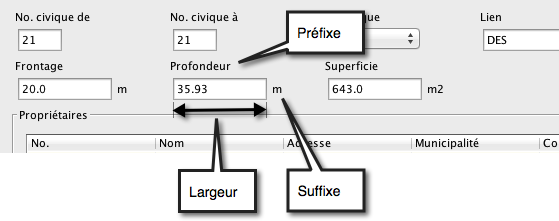
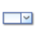

# Formulaires

Les formulaires sont utilisés dans JMap pour les requêtes par attributs afin de saisir les paramètres de recherche, pour la saisie des données attributaires des couches éditables et pour la gestion de données stockées dans des bases de données, toujours en relation avec les éléments d'une couche. Il existe aussi un type de formulaires appelé sous-formulaire, accessible à partir d'un autre formulaire.

L'administrateur JMap conçoit les formulaires à l'aide du designer de formulaires et les utilisateurs peuvent ensuite les utiliser dans les applications JMap Pro, Web, Mobile et Survey. Selon les permissions accordées, les utilisateurs pourront utiliser les formulaires de saisie de données pour visualiser, ajouter, modifier ou effacer des données. 

Pour la saisie des attributs des éléments d'une couche, si aucun formulaire n'est créé, JMap génère un formulaire par défaut. Il s'agit d'un formulaire simple qui présente tous les attributs disponibles. Il est généralement beaucoup plus avantageux de créer un formulaire adapté aux besoins.

Les sections suivantes expliquent en détails le processus de création des formulaires ainsi que la fonction de chaque type de formulaire.

  

## Designer de formulaires

L'interface de design de formulaires permet de définir le contenu et la disposition des formulaires utilisés pour la saisie d'attributs et les recherches.

Chaque formulaire est structuré sous la forme d'une grille dont le nombre de colonnes et de rangées est paramétrable. Il est possible d'ajouter ou d'insérer des rangées et des colonnes à tout moment. Toutes les rangées vides au bas du formulaire et toutes les colonnes vides à droite du formulaire seront éliminées automatiquement à la sauvegarde du formulaire.

Chaque cellule de la grille peut contenir une composante du formulaire (étiquette, champ de saisie de texte, liste de valeurs, etc.) mais chaque composante peut aussi s'étendre en largeur sur plusieurs cellules.

Chaque formulaire peut être composé d'une ou de plusieurs sections. L'utilisateur peut passer d'une section à l'autre dans le formulaire. Cela est particulièrement utile si le formulaire est long ou complexe. 

L'image suivante montre les principales parties du designer de formulaires.

|  |  |
| ----- | ------------------------------------------------------------ |
| **1** | Faites glisser une composante vers une cellule du formulaire. Toutes les cellules disponibles sont mise en surbrillance.  |
| **2** | Appuyez sur  pour créer une nouvelle section, pour effacer une section existante ou pour renommer une section.Appuyez sur pour réinitialiser tout le formulaire. |
| **3** | Accédez aux différentes sections à partir de ces onglets.    |
| **4** | Appuyez sur les boutons  et  pour insérer des rangées ou des colonnes vides aux endroits correspondants. |
| **5** | Le symbole  indique que la composante est en mode lecture seule. |
| **6** | Le symbole  indique que la valeur est requise. |
| **7** | Le bouton  permettent de modifier les paramètres de la composante. Le bouton  permet de supprimer la composante du formulaire. |

La plupart des composantes du formulaire doivent être associées soit à un attribut d'une couche, à un champ d'une base de données ou à un critère de recherche, selon le type de formulaire créé. Les exceptions sont les composantes Étiquette, Photo et Groupe.

### ==Paramètres des composantes - DOC-230, DOC-247, DOC-256==

Chaque type de composante possède sa propre fenêtre de paramètres. Ces paramètres permettent de contrôler le comportement et l'apparence de la composante. Le tableau suivant décrit certains paramètres qui sont communs à plusieurs composantes. Voir plus bas pour une description complète des composantes disponibles.

| **Paramètres des composantes de formulaire** |                                                              |
| -------------------------------------------- | ------------------------------------------------------------ |
| Attribut                                     | Sélectionnez l'attribut de la couche, ou la variable de la requête, auquel cette composante est associée. C'est cet attribut ou cette variable que la composante du formulaire va renseigner. |
| Requis                                       | Détermine si le champ est requis. L'utilisateur ne pourra pas soumettre le formulaire tant que tous les champs requis ne seront pas renseignés. Pour rendre certains champs optionnels, vous devez désélectionner cette option. Les champs requis sont identifiés par un  dans le designer de formulaires. |
| Lecture seule                                | Activez cette option pour que la composante soit en mode lecture seule. L'utilisateur ne pourra pas modifier le contenu. Cette option devrait être utilisée pour une composante ayant une valeur par défaut. |
| Étendu                                       | Par défaut, chaque composante n'occupe qu'une cellule. Pour une composante étendue en largeur sur plusieurs cellules, entrez le nombre de cellules sur lesquelles la composante doit s'étendre. Les cellules occupées par une composante étendue sont marquées Étendu. |
| Infobulle                                    | Ce texte est affiché dans une infobulle quand l'utilisateur survole cette composante avec le pointeur de la souris. |
| Étiquette (préfixe)                          | Entrez un texte statique à afficher en haut de la composante. |
| Étiquette (suffixe)                          | Entrez un texte statique à afficher à droite de la composante. |
| Largeur (pixels)                             | Spécifiez la largeur en pixels du champ de saisie de la composante, excluant l'étiquette en suffixe. La valeur par défaut est 100. La largeur de chaque colonne du formulaire prendra automatiquement la largeur de la composante la plus large. |
| Valeur par défaut                            | Optionnellement, entrez une valeur par défaut pour initialiser le champ de saisie. Il est possible d'utiliser certaines [fonctions](#Fonctions) pour initialiser la valeur par défaut d'une composante. |

Voici un exemple de disposition des composantes d'un formulaire :

Le tableau suivant décrit les différentes composantes disponibles pour la création des formulaires ainsi que leurs paramètres spécifiques. Notez que certaines composantes ne sont pas disponibles pour la création des requêtes par attributs.

| **Composantes de formulaires**                               |                                                              |
| ------------------------------------------------------------ | ------------------------------------------------------------ |
|  Étiquette                | Texte statique à afficher dans le formulaire. L'alignement du texte (gauche, droite, centre) peut être spécifié, de même que le style de la police de caractères pour l'affichage du texte. Il est possible d'utiliser certaines [fonctions](#Fonctions) dans le texte de l'étiquette. |
|  Texte                  | Champ de saisie d'une valeur alpha-numérique. Le champ associé doit être de type alphanumérique ou numérique. **Masque de saisie** : Un masque de saisie peut être utilisé afin de contrôler le format de la valeur saisie. **Multiligne** : (Champs alphanumériques seulement) Si cette option est activée, le champ de saisie sera affiché sur plusieurs lignes de texte, ce qui facilite la saisie de textes plus longs. **Nombre maximal de caractères** : (Champs alphanumériques seulement) Détermine la longueur maximale du texte qu'un utilisateur peut saisir. Cela doit respecter les contraintes du champ de la base de données qui contient les données. **Validation de la plage** : (Champs numériques seulement) Permet de définir une plage de valeurs acceptées (par ex. de 0 à 100). |
|  Liste (choix unique)  | Liste de valeurs dont seulement une valeur peut être sélectionnée. Le champ associé doit être de type alphanumérique ou numérique. Les valeurs de la liste peuvent être fournies dans plusieurs langues, si votre projet supporte plus d'une langue. La liste peut être **dynamique**, c'est-à-dire que son contenu peut être modifié dynamiquement en fonction de la sélection d'une valeur dans une autre liste. Par exemple, sur la sélection d'un pays dans une liste, une autre liste se rafraîchit dynamiquement pour afficher uniquement les villes du pays sélectionné.  **Attribut parent** Si la liste doit être dynamique, sélectionnez l'attribut parent. Pour lier la liste B (enfant) à la liste A (parent), vous devez d'abord sélectionner l'attribut parent pour la liste B (attribut associé à la liste A). Sur un changement de la valeur sélectionnée dans la liste A, le contenu de la liste B sera mis à jour. Les valeurs de la liste B sont déterminées par la relation entre ses valeurs et les valeurs de l'attribut parent. Si la liste B possède une seule valeur, celle-ci est sélectionnée automatiquement.  Les valeurs de la liste peuvent être entrées manuellement, provenir d'une base de données ou provenir d'une autre source : **Valeurs** Entrez les valeurs dans l'espace prévu en spécifiant pour chaque cas, la valeur parent (seulement si la liste est dynamique), la valeur à utiliser dans la base de données et l'étiquette à afficher dans la liste. C'est la valeur qui est utilisée comme donnée. L'étiquette ne sert que pour l'affichage à l'utilisateur. Dans le cas où la valeur et l'étiquette sont les mêmes, entrez la même valeur 2 fois. Si la liste n'est pas dynamique, laissez la valeur parent vide. **Obtenir valeurs d'une base de données** Vous devez sélectionner la base de données de laquelle vous souhaitez obtenir les valeurs. Ensuite, entrez une requête SQL qui sera exécutée pour obtenir les valeurs parent (seulement si la liste est dynamique), les valeurs et les étiquettes à afficher. Normalement, les étiquettes devraient être uniques et triées. Les exemples qui suivent utilisent la table MY_TABLE.   **Exemple** : Liste de pays, disponible en anglais et en français. Cette liste n'est pas dynamique. Elle est associée à un attribut COUNTRY.  `SELECT * FROM MY_TABLE WHERE ITEM_TYPE = 'Country' ORDER BY ITEM_VALUE;`  Dans cet exemple, le champ ITEM_VALUE contient la valeur, le champ ITEM_LABEL_EN contient le nom du pays en anglais et le champ ITEM_LABEL_FR contient le nom du pays en français. Il n'y a pas de valeur parent puisque la liste n'est pas dynamique (n'a pas de liste parent).  **Exemple** : Liste de villes, disponible en anglais et en français. Cette liste est dynamique. Son attribut parent est COUNTRY associé à la liste précédente. Elle présente la liste des villes pour le pays sélectionné dans la liste parent.  `SELECT * FROM MY_TABLE WHERE ITEM_TYPE = 'City' ORDER BY ITEM_VALUE;`  Dans cet exemple, le champ ITEM_VALUE contient la valeur, le champ ITEM_LABEL_EN contient le nom de la ville en anglais et le champ ITEM_LABEL_FR contient le nom de la ville en français. Le champ PARENT_VALUE contient la valeur parent.  **Attention** : Il est nécessaire que la requête SQL d'une liste enfant inclue le champ qui permet de faire la relation avec les valeurs parent. L'exemple précédent utilise select pour inclure tous les champs dans les requêtes.  **Note** : Parfois, les valeurs à présenter dans une liste proviennent d'une table associée à une source de données spatiales stockée dans la base de données System de JMap Server. Dans ces cas, il n'est pas possible de connaître le nom de la table physique. Pour palier à cette situation, vous pouvez utiliser une technique simple : au lieu du nom de la table, écrivez le nom de la source de données, entouré de symboles $.  **Exemple** :   SELECT DISTINCT ID_CITY, CITY FROM \$World cities\$ ORDER BY CITY  **Autre** Il est possible que d'autres sources soient disponibles pour fournir les valeurs et les étiquettes. Si c'est le cas, vous pouvez sélectionner cette option et choisir la source dans la liste des sources disponibles. |
|  Liste (choix multiples) | Liste de valeurs dont une ou plusieurs valeurs peuvent être sélectionnées. Le champ associé doit être de type alphanumérique. La valeur enregistrée dans le champ est la liste des choix sélectionnés, séparés par des virgules (,). Les valeurs de la liste peuvent être entrées manuellement, provenir d'une base de données ou d'une autre source. Voir **Liste (choix unique)** pour plus d'informations. |
|  Case à cocher         | Permet de renseigner le champ associé pour lequel il existe seulement 2 valeurs possibles. Les 2 valeurs possibles doivent être spécifiées et être des chaînes de caractères (p. ex. vrai ou faux) ou numériques (p.ex. 0 ou 1). Si le champ associé est de type booléen, vous devez obligatoirement utiliser les valeurs *true* et *false*. **Valeur (coché)** : Valeur à enregistrer si la case est cochée. **Valeur (non coché)** : Valeur à enregistrer si la case n'est pas cochée. |
|  Calendrier                | Permet de sélectionner une date. L'attribut de la couche, ou le champ utilisé pour la requête, doit être de type date, datetime ou timestamp. **Format de date** : C'est le format dans lequel la composante calendrier affichera la date sélectionnée. Si l'utilisateur saisit la date manuellement, il devra aussi utiliser ce format (p. ex. dd/MM/yyyy, yy/MM/dd H:ss, etc.). |
|  Photo (Non disponible pour les formulaires de requêtes par attributs) | ==Cette composante permet à l'utilisateur d'insérer des images dans un formulaire et dans un sous-formulaire. Elle permet à l'utilisateur de JMap Survey de prendre des photos avec la caméra intégrée à l'appareil. Elle permet à l'utilisateur de JMap Pro ou de JMap Web de sélectionner des images existantes et de les insérer dans le formulaire ou dans le sous-formulaire. Cette composante ne peut pas être présente plus d'une fois dans un même formulaire ou sous-formulaire. ==Pour un formulaire des attributs d'une couche, les photos peuvent être stockées dans la base de données System de JMap Server (aucune configuration n'est alors requise) ou dans une base de données externe. Lorsque que cette composante est ajoutée à un formulaire de base de données, les photos doivent être stockées dans une base de données externe. Vous devez alors définir tous les paramètres requis pour le stockage des photos.  **Stockage des photos** : Choisissez l'option JMap pour stocker les photos dans la base de données System de JMap (seulement disponible pour les formulaires des attributs d'une couche). Les photos sélectionnées par les utilisateurs sont copiées dans le répertoire *JMAP_HOME\db\documents*, et la relation entre l'élément de la couche et la photo est ajoutée à la table JMAP_DOCUMENTS de la base de données System.  Choisissez l'option **Externe** pour le stockage dans la base de données ou le répertoire de votre choix. La relation entre l'élément de la couche et la photo est stockée dans la table et la base de données de votre choix. Si vous choisissez **Externe**, vous devez spécifier l'ensemble de la configuration qui suit. **Effacer les photos avec l'élément** : Sélectionnez cette option pour que les photos associées à un élément soient supprimées automatiquement si l'élément est effacé. Cette option n'est pas activée par défaut. **Base de données**: Sélectionnez la base de données où les photos doivent être stockées. Cette base de données doit être préalablement configurée dans JMap Admin. **Table** : Sélectionnez la table qui va contenir les informations sur les photos. Cette table doit avoir la structure suivante. Le nom de la table et les noms des champs peuvent varier.  Le champ de type BLOB n'est pas requis si le stockage des photos se fait sur disque et non dans la base de données. Voir l'option **Persistance des photos** pour plus de détails. **Champ ID de photo** : Sélectionnez le champ de la table qui contiendra l'identifiant numérique unique de la photo. **Champ ID de l'élément** : Sélectionnez le champ de la table qui contiendra l'attribut identifiant de l'élément de la couche. Cet attribut s'appelle l'attribut clé et est sélectionné lors de la création de la source de données spatiales associée à la couche. **Champ du nom du fichier** : Sélectionnez le champ de la table qui contiendra le nom du fichier des photos. ==**Champ titre de la photo** : Sélectionnez le champ de la table qui contiendra le titre de la photo.  **Champ commentaire de la photo** : Sélectionnez le champ de la table qui contiendra le commentaire de la photo. Ce champ contient 255 caractères. ==**Persistance des photos** : Choisissez l'option **Base de données** pour enregistrer les photos directement dans la base de données, dans un champ de type BLOB présent dans la table. Vous devez alors sélectionner le champ de type BLOB. Choisissez l'option **Disque** pour enregistrer les images dans un dossier du système de fichiers du serveur. Vous devez alors entrer le **dossier des photos** qui contiendra les fichiers des photos.  ==**Note** : Les champs **Titre de la photo** et **Commentaire de la photo** sont des nouveautés de JMap 7 Istanbul. Si vous mettez à jour votre serveur JMap 7 Hanoï à JMap 7 Istanbul, pour permettre aux utilisateurs des applications JMap d'ajouter un titre et un commentaire aux photos vous devez éditer les formulaires pour sélectionner les champs de la table qui contiendront le titre et le commentaire des photos respectivement.== |
|  Arbre                     | Cette composante présente une arborescence de valeurs à N niveaux. L'utilisateur peut sélectionner une valeur dans l'arbre, feuille ou branche. Cette valeur sera stockée dans l'attribut associé. L'attribut associé doit être de type alphanumérique. Les valeurs de l'arbre peuvent être fournies dans plusieurs langues, si votre projet supporte plus d'une langue. L'arbre présente une structure de données parent-enfant, tout comme les listes dynamiques liées entre elles. Par contre, contrairement aux listes dynamiques, l'arbre est associé à un seul attribut. Les valeurs de l'arbre peuvent être entrées manuellement, provenir d'une base de données ou provenir d'une autre source : **Valeurs** Entrez les valeurs dans l'espace prévu en construisant la structure de l'arbre. Pour chaque valeur entrée, vous pouvez définir son parent (ou la racine de l'arbre). **Obtenir valeurs d'une base de données** Vous devez sélectionner la base de données de laquelle vous souhaitez obtenir les valeurs. Ensuite, entrez une requête SQL qui sera exécutée pour obtenir les valeurs à partir d'une table avec relation parent-enfant. L'exemple qui suit utilise la table MY_TABLE.   **Exemple** : Arbre contenant des pays (niveau 1) et des villes (niveau 2), disponible en anglais et en français.  `SELECT * FROM MY_TABLE;`  Dans cet exemple, le champ ITEM_VALUE contient la valeur, le champ ITEM_LABEL_EN contient le nom du pays ou de la ville en anglais et le champ ITEM_LABEL_FR contient le nom du pays ou de la ville en français. Le champ PARENT_VALUE contient le parent. Avec cette configuration, JMap va construire l'arbre suivant :  |
|  Table (Non disponible pour les formulaires de requêtes par attributs) | Permet de gérer des données provenant de bases de données pour lesquelles il existe une relation 1 à N avec les éléments de la couche.  **Exemple** : Une couche de points représente des bornes incendies dans JMap (Assets) et une base de données contient des données sur les inspections réalisées sur ces bornes incendies. Pour chaque borne incendie, il peut y avoir 0, 1 ou plusieurs inspections réalisées. Dans le formulaire des attributs de la couche de bornes incendies (formulaire Assets ), la table permet d'afficher les données d'inspection relatives à une borne incendie, où chaque ligne de la table correspond à une inspection. Selon les permissions accordées, la table permet aussi d'ajouter, de modifier et d'effacer des données d'inspection. Des sous-formulaires peuvent être imbriqués dans un formulaire ou un sous-formulaire. Dans l'exemple, chaque inspection peut avoir 0, 1, ou plusieurs interventions associées. La table dans ce cas, permet d'afficher les données des interventions effectuées lors de chaque inspection.  La table est toujours associée à un sous-formulaire. Ce sous-formulaire définit la manière en que se fait l'accès aux données externes et permet d'en faire la saisie. **Le sous-formulaire doit être préalablement créé avant de pouvoir configurer la table.** **Sous-formulaire** : Sélectionnez un sous-formulaire existant qui permettra de renseigner les valeurs liées à la table. **Champs** : Permet de gérer les champs affichés dans la table. Ces champs sont ceux du sous-formulaire associé à la table. Il est possible de modifier le titre des champs, leur ordre d'affichage, ainsi que leur visibilité dans la table. Il est possible aussi de modifier le format des champs de type numérique et date. Les paramètres de la table permettent de définir les champs des données externes qui seront visibles dans la table et leur ordre.  La figure suivante illustre le desing du formulaire Assets avec la composante Table qui permet d'afficher les données d'inspections, saisies au moyen du sous-formulaire Inspections.    La figure suivante illustre le design du sous-formulaire Inspections avec les composantes Table qui permettent d'afficher les données des interventions et des inspecteurs, saisies au moyen des sous-formulaires imbriqués Interventions et Inspectors.   Pour plus d'information sur l'utilisation des données externes avec les formulaires de JMap, consultez la section [Formulaires de bases de données](#Formulaires de base de données). |
|  Groupe              | Cette composante sert à grouper ensemble des composantes du formulaire. Un cadre avec titre sera dessiné autour des composantes appartenant au même groupe. Insérez cette composante dans une cellule d'une rangée vide pour débuter un nouveau groupe. Cette composante s'étend automatiquement sur toutes les cellules de la rangée. Elle ne peut pas être insérée sur une rangée qui comporte déjà d'autres composantes. |

#### Fonctions

Certaines fonctions permettent d'initialiser les composantes des formulaires. En voici la liste.

| **Fonctions** |                                                    |
| ------------- | -------------------------------------------------- |
| username()    | Remplacé par le code utilisateur de l'utilisateur. |
| fullname()    | Remplacé par le nom complet de l'utilisateur.      |
| date()        | Remplacé par la date courante.                     |
| datetime()    | Remplacé par la date et l'heure courantes.         |

 

Les sections suivantes décrivent les étapes de création des formulaires et sous-formulaires. Les exemples cités font référence aux tables de la figure suivante :

## Formulaires des attributs d'une couche

Ces formulaires sont utilisés pour saisir les valeurs des attributs d'une couche éditable. Il ne peut y avoir qu'un seul formulaire de saisie des attributs par couche. L'utilisateur doit posséder les permissions nécessaires pour modifier les valeurs des attributs d'une couche. Voir la section [Permissions des couches](06 Couches.md) pour plus d'informations à ce sujet.

### Création d'un formulaire des attributs de la couche

Pour créer un formulaire de saisie des attributs d'une couche, sélectionnez **Formulaires** dans le menu des paramètres de la couche. Appuyez ensuite sur **Créer**.

Entrez un nom pour le nouveau formulaire. Vous devez ensuite choisir le type de formulaire à créer, **Attributs de la couche**, et appuyer sur **Sauvegarder**.

Sélectionnez ensuite **Disposition du formulaire** dans le menu **Paramètres** pour ouvrir le designer de formulaires et ajouter des composantes. Chaque composante du formulaire doit être associée à un attribut de la couche. La composante présente la valeur de l'attribut et la valeur est mise à jour quand l'utilisateur ferme le formulaire et sauvegarde les modifications. Voir [Designer de formulaires](#Designer de formulaires) pour plus d'informations.

*Le formulaire des attributs de la couche sert à gérer uniquement les attributs qui sont disponibles dans la source de données spatiales et liés à la couche.*

## Formulaires de base de données

Les formulaires de bases de données sont utilisés pour gérer des données stockées dans des bases de données. Ils permettent de modifier les données existantes, d'ajouter des nouvelles données et d'effacer des données. Il est possible de créer plusieurs formulaires de bases de données pour une même couche. Chaque formulaire de bases de données comporte ses propres permissions pour contrôler quels utilisateurs peuvent modifier les données.

Ces formulaires peuvent être utilisés pour gérer des données avec une relation **1 à 1** avec les données d'une couche. Dans ce cas, un enregistrement est ajouté quand un élément est créé, et l'enregistrement est normalement effacé quand l'élément est effacé.

Ils peuvent aussi être utilisés pour gérer des données avec une relation **1 à N** avec les données de la couche. Dans ce cas, le formulaire est un type spécial appelé **sous-formulaire** et est toujours associé avec une composante table d'un formulaire. Voir [sous-formulaires](#Création d'un sous-formulaire) pour plus d'information à ce sujet.

La configuration de ce type de formulaires est une fonction avancée de JMap et nécessite l'écriture de requêtes SQL pour l'extraction, l'ajout, la modification et l'effacement des données.

*Les formulaires de bases de données servent à gérer les données externes à JMap qui sont en relation avec les données de la couche au moyen d'un champ commun.*

### Création d'un formulaire de base de données

Pour créer un formulaire de bases de données, sélectionnez **Formulaires** dans le menu des paramètres de la couche. Assurez-vous d'ouvrir l'onglet **Formulaire** et appuyez ensuite sur **Créer**.

Vous devez entrer un nom pour le nouveau formulaire. Vous devez ensuite choisir le type **Base de données**, et sélectionner la base de données qui contient les données à utiliser dans les formulaires.

À l'étape suivante, une fenêtre permet d'entrer les requêtes SQL du formulaire. Ces requêtes servent à extraire, ajouter, modifier et effacer des données. La requête SELECT est obligatoire tandis que les autres sont optionnelles. ==Les utilisateurs des applications JMap peuvent effectuer seulement les opérations pour lesquelles vous fournissez une requête SQL.== 

La configuration des requêtes SQL utilise une syntaxe spécialisée. En règle générale, chaque ligne de cette syntaxe doit se terminer par un point-virgule (;). La syntaxe n'est pas sensible à la casse.

Le tableau suivant explique en détails le fonctionnement de cette syntaxe.

| **Syntaxe pour les formulaires de base de données**        |                                                              |
| ---------------------------------------------------------- | ------------------------------------------------------------ |
| **ev(attrib)** ou **elementValue(attrib)**                 | Fonction qui retourne la valeur de l'attribut spécifié en paramètre, pour un élément.  **Exemple** : `ev(city)`  Retourne la valeur de l'attribut *city* de l'élément. |
| **fv(field)** ou **formValue(field)**                      | Fonction qui retourne la valeur présente dans le formulaire, pour le champ spécifié en paramètre. Le nom du champ doit obligatoirement comporter le nom de la table en préfixe.  **Exemple** : `fv(table.name)`  Retourne la valeur saisie dans la composante du formulaire associée au champ TABLE.NAME de la base de données. |
| **ei()** ou **elementId()**                                | Cette fonction retourne l’identifiant de l’élément. Il peut s’agir du champ jmap_id ou d’un autre champ, tel que configuré dans la source de données spatiales. |
| **$*variable***                                            | Permet de créer et d'initialiser des variables qui peuvent ensuite être utilisées dans les différentes expressions. Dans le cas de la requête INSERT d'un formulaire, il est obligatoire de créer une variable qui contient l'identifiant unique de l'enregistrement inséré.  **Exemple** : `$city = EV(city);`  Crée une variable \$city initialisée avec la valeur de l'attribut CITY de l'élément. |
| **nti(*table*, field)** ou **nextTableId(*table*, field)** | Fonction qui retourne la prochaine valeur à utiliser comme identifiant numérique pour la table et le champ spécifiés en paramètres. ==Le champ spécifié doit exister dans la table spécifiée, et doit être un champ numérique de type entier.== La fonction détermine la valeur maximale présente dans la table et retourne cette valeur incrémentée de 1 (max + 1). Cette fonction est utile lors de l'ajout d'un nouvel enregistrement dans la base de données quand la table comporte un identifiant numérique unique.  **Exemple** : `$id = nextTableId(inspections, inspection_id);`  Crée et initialise une variable $id avec la valeur du prochain identifiant INSPECTION_ID de la table INSPECTIONS. Si la valeur maximale présente est 100, la valeur retournée est 101. |

| **Propriétés du formulaire**   |                                                              |
| ------------------------------ | ------------------------------------------------------------ |
| Base de données                | Sélectionnez la base de données contenant les données qui doivent être gérées par le formulaire. |
| Requête SELECT                 | Requête SQL qui obtient les données pour peupler les champs du formulaire. Tous les champs qui sont retournés par cette requête peuvent être utilisés pour la configuration des composantes du formulaire et aussi à l'intérieur des autres requêtes définies dans le formulaire en utilisant la fonction fv(). La requête doit comporter une condition pour faire la liaison entre un attribut de la couche et un champ de la base de données.  **Exemple de requête pour un formulaire de base de données (1 à 1)** :   `SELECT * FROM ASSET_INFO WHERE ASSET_ID = EI();`  Dans cet exemple, tous les champs de la table ASSET_INFO sont obtenus et disponibles pour la configuration des composantes du formulaire. Le champ ASSET_ID est utilisé pour faire la liaison avec l'élément de la couche ASSETS en utilisant la fonction ei(). Si la fonction ei() retourne une valeur en format texte, pour visualiser la valeur vous devez entourer l'expression d'apostrophes :  `SELECT * FROM ASSET_INFO WHERE ASSET_ID = 'EI()';`  **Exemple de requête pour un formulaire de base de données  (1 à N)** :  Exemple sous-formulaire Inspections :   `SELECT * FROM INSPECTION WHERE ASSET_ID = EI();`  Dans cet exemple, tous les champs de la table INSPECTION sont obtenus et disponibles pour la configuration des composantes du sous-formulaire. Le champ ASSET_ID est utilisé pour faire la liaison avec l'élément de la couche ASSETS en utilisant la fonction ei().   Si la fonction ei() retourne une valeur en format texte, pour visualiser la valeur vous devez entourer l'expression d'apostrophes :  `SELECT * FROM INSPECTION WHERE ASSET_ID = 'EI()';`  Exemple sous-formulaire imbriqué Inspectors :   `SELECT * FROM INSPECTOR WHERE INSPECTION_ID = FV(INSPECTION_ID);`  Dans cet exemple, tous les champs de la table INSPECTOR sont obtenus et disponibles pour la configuration des composantes du sous-formulaire. Le champ INSPECTION_ID est utilisé pour faire la liaison avec l'élément de la table INSPECTION en utilisant la fonction fv(field).  Exemple sous-formulaire imbriqué Interventions :   `SELECT * FROM INTERVENTION WHERE INSPECTION_ID = FV(INSPECTION_ID);`  Dans cet exemple, tous les champs de la table INTERVENTION sont obtenus et disponibles pour la configuration des composantes du sous-formulaire. Le champ INSPECTION_ID est utilisé pour faire la liaison avec l'élément de la table INSPECTION en utilisant la fonction fv(field).  |
| Champ d'identifiant            | La requête SELECT doit obligatoirement inclure un champ d'identification unique (numérique ou alphanumérique). Sélectionner le champ qui doit servir d'identifiant unique. Exemple requête formulaire de base de données (1 à 1) : ASSET_INFO.ASSET_ID Exemple requête formulaire de base de données (1 à N) sous-formulaire Inspections : INSPECTION.INSPECTION_ID Exemple requête formulaire de base de données (1 à N) sous-formulaire imbriqué Inspectors : INSPECTOR.INSPECTOR_ID Exemple requête formulaire de base de données (1 à N) sous-formulaire imbriqué Interventions : INTERVENTION.INTERVENTION_ID |
| Requête INSERT                 | Requête SQL qui fait l'insertion de nouvelles données dans la base de données. Configurez cette requête uniquement si le formulaire doit permettre l'ajout d'enregistrements à la base de données. Il est obligatoire de définir une variable qui contient la valeur de l'identifiant unique pour le nouvel enregistrement.  **Exemple de requête pour un formulaire de base de données (1 à 1)** :   `$id = ei(); INSERT INTO ASSET_INFO (ASSET_ID, ASSET_YEAR, BRAND, ASSET_HEIGHT) VALUES (EI(), FV(ASSET_INFO.ASSET_YEAR), FV(ASSET_INFO.BRAND), FV(ASSET_INFO.ASSET_HEIGHT));`  Dans cet exemple, les données du formulaire sont insérées dans la table ASSET_INFO lors de l'exécution de la requête SQL de type INSERT. Les valeurs des champs ASSET_INFO.ASSET_YEAR, ASSET_INFO.BRAND et ASSET_INFO.ASSET_HEIGHT proviennent des valeurs saisies dans le formulaire par l'utilisateur en utilisant la fonction fv(field). La valeur de la variable ASSET_INFO.ASSET_ID provient de la fonction ei().   **Exemple de requête pour un formulaire de base de données  (1 à N)** :   Exemple sous-formulaire Inspections :  `$id = nti(INSPECTION, INSPECTION_ID);  INSERT INTO INSPECTION (INSPECTION_ID, ASSET_ID, INSP_DATE, INSP_COMMENT) VALUES ($id, EI(), FV(INSPECTION.INSP_DATE), FV(INSPECTION.INSP_COMMENT));`  Dans cet exemple une variable \$id est créée et initialisée avec la prochaine valeur (max + 1) du champ ID de la table INSPECTION. Les données du formulaire sont insérées dans la table INSPECTION lors de l'exécution de la requête SQL de type INSERT. Les valeurs des champs INSP_DATE et  INSP_COMMENT proviennent des valeurs saisies dans le sous-formulaire par l'utilisateur en utilisant la fonction fv(field). La valeur du champ INSPECTION_ID provient de la variable \$id. La valeur du champ  ASSET_ID provient de la fonction ei().   Exemple sous-formulaire imbriqué Inspectors :  `$id = nti(INSPECTOR, INSPECTOR_ID);  INSERT INTO INSPECTOR (INSPECTOR_ID, INSPECTION_ID, CONTACT_INFO, TEAM) VALUES ($id, FV(INSPECTOR.INSPECTION_ID), FV(INSPECTOR.CONTACT_INFO), FV(INSPECTOR.TEAM));`  Dans cet exemple une variable \$id est créée et initialisée avec la prochaine valeur (max + 1) du champ ID de la table INSPECTOR. Les données du formulaire sont insérées dans la table INSPECTOR lors de l'exécution de la requête SQL de type INSERT. Les valeurs des champs INSPECTION_ID, CONTACT_INFO et  TEAM proviennent des valeurs saisies dans le sous-formulaire par l'utilisateur en utilisant la fonction fv(field). La valeur du champ INSPECTOR_ID provient de la variable \$id.  Exemple sous-formulaire imbriqué Interventions :  `$id = nti(INTERVENTION, INTERVENTION_ID);  INSERT INTO INTERVENTION (INTERVENTION_ID, INSPECTION_ID, WORK_ORDER, FOLLOW_UP) VALUES ($id, FV(INSPECTION_ID), FV(INTERVENTION.WORK_ORDER), FV(INTERVENTION.FOLLOW_UP));`  Dans cet exemple une variable \$id est créée et initialisée avec la prochaine valeur (max + 1) du champ ID de la table INTERVENTION. Les données du formulaire sont insérées dans la table INTERVENTION lors de l'exécution de la requête SQL de type INSERT. Les valeurs des champs INSPECTION_ID, WORK_ORDER et  FOLLOW_UP proviennent des valeurs saisies dans le sous-formulaire par l'utilisateur en utilisant la fonction fv(field). La valeur du champ INTERVENTION_ID provient de la variable \$id.  |
| Valeur de l'identifiant unique | Sélectionnez la variable qui contient la valeur de l'identifiant unique du nouvel enregistrement inséré dans la table. Celle-ci doit être définie avec la requête INSERT. ==Pour que vos données s'enregistrent dans la base de données (les photos, par exemple), vous devez définir et sélectionner cette variable (DOC-256).==  Exemple requête formulaire de base de données (1 à 1) : \$id Exemple requête formulaire de base de données (1 à N) sous-formulaire Inspections : \$id Exemple requête formulaire de base de données (1 à N) sous-formulaire imbriqué Inspectors : \$id Exemple requête formulaire de base de données (1 à N) sous-formulaire imbriqué Interventions : \$id |
| Requête UPDATE                 | Requête SQL qui fait la mise à jour des données dans la base de données. Configurez cette requête uniquement si le formulaire doit permettre les mises à jour des données. **Exemple de requête pour un formulaire de base de données (1 à 1)** :    `UPDATE ASSET_INFO SET ASSET_YEAR = FV(ASSET_INFO.ASSET_YEAR), BRAND = FV(ASSET_INFO.BRAND), ASSET_HEIGHT = FV(ASSET_INFO.ASSET_HEIGHT) WHERE ASSET_ID = FV(ASSET_INFO.ASSET_ID);`  Dans cet exemple les données du formulaire sont utilisées pour mettre à jour la table ASSET_INFO lors de l'execution de la requête SQL de type UPDATE. Les valeurs des champs ASSET_YEAR, BRAND et ASSET_HEIGHT proviennent des valeurs saisies dans le formulaire par l'utilisateur en utilisant la fonction fv(field). La clause WHERE permet de mettre à jour l'enregistrement qui contient l'identifiant unique de l'élément, ASSET_ID, en utilisant aussi la fonction fv(field).  **Exemple de requête pour un formulaire de base de données  (1 à N)** :  Exemple sous-formulaire Inspections :  `UPDATE INSPECTION SET INSP_DATE = FV(INSPECTION.INSP_DATE), INSP_COMMENT = FV(INSPECTION.INSP_COMMENT) WHERE INSPECTION_ID = FV(INSPECTION.INSPECTION_ID);`  Dans cet exemple les données du sous-formulaire sont utilisées pour mettre à jour la table INSPECTION lors de l'exécution de la requête SQL de type UPDATE. Les valeurs des  champs INSP_DATE et INSP_COMMENT sont mises à jour et elles proviennent des valeurs saisies dans le formulaire par l'utilisateur en utilisant la fonction fv(field). La clause WHERE utilise la fonction fv(field) pour obtenir la valeur de l'identifiant unique de l'enregistrement.   Exemple sous-formulaire imbriqué Inspectors :  `UPDATE INSPECTOR SET CONTACT_INFO = FV(INSPECTOR.CONTACT_INFO), TEAM = FV(INSPECTOR.TEAM) WHERE INSPECTOR_ID = FV(INSPECTOR.INSPECTOR_ID);`  Dans cet exemple les données du sous-formulaire sont utilisées pour mettre à jour la table INSPECTOR lors de l'exécution de la requête SQL de type UPDATE. Les valeurs du  champ CONTACT_INFO est mise à jour et elle provient de la valeur saisie dans le formulaire par l'utilisateur en utilisant la fonction fv(field). La clause WHERE utilise la fonction fv(field) pour obtenir la valeur de l'identifiant unique de l'enregistrement.  Exemple sous-formulaire imbriqué Interventions :  `UPDATE INTERVENTION SET WORK_ORDER = FV(INTERVENTION.WORK_ORDER), FOLLOW_UP = FV(INTERVENTION.FOLLOW_UP) WHERE INTERVENTION_ID = FV(INTERVENTION.INTERVENTION_ID);`  Dans cet exemple les données du sous-formulaire sont utilisées pour mettre à jour la table INTERVENTION lors de l'exécution de la requête SQL de type UPDATE. Les valeurs des  champs WORK_ORDER et FOLLOW_UP sont mises à jour et elles proviennent de la valeur saisie dans le formulaire par l'utilisateur en utilisant la fonction fv(field). La clause WHERE utilise la fonction fv(field) pour obtenir la valeur de l'identifiant unique de l'enregistrement. |
| Requête DELETE                 | Requête SQL qui fait l'effacement des données dans la base de données. Configurez cette requête uniquement si le formulaire doit permettre d'effacer des données.  **Exemple de requête pour un formulaire de base de données (1 à 1)** :    `DELETE FROM ASSET_INFO WHERE ASSET_ID = FV(ASSET_INFO.ASSET_ID);`  Dans cet exemple l'enregistrement correspondant à la valeur de l'attribut ASSET_ID de l'élément est effacé de la table ASSET_INFO, en utilisant la fonction fv(field) pour obtenir la valeur de l'identifiant de l'élément-->.  **Exemple de requête pour un formulaire de base de données  (1 à N)** :  Exemple sous-formulaire Inspections :  `DELETE FROM INSPECTION WHERE INSPECTION_ID = FV(INSPECTION.INSPECTION_ID); DELETE FROM INTERVENTION WHERE INSPECTION_ID = FV(INSPECTION.INSPECTION_ID); DELETE FROM INSPECTOR WHERE INSPECTION_ID = FV(INSPECTION.INSPECTION_ID);`  Dans cet exemple l'enregistrement correspondant à l'identifiant unique de l'inspection est effacé de la table en utilisant la fonction fv(field) pour obtenir la valeur de l'identifiant. Les enregistrements des sous-formulaires imbriqués INTERVENTION et INSPECTOR correspondant à l'identifiant unique de l'inspection sont aussi effacés de la table lorsque l'inspection est effacée.  Exemple sous-formulaire imbriqué Inspectors :  `DELETE FROM INSPECTOR WHERE INSPECTOR_ID = FV(INSPECTOR.INSPECTOR_ID);`  Dans cet exemple, l'enregistrement correspondant à l'identifiant unique de l'inspecteur est effacé de la table, en utilisant la fonction fv(field) pour obtenir la valeur de l'identifiant.  Exemple sous-formulaire imbriqué Interventions :  `DELETE FROM INTERVENTION WHERE INTERVENTION_ID = FV(INTERVENTION.INTERVENTION_ID);`  Dans cet exemple, l'enregistrement correspondant à l'identifiant unique de l'intervention est effacé de la table, en utilisant la fonction fv(field) pour obtenir la valeur de l'identifiant. |

## ==Sous-formulaires==

Les sous-formulaires sont des formulaires de base de données qui sont ouverts à partir d'une composante Table présente dans un autre formulaire. Ils servent normalement à gérer des données qui ont une relation 1 à N avec les éléments de la couche. Ils pourraient servir, par exemple, pour la gestion des données d'inspection sur des actifs (N inspections peuvent être associées au même objet). Ils se configurent de manière similaire aux autres formulaires de base de données.

### Création d'un sous-formulaire

Pour créer un sous-formulaire, sélectionnez **Formulaires** dans le menu des paramètres de la couche. Assurez-vous d'ouvrir l'onglet **Sous-formulaire** et appuyez ensuite sur **Créer**. Vous devez entrer un nom pour le nouveau formulaire et sélectionner la base de données qui contient les données à utiliser dans les formulaires.

À l'étape suivante, vous devez configurer les requêtes SQL du sous-formulaire, tel qu'expliqué plus haut pour la création d'un formulaire de base de données.

*Les sous-formulaires sont des formulaires de base de données qui servent à gérer des données en relation 1 à N avec les données de la couche au moyen d'un champ commun.* 

### ==DOC-251 Sous-formulaires imbriqués==

Plusieurs niveaux de sous-formulaires peuvent être imbriqués dans un sous-formulaire. lls servent à gérer des données qui ont une relation 1 à N avec les enregistrements du sous-formulaire. Ils peuvent servir, par exemple, pour la gestion des données des interventions qui découlent d'une inspection effectué à un actif (N interventions peuvent être associées à 1 inspection). Un sous-formulaire imbriqué est ouvert à partir d'une composante Table présente dans le sous-formulaire auquel il se ratache.
La création d'un sous-formulaire imbriqué suit les même étapes de la [création d'un sous-formulaire](#Création d'un sous-formulaire). Des exemples des requêtes sont présentés dans le tableau de la section [Création d'un formulaire de base de données](#Création d'un formulaire de base de données).

*Les sous-formulaires imbriqués sont des formulaires de base de données qui servent à gérer des données en relation 1 à N avec les données d'un sous-formulaire au moyen d'un champ commun.* 

La figure présente un aperçu des sous-formulaires imbriqués de l'exemple dans l'application JMap Pro.

## Permissions des formulaires de base de données

Les formulaires de base de données comportent leurs propres permissions. Les permissions disponibles sont décrites dans le tableau suivant.

| **Permissions des formulaires** |                                                              |
| ------------------------------- | ------------------------------------------------------------ |
| Ajouter des données             | Permet à un utilisateur ou à un groupe d'utiliser le formulaire pour ajouter de nouvelles données dans la base de données. |
| Modifier des données            | Permet à un utilisateur ou à un groupe d'utiliser le formulaire pour modifier des données existantes dans la base de données. |
| Effacer des données             | Permet à un utilisateur ou à un groupe d'utiliser le formulaire pour effacer des données existantes dans la base de données. |

 

## Formulaires de requêtes par attributs

Tout comme les formulaires d'édition de données, les formulaires utilisés pour les requêtes par attributs sont créés en utilisant le designer de formulaires. Ces formulaires sont utilisés par les utilisateurs pour saisir les paramètres des requêtes. Chaque composante du formulaire est donc associée à un paramètre de la requête (`$param1`, `$param2`, etc.).

Contrairement aux autres types de formulaires, ils ne peuvent pas être divisés en sections. Aussi, les composantes **Photo** ne sont pas disponibles pour ce type de formulaires.

Ces formulaires sont créés lors de la configuration des requêtes par attributs, en appuyant sur **Disposition du formulaire**.

Lors de la création d'un formulaire de requête par attributs, il est important de tenir compte des paramètres qui sont requis et de ceux qui sont optionnels dans la définition de la requête. Par exemple, si une composante du formulaire n'a pas l'option **Requis** d'activée, la requête doit prévoir que le paramètre en question est optionnel. Consultez [Création de requêtes par attributs](05 Projets.md) pour plus d'information sur les paramètres optionnels dans les requêtes. 

