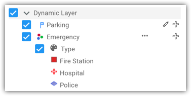
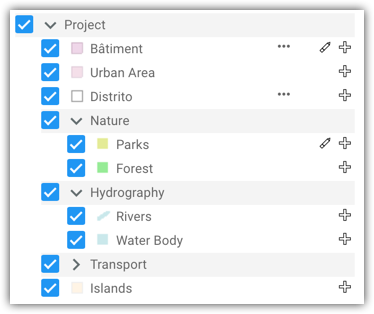
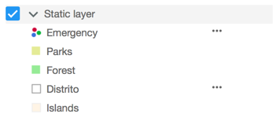
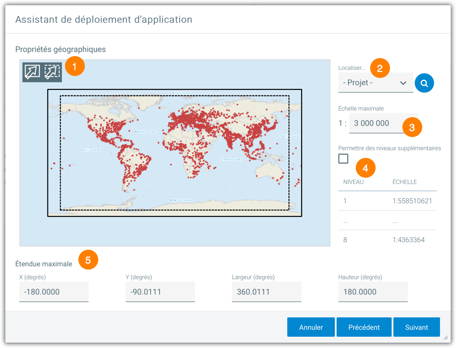
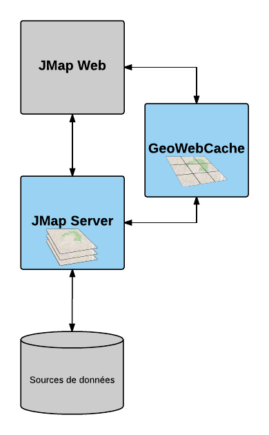
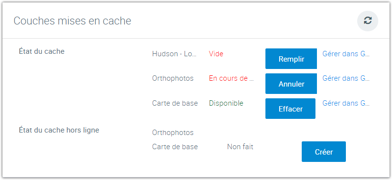

# Déploiement d'applications JMap

Le déploiement d'une application JMap consiste à préparer une application et à la mettre en ligne pour qu'elle soit accessible par les utilisateurs. Vous devez sélectionner les options souhaitées (type d'application, extensions activées, contrôle d'accès, etc.) afin de personnaliser l'application selon vos besoins. Pour qu'un utilisateur puisse ouvrir une application JMap déployée, il suffit de lui donner l'URL de l'application.

Les applications JMap déployées sont mises en ligne dans le serveur web intégré à JMap Server mais peuvent aussi être copiées manuellement vers d'autres serveurs web.

La section de déploiement montre une liste des applications déjà déployées.

## Création d'un nouveau déploiement

Pour créer un nouveau déploiement d'application, appuyez sur le bouton **Créer** depuis la section des déploiements. Certains paramètres sont communs à tous les types d'applications. Les tableaux suivants décrivent ces paramètres.

| **Modèle**         |                                                              |
| ------------------ | ------------------------------------------------------------ |
| Type d'application | ==Il existe quatre types d'applications JMap qui doivent être déploiées==. Chaque type d'application offre des caractéristiques différentes, adaptées à différents besoins. Des modèles d'applications personnalisés peuvent aussi être ajoutés. Il peut s'agir de variantes des types offerts par défaut. **Applications JMap Pro** : Ce type d'application JMap offre des fonctionnalités avancées. Il nécessite davantage de ressources informatiques de même que l'installation d'un environnement d'exécution Java (Java n'est plus requis si vous utilisez le mode de déploiement avec programme d'installation). **Applications JMap Web** : Ce type d'application JMap est plus léger et est exécuté dans des navigateurs web et web mobile. Il offre moins de fonctionnalités avancées que les applications JMap Pro. **Service WFS** : Ce type d'application est un service web de données vectorielles destiné à fournir des données à des applications tierces au travers du protocole normalisé Web Feature Service. **Service WMS** : Ce type d'application est un service web de productions d'images de cartes destiné à fournir des cartes à des applications tierces au travers du protocole normalisé Web Mapping Service. |

| **Identification**    |                                                              |
| --------------------- | ------------------------------------------------------------ |
| Nom                   | Entrez un nom pour la nouvelle application déployée. Les noms doivent être uniques. Le nom peut contenir des espaces et n'importe quel autre caractère. |
| Type                  | Sélectionnez le type de déploiement local ou externe. **Local** : Le service de l'application sera déployé directement dans JMap Server. **Externe** : Sélectionnez cette option pour des applications qui doivent être déployées sur un serveur web externe à JMap Server. Le service de l'application ne sera pas déployé dans JMap Server. À la place, un fichier .war est créé. Ce fichier doit être copié sur le serveur web externe. Un bouton **Télécharger** dans la section du déploiement permet de télécharger le fichier .war. |
| Protocole             | Le protocole à utiliser pour les communications entre l'application JMap et JMap Server. Choisissez **HTTPS** pour des communications sécurisées. Si le protocole HTTPS n'est pas configuré dans JMap Server, cette option n'est pas disponible. Pour plus d'information sur l'utilisation du protocole HTTPS, consultez la section [Utilisation de HTTPS avec JMap](10 Sécurité.md). |
| Hôte de l'application | Le nom d'hôte ou l'adresse IP qui fera partie de l'URL de l'application déployée. Si votre serveur comporte plusieurs adresses IP, entrez celle qui doit être utilisée. Si vous avez sélectionné le type de déploiement externe, assurez-vous d'entrer le nom ou l'adresse du serveur web externe où l'application sera déployée. |
| Port de l'application | Le port TCP/IP utilisé dans l'URL de l'application déployée. |
| Chemin relatif        | Le chemin utilisé dans l'URL de l'application déployée, dérivé du nom donné à l'application. |

Les étapes suivantes dépendent du type d'application que vous avez sélectionné. Consultez les sections suivantes : [Applications JMap Pro](#Applications JMap Pro), [Applications JMap Web](#Applications JMap Web) et [Services WFS et WMS](#Services WFS et WMS).

## Applications JMap Pro

Les paramètres suivants s'appliquent aux applications de type JMap Pro.

| **Options de l'application**      |                                                              |
| --------------------------------- | ------------------------------------------------------------ |
| Projet                            | Sélectionnez le projet à ouvrir au démarrage de JMap Pro.    |
| Langue                            | Sélectionnez la langue à utiliser dans JMap Pro.Les éléments de l'interface graphique (menus, boutons, textes des fenêtres, etc.) seront dans langue sélectionnée. Si vous sélectionnez l'option **Automatique**, la langue de l'interface graphique sera celle des paramètres régionaux du système de l'utilisateur, ou l'anglais, si cette langue n'est pas prise en charge par JMap.La configuration du projet (noms des couches, infobulles, etc.) sera dans la langue sélectionnée, si les traductions pour cette langue sont disponibles dans le projet. Si vous sélectionnez l'option **Automatique**, la langue du projet sera celle des paramètres régionaux du système de l'utilisateur. Si la langue du système n'est pas disponible dans le projet, la langue par défaut définie dans le projet sera utilisée. |
| Rotation de la carte              | Vous pouvez définir la rotation à appliquer à la carte à l'ouverture de l'application. |
| Accès contrôlé                    | Cette option permet de déterminer si l'accès à cette application doit être contrôlé. Si cette option est activée, une fenêtre d'authentification apparaîtra au démarrage de l'application. Si l'option n'est pas sélectionnée, le projet doit permettre l'ouverture de sessions anonymes. |
| Activer l'authentification unique | Sélectionnez cette option afin d'activer la fonction d'authentification unique pour cette application. Notez que l'authentification unique doit être configurée sur JMap Server pour que cette option soit disponible. Au démarrage de JMap Pro, si l'authentification unique ne peut pas fonctionner, une fenêtre d'authentification sera affichée automatiquement. Consultez la section [Authentification unique](10 Sécurité.md) pour plus d'information. |
| Intégré dans le navigateur        | Sélectionnez cette option afin que l'application JMap soit intégrée dans une fenêtre du navigateur web sous la forme d'une applet Java. Si non, l'application s'ouvrira dans sa propre fenêtre. **Note** : Cette option n'est pas recommandée car la majorité des navigateurs web ne supportent plus l'exécution de Java. |

| **Avancé**                                                 |                                                              |
| ---------------------------------------------------------- | ------------------------------------------------------------ |
| Type de connexion                                          | Sélectionnez la méthode de connexion à utiliser entre l'application client et JMap Server. Les connexions directes sont généralement indiquées pour une utilisation interne au sein des entreprises, tandis que les connexions par proxy sont destinées aux utilisateurs à l'extérieur du réseau local. Les connexions par proxy utilisent le protocole HTTP et passent donc plus facilement à travers les pare‑feux. |
| Max. de mémoire pour les données                           | Spécifiez la mémoire maximale pouvant être utilisée pour stocker des données vectorielles dans l'application client. Lorsque cette limite est atteinte, l'application libérera de la mémoire en supprimant des anciennes données afin de stocker de nouvelles données. La valeur par défaut de 128 Mo est adéquate pour la plupart des jeux de données, mais il se peut que vous deviez l'ajuster lorsque la quantité de données à afficher est très élevée. |
| Taille max. du tas (heap)                                  | Spécifiez la mémoire maximale pouvant être allouée à l'application afin de stocker tous les paramètres et données dont elle a besoin pour fonctionner. Cette mémoire comprend la mémoire configurée précédemment pour les données vectorielles. Cette mémoire devrait toujours être supérieure à la mémoire maximale réservée pour les données. La valeur par défaut de 512 Mo convient à la plupart des applications, mais il se peut que vous deviez l'ajuster dans certains cas. Notez que la quantité de mémoire utilisée par le processus de l'application (tel qu'observé dans des gestionnaires de tâches) peut être supérieure à cette valeur. |
| Afficher ce message dans la fenêtre de connexion           | Vous pouvez facultativement ajouter un message qui sera affiché dans la fenêtre de connexion pour tous les utilisateurs de cette application. |
| Afficher la liste des projets dans la fenêtre de connexion | Sélectionnez cette option afin de présenter une liste des projets disponibles dans la fenêtre de connexion. Les utilisateurs pourront alors choisir le projet qu'ils désirent ouvrir. Les paramètres de sécurité du projet seront utilisés pour déterminer si un utilisateur est autorisé ou non à ouvrir un projet en particulier. |
| Ne pas lister les utilisateurs                             | Sélectionnez cette option afin de cacher la liste des utilisateurs dans l'application déployée. Cette option s'avère utile notamment si vous devez cacher les comptes des utilisateurs internes lorsque vous déployez une application qui est accessible au grand public sur Internet. La liste des utilisateurs est utilisée pour différentes fonctions, telles que le partage de contextes et l'envoi de cartes par courriel. |
| Chemin parent du dossier .jmap                             | Ce paramètre avancé permet de spécifier un emplacement différent de celui par défaut pour le dossier .jmap. Ce dossier contient des paramètres de JMap Pro et des données en cache.Indiquez l'emplacement souhaité du dossier .jmap.   **Exemple** :   `C:/dossier_permanent`  Donne un dossier final : C:/dossier_permanent/username/.jmap |

| **Options de la carte (suite)**      |                                                              |
| ------------------------------------ | ------------------------------------------------------------ |
| Montrer la vue d'ensemble par défaut | Sélectionnez cette option pour afficher la fenêtre de la vue d'ensemble à l'ouverture de l'application. |
| Afficher la barre d'échelle          | Sélectionnez cette option pour afficher une barre d'échelle graphique dans chaque carte de l'application. L'utilisateur peut ajouter ou enlever la barre au cours de sa session. |
| Flèche du nord                       | Sélectionnez cette option pour afficher une flèche graphique indiquant le nord dans chaque carte de l'application. L'utilisateur peut ajouter ou enlever la flèche au cours de sa session. Vous pouvez choisir le modèle à utiliser, sa taille, de même que sa position sur la carte. |

Appuyez sur pour ajouter un logo à afficher sur la carte.

| **Logos**        |                                                              |
| ---------------- | ------------------------------------------------------------ |
| Position         | Détermine la position du logo sur la carte.                  |
| Déplacement en X | Détermine un décalage horizontal relativement à la position sélectionnée. |
| Déplacement en Y | Détermine un décalage vertical relativement à la position sélectionnée. |
| Transparence     | Spécifiez la transparence partielle du logo (0% = opaque, 100% = invisible). |

| **Extensions**                |                                                              |
| ----------------------------- | ------------------------------------------------------------ |
| Nom de l'extension et version | Les extensions disponibles pour les applications JMap Pro sont énumérées ici. Sélectionnez celles que vous désirez déployer avec l'application. Les extensions ajouteront généralement de nouvelles fenêtres, menus ou barres d'outils à l'application. |
| Barres d'outils visibles      | Sélectionnez cette option pour que les barres d'outils de l'extension sélectionnée soient visibles au démarrage de l'application. Si non, l'utilisateur pourra afficher les barres d'outils sur demande. |
| Fenêtres visibles             | Sélectionnez cette option pour que les fenêtres et autres composantes de l'interface graphique de l'extension sélectionnée soient visibles au démarrage de l'application. Si non, l'utilisateur pourra les afficher sur demande. |
| Paramètres supplémentaires    | Certaines extensions peuvent prendre des paramètres en entrée au démarrage. Si c'est le cas, ces paramètres peuvent être insérés dans ce champ, pour l'extension sélectionnée. |

Appuyez sur **Terminer** afin de compléter le processus de déploiement.

## Applications JMap Web

Les paramètres suivants s'appliquent aux applications de type JMap Web.

| **Options de l'application**             |                                                              |
| ---------------------------------------- | ------------------------------------------------------------ |
| Projet                                   | Sélectionnez le projet à ouvrir au démarrage de JMap Web.    |
| Langue                                   | Sélectionnez la langue à utiliser dans JMap Web. Les éléments de l'interface graphique (menus, boutons, textes des fenêtres, etc.) seront dans langue sélectionnée. Si vous sélectionnez l'option **Automatique**, la langue de l'interface graphique sera celle des paramètres régionaux du système de l'utilisateur, ou l'anglais, si cette langue n'est pas prise en charge par JMap. La configuration du projet (noms des couches, infobulles, etc.) sera dans la langue sélectionnée, si les traductions pour cette langue sont disponibles dans le projet. Si vous sélectionnez l'option **Automatique**, la langue du projet sera celle des paramètres régionaux du système de l'utilisateur. Si la langue du système n'est pas disponible dans le projet, la langue par défaut définie dans le projet sera utilisée. |
| Rotation de la carte                     | Vous pouvez définir la rotation à appliquer à la carte à l'ouverture de l'application. |
| Accès contrôlé                           | Cette option permet de déterminer si l'accès à cette application doit être contrôlé. Si cette option est activée, une fenêtre d'authentification apparaîtra au démarrage de l'application. Si l'option n'est pas sélectionnée, le projet doit permettre l'ouverture de sessions anonymes. |
| Afficher la barre latérale à l'ouverture | Détermine si la barre latérale (contenant la liste des couches et les recherches) sera affichée à l'ouverture de l'application. |
| Zoom continu                             | Cette option permet de zoomer de manière continue sur la carte. Si cette option n'est pas cochée, les zoom se font en incréments prédéterminés. Cette option est automatiquement désactivée si Google Maps est affiché comme carte de base. Cette option est cochée par défaut pour les nouveaux déploiements Web à partir de JMap 7 Cairo. |
| Outil de géolocalisation                 | Sélectionnez cette option pour activer l'outil de géolocalisation dans l'application. L'option n'est disponible que si l'application est déployée avec le protocole HTTPS. Si cette option est désactivée, le bouton de géolocalisation sera absent de l'interface utilisateur. |
| Outils d'édition des données             | Sélectionnez cette option pour activer les outils d'édition des données géométriques et de leurs attributs. Même si ces outils sont activés, l'utilisateur doit posséder les permissions nécessaires pour modifier des données d'une couche. |
| Outils de sélection                      | Sélectionnez cette option pour activer les outils de sélection dans l'application. Si cette option est désactivée, le bouton de sélection sera absent de l'interface utilisateur. |
| Outils de Google                         | Sélectionnez cette option pour activer les fonctions de recherches d'adresses, de calcul d'itinéraires et de Street View de Google. **Important** : Vous devez vous assurer d'utiliser cette option conformément à la licence d'utilisation de Google. |
| Outils de partage                        | Sélectionnez cette option pour activer les outils de partage (lien vers cette carte, carte intégrée et créer une image). Si cette option est désactivée, le menu de partage sera absent de l'interface utilisateur. |
| Partager sur les réseaux sociaux         | Si l'option des outils de partage est sélectionnée, vous pouvez sélectionner cette option pour activer le partage de cartes sur les réseaux sociaux (Facebook, LinkedIn, Twitter). |

| **GeoWebCache** |                                                              |
| --------------- | ------------------------------------------------------------ |
| Utilisateur     | Si vous utilisez un serveur GeoWebCache, entrez le compte utilisateur que GeoWebCache doit utiliser pour accéder à l'application déployée et au projet sélectionné. Ce compte utilisateur doit absolument avoir les permissions nécessaires pour ouvrir le projet associé à cette application déployée. Consultez la section [Utilisation d'un serveur GeoWebCache](#Utilisation d'un serveur GeoWebCache) pour plus d'information. |
| Mot de passe    | Entrez le mot de passe que GeoWebCache doit utiliser pour accéder à l'application déployée et au projet associé. |

| **Avancé**                   |                                                              |
| ---------------------------- | ------------------------------------------------------------ |
| Cross-Origin Request Sharing | Cochez cette option si l'application doit être embarquée dans un site web dont le nom de domaine (DNS) est différent de celui de l'application. |
| X-Frame Options              | Les options offrent l'éventail de possibilités pour que l'application JMap Web soit appelée à partir d'un iframe. |
| Référents autorisés X-Frame  | Ajoutez toute URL de domaine autorisée à appeler l'application dans un iframe. Les URL doivent être séparées par des points-virgule. Exemple : http://172.17.101.14:8082;http://172.17.101.15:8083. |
| Inactivité d'une session     | Cochez cette option pour permettre de fermer la session d'un utilisateur après une période déterminée d'inactivité. |
| Adresse REST API             | JMap Web nécessite les services REST de JMap Server. Entrez une adresse des services REST différente si ceux-ci ont été déployés sur un autre serveur. |

### ==DOC-237 Configuration des couches==

Ce type d'application nécessite une configuration de couches qui peut être différente de celle qui existe dans le projet à diffuser. JMap Web affiche des images de cartes qui sont générées par JMap Server à partir des couches du projet. Une image contient souvent des données de plusieurs couches combinées ensemble. 

**Couches d'images tuilées**

Les images produites peuvent être des tuiles (images à tailles fixes) ou non (images à tailles variables). Dans le cas des images tuilées, elles peuvent être générées à l'avance ou sur demande et peuvent être mises en cache pour de meilleures performances. Les images non tuilées sont toujours générées à la demande. En général, couches d'images tuilées offrent de meilleures performances et une expérience utilisateur plus fluide, mais elles peuvent introduire des effets de bordures et peuvent surcharger le serveur si leur nombre est élevé.

**Cartes de base**

Les cartes de base sont des couches qui servent à afficher une carte en arrière plan. Les données des cartes de base sont statiques et ne sont pas interrogeables par JMap. Une seule carte de base peut être affichée à la fois dans l'application mais l'utilisateur peut sélectionner celle de son choix, si plusieurs sont disponibles.

Les cartes de base peuvent être composées de couches du projet JMap ou provenir de services externes (OpenStreetMap, Google Maps, Bing Maps, WMTS, ==MapBox==). Lorsqu'elles sont produites par JMap Server, tuilées et mises en cache, elles peuvent être partagées par plusieurs applications JMap Web.

Vous pouvez ajouter une couche en cliquant sur *.*

| **Types de couches**                  |                                                              |
| ------------------------------------- | ------------------------------------------------------------ |
| Couche dynamique JMap                 | Les couches dynamiques peuvent être tuilées ou non, mais sont toujours générées sur demande et ne peuvent pas être mises en cache. Elles sont un bon choix pour des données qui peuvent changer souvent ou qui requièrent une plus grande interactivité. L'utilisateur pourra contrôler la visibilité de chacune des couches qui composent la couche dynamique, afficher des thématiques et leurs légendes, faire de l'édition de données, des sélections, etc.* Une couche dynamique permet une grande interactivité avec les couches qui la composent.* |
| Couche dynamique JMap (projet entier) | Les couches dynamiques pour le projet entier sont un type spécial de couche dynamique qui présente les couches du projet avec leur organisation (hiérarchie de groupes et de couches). Elles sont un moyen rapide de déployer une application qui présente fidèlement un projet JMap. Par contre, puisqu'elles sont toujours dynamiques et peuvent être composées d'un grand nombre de couches, elles n'offrent pas des performances optimales quand le nombre d'utilisateurs est élevé.  |
| Couche statique JMap                  | Les couches statiques sont toujours tuilées et souvent mises en cache. Elles sont un bon choix pour des données qui ne changent pas souvent. Elles peuvent être des cartes de base, ou non. Elles sont moins interactives que les couches dynamiques. L'utilisateur pourra voir la composition d'une couche statique (sauf si c'est une carte de base) mais ne pourra pas contrôler la visibilité de chacune d'elles, ni demander l'affichage de thématiques ou faire de l'édition des données. L'utilisateur pourra par contre afficher des infobulles et faire des sélections sur les couches qui composent une couche statique.Les couches statiques JMap peuvent être utilisées comme cartes de base.  |
| Google Maps                           | Ajouter une carte de base qui affiche la carte de Google Maps. Pour que cette couche s'affiche correctement avec les autres couches, la projection du projet JMap doit obligatoirement être la même que celle utilisée par Google Maps, soit **WGS84 / Pseudo-Mercator (EPSG:3857)**. Vous pouvez choisir les types de cartes (plan, relief, satellite, hybride) que vous voulez ajouter. **Important** : Pour que cette couche s'affiche vous devez entrer une clé API Google Maps dans votre configuration. Dans l'interface de configuration de la couche s'affiche la clé existante mais vous ne pouvez pas l'éditer dans l'interface. La section [Paramètres de JMap Server ](11 Gestion de JMap Server.md)offre les détails pour entre ou éditer une clé API Google Maps.Vous devez aussi vous assurer d'utiliser cette option conformément à la licence d'utilisation de Google. |
| Bing Maps                             | Ajouter une carte de base qui affiche la carte de Bing Maps. Pour que cette couche s'affiche correctement avec les autres couches, la projection du projet JMap doit obligatoirement être la même que celle utilisée par Bing Maps, soit **WGS84 / Pseudo-Mercator (EPSG:3857)**. Vous pouvez choisir les types de cartes (route, satellite, satellite avec légendes) que vous voulez ajouter. **Important** : Pour que cette couche s'affiche vous devez entrer une clé d'API Bing Maps dans votre configuration. Dans l'interface de configuration de la couche s'affiche la clé existante mais vous ne pouvez pas l'éditer dans l'interface. La section [Paramètres de JMap Server ](11 Gestion de JMap Server.md)offre les détails pour entre ou éditer une clé API Bing Maps. Vous devez aussi vous assurer d'utiliser cette option conformément à la licence d'utilisation de Microsoft. |
| OpenStreetMap                         | Ajouter une carte de base qui affiche la carte de OpenStreetMap. Pour que cette couche s'affiche correctement avec les autres couches, la projection du projet JMap doit obligatoirement être la même que celle utilisée par OpenStreetMap, soit **WGS84 / Pseudo-Mercator (EPSG:3857)**. **Important** : Vous devez vous assurer d'utiliser cette option conformément à la licence d'utilisation de OpenStreetMap. |
| ==MapBox Map==                     | ==Ajouter une carte de base qui affiche une carte de MapBox. Pour que cette couche s'affiche correctement avec les autres couches, la projection du projet JMap doit obligatoirement être la même que celle utilisée par MapBox, soit **WGS84 / Pseudo-Mercator (EPSG:3857)**. Vous pouvez choisir les types de cartes (Light, Streets, Dark, Satellite, Outdoors) que vous voulez ajouter.  **Important** : Vous devez vous assurer d'utiliser cette option conformément à la licence d'utilisation de MapBox.== |
| GeoWebCache                           | Ajouter une couche statique JMap en réutilisant un cache de tuiles existant disponible dans GeoWebCache. Pour plus d'information, consultez la section [Utilisation d'un serveur GeoWebCache](#Utilisation d'un serveur GeoWebCache). |
| Couche WMTS                           | Ajouter une couche provenant d'un serveur compatible avec WMTS (version 1.0.0). Vous devez donner un nom à la couche et indiquer si vous souhaitez que la couche soit visible à l'ouverture de l'application et listée dans le menu **Couches**. Vous pouvez utiliser une couche existante dans le projet ou vous connecter directement à une source externe pour obtenir les données. Dans ce cas, vous devez fournir l'URL GetCapabilities qui retournera les capacités du serveur WMTS. L'URL devrait être semblable à celle‑ci : http://www.server.com/wmts?SERVICE=WMTS&VERSION=1.0.0&REQUEST=GetCapabilities   **Exemple** :  [https://basemap.nationalmap.gov/arcgis/rest/services/USGSHydroCached/MapServer/WMTS/1.0.0/WMTSCapabilities.xml](https://basemap.nationalmap.gov/arcgis/rest/services/USGSHydroCached/MapServer/WMTS/1.0.0/WMTSCapabilities.xml) Vous devez ensuite sélectionner la couche à ajouter à l'application JMap Web. Seules les couches dont la projection est la même que celle du projet sont sélectionnables. |

Les paramètres suivants s'appliquent lors de la création d'une couche JMap (statique ou dynamique) pour JMap Web.

| **Propriétés**               |                                                              |
| ---------------------------- | ------------------------------------------------------------ |
| Nom de la couche             | Nom qui identifie la couche. Ce nom sera présenté à l'utilisateur dans le gestionnaire de couches de l'application. Le nom doit être unique. |
| Format de l'image            | Format utilisé pour la production des images de la couche. Pour les couches comportant des photos aériennes ou satellitaires, le format JPEG offre généralement les meilleurs taux de compression. Par contre, ce format ne permet pas d'ajuster la transparence de la couche, qui est opaque. |
| Carte de base                | Détermine si la couche sera une carte de base ou non.        |
| Visible                      | Détermine si la couche sera initialement visible ou non visible à l'ouverture de l'application. Cette option ne s'applique pas aux couches qui sont des cartes ce base. |
| Listée                       | Détermine si la couche sera affichée dans la liste des couches présentées aux utilisateurs. Une couche peut être affichée sur la carte sans être affichée dans la liste. |
| Tuilée                       | Détermine si les images de la couche seront tuilées ou non. Les couches statiques sont automatiquement tuilées. |
| Mise en cache                | Sélectionnez cette option si vous souhaitez que **GeoWebCache** soit utilisé pour mettre en cache les tuiles générées pour cette couche. Cette option n'est disponible que pour les couches statiques. Consultez la section [Utilisation d'un serveur GeoWebCache](#Utilisation d'un serveur GeoWebCache) pour plus d'information. |
| **Composition de la couche** |                                                              |
| Couches disponibles          | Liste des couches du projet qui sont disponibles pour inclure dans la nouvelle couche. |
| Couches sélectionnées        | Liste des couches qui sont sélectionnées pour faire partie de la nouvelle couche. Vous pouvez définir l'ordre d'affichage des couches du projet qui composent la nouvelle couche. Toutes les couches sélectionnées seront dessinées ensemble dans les images produites par JMap Server. |
| **Carte miniature**          |                                                              |
| Sélectionner                 | Lorsque la couche est une Carte de base, vous pouvez sélectionner une image pour la représenter en miniature dans l'application. L'image à téléverser doit avoir une taille de 100x100 pixels, dans le cas contraire elle sera modifiée pour atteindre cette taille. Si vous ne sélectionnez pas une image, la miniature affichera une image par défaut. |

### ==DOC-243 Propriétés géographiques==

Les propriétés géographiques de l'application JMap Web permettent de redéfinir certaines propriétés du projet pour cette application. Ce type d'application peut générer une charge de travail importante sur JMap Server et un espace de stockage considérable si vous utilisez un serveur **GeoWebCache**. En réduisant l'étendue maximale de la carte et l'échelle maximale, vous pouvez donc aider à diminuer la charge et améliorer les performances. Par défaut, JMap Web utilisera les mêmes propriétés que celles définies dans le projet.

Les paramètres suivants s'appliquent aux applications JMap Web.

| **Propriétés géographiques** |                                                              |
| ---------------------------- | ------------------------------------------------------------ |
| **1**                        | Utilisez ces outils pour redéfinir les étendues initiale et maximale au besoin. Par défaut, ce sont les étendues du projet qui sont utilisées. Limiter l'étendue maximale de la carte peut grandement réduire la taille des données en cache pour ce type d'application. L'étendue maximale est représentée par la ligne au trait plein. L'étendue initiale est représentée par la ligne au trait pointillé. |
| **2**                        | **Localiser...** La fonction **Localiser** permet de rechercher les données sur la carte. Dans certains cas, les étendues connues par JMap peuvent être incorrectes et la carte affichée par défaut peut sembler vide. Pour vous aider à localiser correctement les données, vous pouvez utiliser cet outil pour zoomer sur l'étendue d'une couche en particulier ou sur l'étendue du projet entier. Une fois les données bien localisées, vous pouvez redéfinir des étendues maximale et initiale valides. |
| **3**                        | **Échelle maximale** Ce paramètre permet de redéfinir l'échelle maximale de la carte afin de limiter les possibilités d'agrandissement de la carte par l'utilisateur. Par défaut, l'échelle maximale définie dans le configuration du projet est utilisée, mais il est possible de spécifier une autre échelle. Spécifier une échelle maximale plus petite permet de réduire de beaucoup la taille des données en cache pour ce type d'application. |
| **4**                        | **Niveaux / Échelles** Affiche la liste des niveaux de zoom et les échelles qui seront utilisés par l'application. Les niveaux sont déterminés par l'échelle maximale et l'étendue maximale. **Permettre des niveaux supplémentaires** Cette option permet à JMap Web, dans certains cas particuliers, d'afficher la carte à des échelles plus grandes (zoom plus proche) que celles utilisées normalement. L'échelle maximale normalement utilisée est d'environ 1:1000. ==OpenLayers, la bibliothèque avec laquelle JMap Web est développée permet une échelle 1:211. Si l'échelle maximale définie plus haut est supérieure à 1:211 (p. e. 1:100), vous devez sélectionner cette option afin d'autoriser JMap Web à zoomer d'avantage.== La plupart des cartes de base (Google Maps, Bing Maps, OpenStreetMap) ne peuvent pas s'afficher de manière optimale aux niveaux supérieurs à 1:1000. |
| **5**                        | **Étendue maximale** Les paramètres de l'étendue maximale sont affichés au bas de la carte (coordonnée X, Y du point inférieur gauche, largeur et hauteur, dans le système de coordonnées du projet). Vous pouvez aussi saisir les paramètres directement dans les champs respectifs. |

  

## Services WFS et WMS

### Service WMS

Web Map Service (WMS) est une norme proposée par l'[Open Geospatial Consortium](http://www.opengeospatial.org/) qui définit comment les applications client peuvent obtenir des images de cartes d'un serveur compatible avec la norme.

JMap Server peut agir comme serveur WMS. Si vous mettez en place un service web WMS, d'autres applications pourront interroger JMap Server via le protocole WMS, pour le projet sélectionné

| **Options de l'application** |                                                              |
| ---------------------------- | ------------------------------------------------------------ |
| Projet                       | Sélectionnez le projet JMap qui sera accessible par le service WMS. |
| Accès contrôlé               | Sélectionnez cette option si le service WMS doit être sécurisé par une authentification HTTP. Le projet sélectionné doit permettre l'accès anonyme si cette option n'est pas sélectionnée. |

Une fois le service déployé, vous pouvez appuyer sur **Lancer** afin d'afficher une page web qui contient 2 hyperliens : Le premier est la requête de type **getCapabilities** que vous devez fournir aux applications qui souhaitent interroger le service WMS de JMap. Le second est un exemple de requête de type **getMap** qui permet d'obtenir une image de carte.

### Service WFS

Web Feature Service (WFS) est une norme proposée par l'[Open Geospatial Consortium](http://www.opengeospatial.org/) qui définit comment les applications client peuvent obtenir des données vectorielles et leurs attributs (format GML) à partir d'un serveur compatible avec WFS.

JMap Server peut agit comme serveur WFS. Si vous mettez en place un service web WFS, d'autres applications pourront interroger JMap Server via le protocole WFS, pour le projet sélectionné.

| **Options de l'application** |                                                              |
| ---------------------------- | ------------------------------------------------------------ |
| Projet                       | Sélectionnez le projet JMap qui sera accessible par le service WFS. |
| Accès contrôlé               | Sélectionnez cette option si le service WFS doit être sécurisé par une authentification HTTP. Le projet sélectionné doit permettre l'accès anonyme si cette option n'est pas sélectionnée. |

Une fois le service déployé, vous pouvez appuyer sur **Lancer** afin d'afficher une page web qui contient un hyperlien vers la requête de type **getCapabilities** que vous devez fournir aux applications qui souhaitent interroger le service WFS de JMap.

## Gestion des applications déployées

Une fois que vous avez déployé des applications, vous pouvez effectuer certaines tâches de gestion sur celles‑ci à partir de l'interface **Applications déployées** de la section **Déploiements**.

### Édition d'une application existante

L'édition d'une application existante vous permet de repasser toutes les sections de configuration et de changer au besoin les options. Cliquez sur son nom et appuyez sur **Éditer**.

### Duplication d'une application

Sélectionnez une application pour la dupliquer.

### Mise à jour d'applications

La mise à jour d'une application déployée implique le redéploiement de celle-ci en écrasant la version existante. Cette tâche équivaut à éditer une application existante en conservant toutes les mêmes options. La mise à jour d'applications est utile lorsque vous installez une nouvelle version de JMap afin de vous assurer que votre application déployée utilise toutes les versions de bibliothèques les plus récentes. Vous n'avez pas besoin de mettre à jour les applications déployées lorsque les données ou le projet changent.

### Chargement et arrêt d'applications

Si vous désirez temporairement rendre une application déployée indisponible, vous devez l'arrêter en la sélectionnant dans la liste et en appuyant sur **Arrêter**. Lorsqu'une application est arrêtée, les utilisateurs ne peuvent plus la démarrer en utilisant son URL. Si vous désirez la rendre disponible de nouveau, appuyez simplement sur **Charger** afin de la charger de nouveau.

### Téléchargements d'applications

Si une application est de type Externe, vous pouvez télécharger son fichier .war afin de le déployer sur un autre serveur Web. Sélectionnez l'application et appuyez sur **Télécharger**.

Pour plus d'information sur les applications externes, consultez [cette section](#Déploiement d'applications JMap).

### Suppression d'applications

La suppression d'une application déployée existante supprime tous les fichiers qui y sont rattachés. Il n'existe aucune façon d'annuler la suppression d'une application (vous devez la redéployer). Notez que lorsque vous supprimez une application, les données et votre configuration (projets, couches, sources de données, bases de données) ne sont aucunement supprimés ou touchés de quelque façon que ce soit.

Le bouton  permet d'accéder à d'autres fonctions :

### Permissions

Si vous sélectionnez un déploiement, vous pouvez accéder à la section des **Permissions** de l'application. 

### Télécharger services REST

Le fichier *service.war* contenant les services REST de JMap est téléchargé sur votre ordinateur pour être déployé sur une autre serveur.

### Télécharger services report

Le fichier report.war contenant le service de rapports est téléchargé sur votre ordinateur pour être déployé sur un autre serveur.

## ==Utilisation d'un serveur GeoWebCache==

Les applications JMap Web utilisent une approche basée sur la production d'images de cartes générées par JMap Server. Les images peuvent être produites sous la forme d'une série de tuiles adjacentes les unes aux autres, pour chaque niveau d'échelle. Le nombre de tuiles pour les niveaux d'échelles inférieures (petite échelle, peu de détails d'une grande portion du territoire) est petit, tandis qu'il est typiquement très élevé pour les niveaux d'échelles supérieures (grande échelle, beaucoup de détails d'une petite portion du territoire).

La création de ces images se fait sur demande lorsque des utilisateurs naviguent sur la carte dans des applications web. Le travail fait par JMap Server pour produire ces images est considérable et peut occasionner un délai non négligeable dans ces applications. Pour améliorer les performances, il est conseillé d'utiliser un système de mise en cache des tuiles (*tile cache*). Un tel système conserve chaque tuile en cache une fois qu'elle est produite et peut aussi demander à JMap Server de produire à l'avance l'ensemble des images pour chaque couche. Cette opération peut demander plusieurs heures de travail durant lesquelles JMap Server sera très sollicité. De plus, l'espace de stockage requis pour l'ensemble des tuiles mises en cache peut être considérable. Par la suite, puisque toutes les images seront déjà produites et disponibles, la navigation dans les applications webs'en trouvera de beaucoup accélérée.

JMap Server est compatible avec le produit en code libre GeoWebCache ([http://geowebcache.org](http://geowebcache.org/)). Cependant, pour fournir une meilleure intégration avec JMap Admin, K2 Geospatial fournit sa version de GeoWebCache légèrement adaptée. Consultez le site web de K2 Geospatial ([k2geospatial.com](http://k2geospatial.com/)) pour télécharger l'installeur de GeoWebCache pour JMap Server.

La figure suivante illustre l'utilisation de GeoWebCache avec JMap.

### Configuration de JMap pour utiliser GeoWebCache

Pour utiliser GeoWebCache conjointement avec JMap Server, des paramètres sont requis dans JMap Admin afin de fournir à JMap les informations de connexion vers GeoWebCache. Ces paramètres sont saisis dans la section **JMap Server / Paramètres**.

L'URL vers GeoWebCache indique à quelle adresse JMap Server communique avec GeoWebCache. Le fait de fournir plusieurs URL différentes permet aux applications web de lancer plusieurs requêtes d'images simultanément, ce qui donne de meilleures performances lors du chargement de la carte. Ces URL doivent utiliser des noms de domaines ou des adresses IP qui pointent vers la même instance de GeoWebCache (p.ex. cache1.jmaponline.net, cache2.jmaponline.net). 

Le nom d'utilisateur et le mot de passe configurés permettent à JMap Server de se connecter et d'envoyer des commandes à GeoWebCache. Par exemple, JMap Server peut demander à GeoWebCache de créer, effacer ou mettre à jour des caches de tuiles. Ces paramètres doivent correspondre à ce qui est configuré dans GeoWebCache. Voir plus bas pour plus d'information sur la configuration de GeoWebCache. 

Consultez la section [Paramètres de JMap Server](11 Gestion de JMap Server.md) pour plus d'information sur la configuration des ces paramètres.

### Configuration de GeoWebCache

GeoWebCache n'est pas inclus avec JMap et doit être installé séparément. Pour plus d'information sur l'installation et la configuration de GeoWebCache, consultez [cet article](https://k2geospatial.atlassian.net/wiki/x/NIAPAQ).

### ==Utilisation de GeoWebCache pour les applications de type JMap Web====

==Si GeoWebCache est bien installé et configuré, vous pouvez l'utiliser avec les applications de type web. La configuration de l'utilisation de GeoWebCache pour ces applications se fait lors du déploiement de ces applications. C'est au moment de la configuration des couches que vous pouvez sélectionner les options **Mise en cache** et **hors-ligne** (pour l'application Survey seulement). Voir [Applications JMap Web](#Applications JMap Web).==

==Dans la section d'information d'une application JMap Web déjà déployée, il y a une sous-section **Couches mises en cache**. Cette section montre la liste des couches pour lesquelles l'option **Mise en cache** a été activée. Cette section vous permet de gérer la mise en cache et d'accéder à la console de gestion de GeoWebCache. Si aucune couche n'est mise en cache, cette section ne s'affiche pas.==

#### État du cache

Pour chaque couche, appuyez sur **Remplir** pour démarrer la production du cache de tuile. Ce processus peut être annulé en appuyant sur **Annuler**. Pour effacer le cache pour une couche, appuyez sur le bouton **Effacer**. La production du cache peut être très longue. Si vous désirez gérer le cache directement à partir des interfaces de GeoWebCache, cliquez sur **Gérer dans GeoWebCache**.

#### État du cache hors ligne

Vous devez appuyer sur **Créer** pour demander à GeoWebCache de préparer le cache pour le mode hors ligne pour chaque couche. Cette option n'est disponible que si l'état du cache pour une couche est à Prêt. Cette opération peut prendre plusieurs minutes, selon la taille du cache. Si le cache hors ligne est déjà prêt, vous pouvez l'effacer en appuyant sur **Effacer**.

