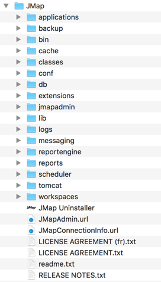
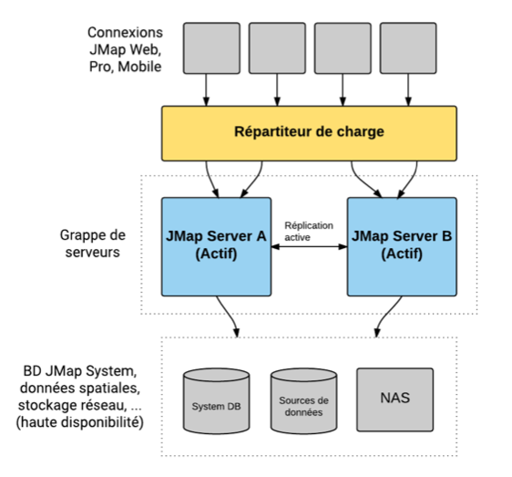

# Gestion de JMap Server

Les sections suivantes traitent des tâches de gestion de JMap Server.

 

## ==État de JMap Server==

La section **État** de JMap Admin fournit de nombreuses informations utiles pour effectuer le suivi de JMap Server. De plus, cette section fournit des informations détaillées sur votre licence d'utilisation. Chaque partie est expliquée ci-dessous.

| **Général** |                                                              |
| ----------- | ------------------------------------------------------------ |
| Version     | Information complète sur la version de JMap Server. Vous devez fournir cette information lorsque vous demandez du soutien technique. |
| Adresse IP  | Adresse IP de l'hôte exécutant JMap Server.                  |
| Port        | Port TCP/IP utilisé par JMap Server pour les connexions avec JMap Pro et autres instances de JMap Server. |

| **Sessions**                     |                                                              |
| -------------------------------- | ------------------------------------------------------------ |
| Total de sessions actives        | Nombre total de sessions utilisateur en cours.               |
| Sessions JMap Pro actives        | Nombre de sessions utilisateur en cours pour les applications JMap Pro. Le nombre maximal de sessions autorisées par la licence pour ce type d'application est indiqué. |
| Sessions JMap Web actives        | Nombre de sessions utilisateur en cours pour les applications JMap Web. Le nombre maximal de sessions autorisées par la licence pour ce type d'application est indiqué. |
| ==Sessions JMap Survey actives== | ==Nombre de sessions utilisateur en cours pour les applications JMap Survey. Le nombre maximal de sessions autorisées par la licence pour ce type d'application est indiqué.== |
| Sessions JMap Server actives     | Nombre de sessions JMap Server en cours. Le nombre maximal autorisé pour ce type de sessions est indiqué. |
| Administrateurs                  | Noms d'utilisateurs administrateurs actuellement connectés à JMap Admin. Ce champ indique également le nom d'hôte de l'ordinateur ou l'adresse IP à partir de laquelle les administrateurs sont connectés. |

| **Ressources**                             |                                                              |
| ------------------------------------------ | ------------------------------------------------------------ |
| Java VM                                    | Version de la machine virtuelle Java utilisée par JMap Server. |
| Id du processus                            | Numéro du processus système de JMap Server.                  |
| Processeurs disponibles                    | Nombre de processeurs utilisés par le processus de JMap Server. |
| Mémoire utilisée                           | Portion de la mémoire allouée qui est utilisée par JMap Server. |
| Mémoire allouée                            | Mémoire totale allouée par le système d'exploitation pour JMap Server. Si la mémoire utilisée atteint cette limite, le système d'exploitation allouera d'autre mémoire (si elle est disponible). La mémoire maximale allouée à JMap Server est définie dans les paramètres initiaux, lors de l'installation. |
| Utilisation de la réserve de fils          | Nombre de processeurs de requêtes simultanés (fils) en cours d'utilisation (comparé au nombre de fils de la réserve initiale). |
| Pointe d'utilisation de la réserve de fils | Utilisation maximale atteinte depuis le démarrage du serveur (aide à déterminer la taille optimale de la réserve initiale). |
| Démarré depuis                             | Date et heure du dernier démarrage de JMap Server.           |

| **Cache**                    |                                                              |
| ---------------------------- | ------------------------------------------------------------ |
| Utilisation du cache mémoire | Proportion du cache mémoire des données utilisé par JMap Server par rapport à la limite définie et au pourcentage relatif. |
| Efficacité du cache mémoire  | Nombre de fois que les données demandées sont trouvées dans le cache, exprimé en pourcentage du nombre total de requêtes de données. |
| Utilisation du cache disque  | Proportion du cache disque utilisée par JMap Server par rapport à la limite définie et au pourcentage relatif. |
| Efficacité du cache disque   | Nombre de fois que les données demandées sont trouvées dans le cache disque, exprimé en pourcentage du nombre total de requêtes de données. |

| **Information sur la licence**         |                                                              |
| -------------------------------------- | ------------------------------------------------------------ |
| Modèle                                 | Modèle de licence utilisé. Cliquez sur le lien pour voir le texte de la licence. |
| Enregistré à                           | Organisation détenant la licence d'utilisation de JMap Server. |
| Numéro de série                        | Numéro de série unique de JMap Server.                       |
| Nombre maximum d'utilisateurs          | Nombre maximal d'utilisateurs pouvant être créés dans JMap en vertu de la licence. |
| Nombre maximum de sessions JMap Pro    | Nombre maximum de sessions simultanées ouvertes par des applications JMap Pro, en vertu de la licence. |
| Nombre maximum de sessions JMap Web    | Nombre maximum de sessions simultanées ouvertes par des applications JMap Web, en vertu de la licence. |
| Nombre maximum de sessions JMap Survey | Nombre maximum de sessions simultanées ouvertes par des applications JMap Survey, en vertu de la licence. |
| Nombre maximum de projets              | Nombre maximum de projets pouvant être créés dans JMap en vertu de la licence. |
| Sessions multiples                     | Autorisation pour un même utilisateur d'avoir plusieurs sessions simultanées. |
| Expiration                             | S'il y a lieu, date d'expiration de la licence. Après cette date, JMap Server ne démarrera plus. |
| Produits sous licence                  | Liste de modules JMap autorisés par la licence.              |

## Exportation et importation

### ==DOC-263 Exportation et importation de la configuration de JMap==

Votre configuration de JMap Server (sources de données spatiales, bases de données, projets, couches, etc.) est stockée sur disque en format binaire. Cette configuration n'est accessible que par le biais de JMap Server et n'est compatible qu'avec votre version en cours (version principale, p. ex. 7.X). En utilisant l'outil d'exportation, une version texte de cette configuration peut être produite. Cette configuration exportée peut alors être importée de nouveau vers JMap Server, et même vers une nouvelle version, avec des paramètres identiques ou différents. Voici quelques situations où il peut être utile d'exporter et d'importer votre configuration :

- Vous avez installé une nouvelle version de JMap comportant des changements majeurs et vous désirez réutiliser votre configuration existante. Vous pouvez exporter la configuration de votre version JMap précédente et ensuite l'importer dans la nouvelle version.
- Vous gérez de nombreuses instances de JMap Server et vous devez déplacer un projet d'une instance vers l'autre. Vous pouvez effectuer une exportation partielle afin de n'exporter que le projet dont vous avez besoin, puis importer celui-ci dans l'autre instance.
- Vous devez reproduire votre environnement de développement dans l'environnement de production. Vous pouvez effectuer une exportation complète de votre serveur de développement puis l'importer vers le serveur de production.

Les outils d'exportation et d'importation sont disponibles en sélectionnant **Import / Export** à partir de la section JMap Server.

#### Exportation

Lorsque vous exportez une configuration, vous devez déterminer si vous désirez exporter la configuration entière ou certaines ressources spécifiques (exportation partielle). Si vous décidez d'exporter des ressources spécifiques, vous devez déterminer si vous désirez exporter des bases de données, des sources de données spatiales, des projets, des modèles de style ou des modèles de métadonnées. Il existe une relation de dépendance entre ces diverses ressources : les projets dépendent des sources de données spatiales et des modèles de style, tandis que les sources de données spatiales peuvent dépendre de bases de données. Par conséquent, si vous exportez un projet, les sources de données spatiales, les modèles de style et possiblement aussi les bases de données seront exportés aussi.

==Si l'un des projets contient des couches référencées d'un autre projet, vous devez exporter le projet qui contient les couches originales au même temps que le projet qui contient les couches référencées.==

Le processus d'exportation crée quatre fichiers : le fichier *.properties* est le principal fichier d'exportation et il contient l'information de configuration. Tous les fichiers sont nécessaires à l'importation. Vous pouvez déterminer le répertoire de destination et le nom du fichier.

#### Importation

Lorsque vous importez une configuration, vous avez le choix d'importer une configuration complète (importation complète) ou seulement une portion de celle‑ci (importation partielle). Vous ne pouvez effectuer une importation complète que si les fichiers d'exportation contiennent une exportation complète. **Lorsque vous effectuez une importation complète, toute configuration existante dans JMap Server est supprimée et remplacée par la configuration importée.** Lorsqu'une importation complète est terminée, vous êtes automatiquement retourné à la page de connexion de JMap Admin. 

Lorsque vous effectuez une importation partielle, il peut y avoir des situations où les ressources importées existent déjà (noms identiques). Dans ces cas, vous devez indiquer à JMap Admin l'action à exécuter : remplacer la ressource existante ou en créer une nouvelle sous un nom différent. Les sources de données de type fichier que vous importez ne sont pas prêtes à utiliser et doivent d'abord être mises à jour après l'importation.

==Si l'un des projets contient des couches référencées d'un autre projet, vous devez importer le projet qui contient les couches originales au même temps que le projet qui contient les couches référencées.==

### ==DOC-245 Exportation et importation des données utilisateur de JMap==

Les données utilisateur de JMap comprennent toutes les données qui sont créées ou modifiées par les utilisateurs. Cela inclut les préférences utilisateur, les contextes, les couches personnelles, les données des couches éditables JMap, etc. Si vous changez d'instance de JMap Server et voulez conserver toutes les données utilisateur existantes, vous devez les exporter à partir de l'ancien serveur et les importer dans le nouveau serveur.

==Le fichier de configuration de l'exportation et l'importation des données des utilisateurs est un fichier *.properties*. Pour une exportation/importation réussies, validez que ce fichier contient la ligne suivante :==

==project.id.ID_OF_THE_PROJECT_BEFORE_EXPORT=ID_OF_THE_PROJECT_AFTER_EXPORT_SERVER_CONFIGURATION.==

#### Exportation

Lorsque vous exportez les données utilisateur, vous devez choisir d'exporter toutes les données ou alors seulement les couches éditables stockées dans JMap (incluant les couches personnelles) ou seulement les espaces de travail (incluant les contextes, les cartes et préférences des utilisateurs, etc.).

#### Importation

Lorsque vous effectuez une importation des données utilisateur, il peut y avoir des situations où les ressources importées existent déjà (noms identiques). Dans ces cas, vous devez indiquer à JMap Admin l'action à prendre : remplacer la ressource existante ou en créer une nouvelle sous un nom différent.

## Données des utilisateurs

Les utilisateurs des applications JMap peuvent générer certaines données qui sont stockées dans l'environnement de JMap Server.

Ces données sont de diverses natures telles que des préférences utilisateur (choix des unités, paramètres d'impression, etc.), des contextes cartographiques (JMap Pro et JMap Web) et des gabarits d'impressions personnalisés. 

Les données des contextes cartographiques sont stockées en format JSON dans la table JMAP_CONTEXTS de la base de données System.

Les données autres que celles des contextes sont stockées dans des dossiers distincts pour chaque utilisateur. Le dossier parent de ces dossiers utilisateur est

*(JMap_Home)\workspaces\<username>*

Notez que ce dossier peut être localisé dans un autre endroit en spécifiant un dossier différent à la ligne *server.workspaces.path* du fichier *jmapserver.properties* et en copiant manuellement les fichiers et sous dossiers.

Dans certains cas, l'administrateur peut avoir à copier certains fichiers lors de migrations ou pour les partager avec d'autres utilisateurs. Les sections suivantes décrivent plus en détails chacun des cas.

Notez que les fonctions d'exportation et d'importation des configurations de JMap prennent aussi en charge les données des utilisateurs.

### Contextes

Les contextes cartographiques sont composés de l'ensemble des paramètres permettant de recréer une carte géographique par un utilisateur des applications JMap Pro o JMap Web. Ils permettent de sauvegarder des cartes et de les partager entre les utilisateurs. Les contextes existants peuvent être rappelés facilement pour recréer un environnement cartographique. Tous les paramètres des couches, les annotations, les thématiques, les sélections, etc. font partie du contexte et sont recréés à l'ouverture du contexte.

Un contexte est associé au projet dans lequel il fut créé. Il n'est pas accessible à partir des autres projets.

### Couches personnelles

La section [Couches personnelles](05 Projets.md) donne plus d'information sur la gestion des couches personnelles et les détails sur la procédure pour les rendre publiques. Les données des couches personnelles ne sont pas stockées dans le dossier workspaces mais sont plutôt enregistrées directement dans la base de données System de JMap Server (une table par couche personnelles).

Les outils d'exportation et d'importation prennent en charge les données des couches personnelles.

### Tables JMap Spatial

Tout comme les couches personnelles, les données des couches éditables des projets JMap sont stockées directement dans la base de données System de JMap Server dans des tables appelées tables JMap Spatial.

Les outils d'exportation et d'importation prennent en charge les données des tables JMap Spatial.

### Gabarits d'impression

Les utilisateurs des applications JMap Pro peuvent créer leurs gabarits d'impression personnels. Les fichiers sont stockés dans le dossier

*(JMap_Home)\workspaces\<username>\printLayouts*

Vous pouvez rendre publiques les gabarits d'impression crées par les utilisateurs. Pour ce faire vous devez copier les fichiers dans ce répertoire

*(JMap_Home)\workspaces\public\printLayouts*.

Les gabarits publiques sont accessibles par tous les utilisateurs de JMap Pro.

 

## ==Doc-237 Paramètres de JMap Server==

Ces paramètres ont un impact sur le fonctionnement et les performances du système JMap Server. Appuyez sur **Sauvegarder** afin de sauvegarder toutes vos modifications. Cliquez sur  afin de relire les paramètres des fichiers de configuration si ceux-ci ont changé. Les fichiers de configuration se trouvent dans *JMAP_HOME/conf*.

| **Général**           |                                                              |
| --------------------- | ------------------------------------------------------------ |
| Nom de ce JMap Server | Vous pouvez donner un nom cette instance de JMap Server. Ce nom s'affiche dans l'écran d'authentification et dans l'entête de JMap Admin. |
| Langue par défaut     | Vous pouvez sélectionner la langue par défaut qui sera sélectionnée automatiquement lors de la création des nouveaux projets. |
| Langues disponibles   | Vous pouvez sélectionner les langues disponibles qui seront sélectionnées automatiquement lors de la création de nouveaux projets. |

| **Réseau**                           |                                                              |
| ------------------------------------ | ------------------------------------------------------------ |
| Adresse préféré pour service externe | Adresse du proxy utilisé pour déployer les applications. Lors de la configuration d'un nouveau déploiement, vous pouvez changer l'adresse locale à cette adresse externe. |
| Adresse préférée de JMap Server      | Adresse locale de JMap Server utilisée pour déployer les applications. Lors de la configuration d'un nouveau déploiement, vous pouvez changer l'adresse externe à cette adresse locale. |
| Port du serveur                      | Port TCP/IP utilisé par JMap Server pour les connexions avec JMap Pro et autres instances de JMap Server. |
| Port du serveur Web                  | Port TCP/IP utilisé par le serveur web intégré de JMap Server pour les requêtes HTTP. Utilisé pour JMap Admin et pour les déploiements d'applications de type local. |
| Port du serveur Web (https)          | Port TCP/IP utilisé par le serveur web intégré de JMap Server pour les requêtes HTTPS. |

| **Cache**                   |                                                              |
| --------------------------- | ------------------------------------------------------------ |
| Taille en mémoire           | Taille du cache en mémoire. Conserve les tuiles de données vectorielles chargées antérieurement afin de minimiser les requêtes aux sources de données. Aide à améliorer les performances de JMap Server. Les statistiques du cache sont affichées dans la section État de JMap Server. |
| Taille sur disque           | Taille du cache disque. Fonctionne comme le cache en mémoire. Il est recommandé de sélectionner l'option **Illimité**. |
| Mémoire traitement d'images | Taille du cache destinée aux opérations d'imagerie. Ce cache est utilisé par JMap Server lors du traitement de fichiers images (sources de données matricielles qui lisent les fichiers images). Aide grandement à améliorer les performances de JMap Server lors de la manipulation d'images volumineuses. |

| **HTTPS** |                                                              |
| --------- | ------------------------------------------------------------ |
| Rediriger | Rediriger automatiquement les utilisateurs de JMap Admin vers une connexion sécurisée (https). Cette option est disponible seulement si un certificat de sécurité est présent. Pour plus d'information, consultez la section [Utilisation de HTTPS avec JMap](10 Sécurité.md). |

| **Proxy HTTP** |                                                              |
| -------------- | ------------------------------------------------------------ |
| Hôte           | Nom d'hôte ou adresse du serveur proxy HTTP. Utilisé lorsque JMap Server doit passer par un proxy HTTP pour accéder à des systèmes à l'extérieur du réseau local. |
| Port           | Port TCP/IP utilisé pour la connexion au serveur proxy HTTP. |
| Utilisateur    | Nom d'utilisateur utilisé pour la connexion au serveur proxy HTTP. |
| Mot de passe   | Mot de passe utilisé pour la connexion au serveur proxy HTTP. |

| **Serveur SMTP (Courriel)** |                                                              |
| --------------------------- | ------------------------------------------------------------ |
| Hôte                        | Nom d'hôte ou adresse du serveur SMTP. JMap Server a besoin d'un serveur SMTP pour envoyer des courriels. |
| Port                        | Port TCP/IP utilisé pour se connecter au serveur SMTP.       |
| Utilisateur                 | Nom d'utilisateur utilisé pour la connexion au serveur SMTP (si requis). |
| Mot de passe                | Mot de passe utilisé pour la connexion au serveur SMTP (si requis). |
| Chiffrement                 | Sélectionnez une méthode de chiffrement si le serveur SMTP le requière. |

| **GeoWebCache** |                                                              |
| --------------- | ------------------------------------------------------------ |
| URL (1-4)       | Entrez une URL (ou plusieurs) pour se connecter au serveur GeoWebCache. Seule une URL est nécessaire mais le fait d'en utiliser plusieurs, qui pointent vers le même serveur, permettra d'optimiser d'avantage l'utilisation de ce type de serveur. ==La configuration des paramètres pour GeoWebCache est optionnelle mais permet d'offrir de meilleures performances pour les applications JMap Web.== Consultez la section [Utilisation d'un serveur GeoWebCache](09 Déploiement d'applications JMap.md) pour plus d'information. |
| Utilisateur     | Nom d'utilisateur utilisé pour se connecter au serveur GeoWebCache. |
| Mot de passe    | Mot de passe utilisé pour se connecter au serveur GeoWebCache. |

| **Route Logistics Service** |                                                              |
| --------------------------- | ------------------------------------------------------------ |
| URL                         | Entrez l'adresse du service RLS à utiliser (p. ex. ==https://rls.jmaponline.net/rls/rest/v1.0)==. Ce service permet de géocoder des adresses et de calculer des routes optimales. |
| ID Client                   | Entrez la clé unique de votre organisation vous permettant d'utiliser les services de RLS. |

| **API Keys** |                                                              |
| ------------ | ------------------------------------------------------------ |
| Google       | Entrez la clé d'API de votre organisation vous permettant d'utiliser les services de Google. Vous pouvez obtenir les détails ici : [https://developers.google.com/maps/documentation/javascript/get-api-key?hl=Fr](https://developers.google.com/maps/documentation/javascript/get-api-key?hl=Fr). |
| Bing         | Entrez la clé d'API de votre organisation vous permettant d'utiliser les services de Bing. Vous pouvez obtenir les détails ici : [https://msdn.microsoft.com/fr-fr/library/ff428642.aspx](https://msdn.microsoft.com/fr-fr/library/ff428642.aspx). |
| ==Mapbox== | ==Entrez la clé d'API de votre organisation vous permettant d'utiliser les services de cache et les couches de Mapbox. Vous pouvez obtenir les détails ici : [https://docs.mapbox.com/api/](https://docs.mapbox.com/api/).==== |

| **Explorateur de fichiers** |                                                              |
| --------------------------- | ------------------------------------------------------------ |
| Permettre le téléversement  | Cochez cette option si vous permettez le téléversement de fichiers vers JMap Server directement à partir de JMap Admin. |
| Taille maximale par fichier | Indiquez la taille maximale d'un fichier à téléverser. Cochez l'option Illimité si vous n'établissez pas de limite pour la taille des fichiers. |
| Répertoire destination      | Indiquez le répertoire où seront copiés les fichiers téléversés. Chaque compte administrateur dans JMap possède un sous-répertoire créé automatiquement dans le répertoire *JMAP_HOME/Data/Uploads*. Les fichiers téléversés sont accessibles à tous les utilisateurs de JMap Admin. Le répertoire *Uploads* est disponible aussi lors de la création des sources de données spatiales. |

| **Paramètres chargés**            |                                                              |
| --------------------------------- | ------------------------------------------------------------ |
| Pilote de base de données         | Liste des pilotes de bases de données chargés. De nouveaux pilotes peuvent être ajoutés en créant des fichiers de configuration dans le répertoire *JMAP_HOME/conf/db* sur le serveur. |
| Sources de données personnalisées | Sources de données spatiales associées à certaines applications spécifiques. |
| Projections                       | Liste de projections chargées. De nouvelles projections peuvent être créées en ajoutant des entrées dans le fichier *JMAP_HOME/conf/projections.properties* sur le serveur. |
| Générateurs d'éléments            | Modules de génération d'éléments cartographiques associés à certaines applications spécifiques. |
| Gestionnaires d'utilisateurs      | Liste des modules de gestion d'utilisateurs chargés. Les gestionnaires d'utilisateurs permettent d'effectuer la gestion des utilisateurs et des groupes en plus de fournir le service d'authentification utilisé dans JMap Server. |

 

## Statistiques d'utilisation

Les statistiques d'utilisation offrent à l'administrateur JMap de l'information sur l'utilisation des projets, des couches et des contextes. JMap Server enregistre certaines activités de utilisateurs et permet de générer des rapports contenant des statistiques sur l'utilisation des ressources dans les applications JMap Pro et JMap Web. Ces informations peuvent s'avérer utiles pour évaluer la pertinence de certains projets ou de certaines couches, peu ou pas utilisés. 

Pour activer l'enregistrement des données d'utilisation vous devez cocher l'option **Statistiques d'utilisation** lors de la création ou de l'édition d'un projet. La section [Création de projets](05 Projets.md) offre des détails sur le sujet. Lors de l'exportation et importation du projet, votre choix est enregistré dans la configuration exportée.

Ainsi de manière automatique à chaque fois qu'un utilisateur ouvre un projet, qu'il voit une couche ou qu'il voit ou crée un contexte dans une application JMap Pro ou JMap Web, l'activité s'enregistre dans une table temporelle dans la BD System. À chaque nuit, à une heure déterminée, les données sont agrégées dans deux tables (JMAP_STATISTICS_MONTHLY et JMAP_STATISTICS_YEARLY) et elles sont par la suite affichées dans cette section de JMap Admin. La fréquence d'agrégation des données peut être configurée dans les paramètres de JMap. Pour ce faire vous devez modifier la variable *server.statistics.config.cron* dans le fichier *jmapserver.properties* qui se trouve dans le dossier *JMap_HOME/conf*. Cette page [http://www.quartz-scheduler.org/documentation/quartz-2.3.0/tutorials/crontrigger.html](http://www.quartz-scheduler.org/documentation/quartz-2.3.0/tutorials/crontrigger.html) offre des détails sur les expressions *cron*. Les informations sur les activités des utilisateurs qui ont été effacés sont consignées dans les deux tables. Les détails des fonctions d'agrégation se trouvent dans l'API REST de JMap Admin.

Les informations enregistrées dans la table temporelle diffèrent légèrement entre les applications JMap Pro et JMap Web. Les données d'utilisation provenant de JMap Pro sont enregistrées lorsque l'application JMap Pro est fermée ou lorsque que le projet est fermé car l'utilisateur change de projet.

### Calculer les statistiques

| **Statistiques sur les projets** |                                                              |
| -------------------------------- | ------------------------------------------------------------ |
| De                               | Sélectionnez le début de la période pour laquelle seront calculées les statistiques. |
| À                                | Sélectionnez la fin de la période pour laquelle seront calculées les statistiques. |
| Utilisateur                      | Sélectionnez un utilisateur pour lequel obtenir les statistiques. Si l'utilisateur qui a ouvert le projet a été éliminé de JMap, ses statistiques d'utilisation s'ajoutent à l'utilisateur System et s'affichent sous cet utilisateur. |
| Nom du projet                    | Inscrivez le nom du projet pour lequel vous souhaitez obtenir les statistiques. Vous pouvez inscrire une partie du nom du projet, tous les projets dont le nom coïncide en partie avec le nom inscrit s'affichent. |
| Nombre d'ouvertures              | Le résultat indique le nombre de fois que l'utilisateur a ouvert le projet dans une application JMap Pro ou JMap Web. Prenez note que les données provenant de JMap Pro sont enregistrées lorsque l'application est fermée ou lorsque que le projet est fermé car l'utilisateur change de projet. |

Appuyez sur **Appliquer** pour produire les statistiques par projet. Appuyez sur **Réinitialiser** pour effacer les statistiques.

| **Statistiques sur les couches** |                                                              |
| -------------------------------- | ------------------------------------------------------------ |
| De                               | Sélectionnez le début de la période pour laquelle seront calculées les statistiques. |
| À                                | Sélectionnez la fin de la période pour laquelle seront calculées les statistiques. |
| Nom du projet                    | Sélectionnez le projet dans lequel se trouve la ou les couches dont vous souhaitez calculer les statistiques. |
| Utilisateur                      | Sélectionnez un utilisateur pour lequel obtenir les statistiques. Si l'utilisateur qui a ouvert le projet a été éliminé de JMap, ses statistiques d'utilisation s'ajoutent à l'utilisateur System et s'affichent sous cet utilisateur. |
| Couche                           | Inscrivez le nom ou une partie du nom de la ou les couches pour lesquelles vous souhaitez calculer les statistiques. |
| Nombre de vues                   | Le résultat indique le nombre de fois que l'utilisateur a vu la ou les couches dans une application JMap Pro ou JMap Web. La décompte se fait une fois au cours de chaque session. Lorsque la couche est visible dans la carte, une vue est compté. Si l'utilisateur désactive la visibilité de la couche et il l'active par la suite au cours de la session, seulement 1 vue est comptée.Prenez note que les données provenant de JMap Pro sont enregistrées lorsque l'application est fermée ou lorsque que le projet est fermé car l'utilisateur change de projet. |

Appuyez sur **Appliquer** pour produire les statistiques par couche. Appuyez sur **Réinitialiser** pour effacer les statistiques.

| **Statistiques sur les contextes publics** |                                                              |
| ------------------------------------------ | ------------------------------------------------------------ |
| De                                         | Sélectionnez le début de la période pour laquelle seront calculées les statistiques. |
| À                                          | Sélectionnez la fin de la période pour laquelle seront calculées les statistiques. |
| Filtre                                     | Trois filtres permettent de calculer différentes statistiques. **Nbe. de créations par utilisateur** : Calcule le nombre de contextes crées par l'utilisateur pour un projet donné.  **Contexte public, utilisé par projet** : Calcule le nombre de fois qu'un contexte public est ouvert par tous les utilisateurs d'applications JMap Pro dans un projet donnée. **Contexte public, utilisé par projet et utilisateur** : Calcule le nombre de fois qu'un contexte public est ouvert par un utilisateur d'applications JMap Pro dans un projet donnée. Les contextes des applications JMap Web sont privés. JMap calcule les statistiques que pour les contextes publics, utilisés dans les applications JMap Pro. |
| Utilisateur                                | Sélectionnez un utilisateur pour lequel obtenir les statistiques. Si l'utilisateur qui a ouvert le projet a été éliminé de JMap, ses statistiques d'utilisation s'ajoutent à l'utilisateur System et s'affichent sous cet utilisateur. |
| Nom du projet                              | Inscrivez le nom du projet pour lequel vous souhaitez obtenir les statistiques sur les contextes. |
| Nombre de créations                        | Cette statistique calcule le nombre de contextes créés au cours de la période pour l'utilisateur et le projet sélectionnés dans les applications JMap Web et JMap Pro. |
| Nom du contexte                            | Inscrivez le nom du contexte public pour lequel vous souhaitez obtenir les statistiques. |
| Nombre d'utilisations                      | Cette statistique calcule le nombre de fois que le contexte public a été ouvert, soit par tous les utilisateurs dans un projet dans une application JMap Pro ou soit par un utilisateur précis dans un projet dans une application JMap Pro. |

Sélectionnez le filtre et appuyez sur **Appliquer** pour afficher les paramètres qui permettront de définir le calcul. Une fois les paramètres complétés, appuyez à nouveau sur **Appliquer** pour produire les statistiques. Appuyez sur **Réinitialiser** pour effacer les statistiques.

### Exporter les rapports

Vous pouvez exporter le rapport produit en format Excel ou PDF. Pour ce faire, une fois calculées les statistiques, appuyez sur **Excel** ou sur **PDF** pour télécharger automatiquement un fichier du format sélectionné.

 

## Journalisation

Les journaux sont des fichiers qui contiennent des informations sur les activités effectuées dans JMap Server. La quantité d'événements inscrite dans les journaux dépend du niveau de journalisation sélectionné. Un nouveau fichier de journal est créé chaque jour par défaut, mais ce paramètre peut être modifié. Par défaut, les journaux sont placés dans le répertoire JMAP_HOME/logs. Il se peut que vous ayez besoin de vérifier périodiquement le volume des journaux et d'archiver ou de supprimer les anciens fichiers.

| **Paramètres de journalisation** |                                                              |
| -------------------------------- | ------------------------------------------------------------ |
| Niveau de journalisation         | Le niveau maximal des messages ajoutés aux journaux. Par exemple, si **Avertissement** est sélectionné, seuls les messages des niveaux **Avertissement**, **Erreur** ou **Fatale** s'inscriront dans les journaux. Les niveaux de journalisation suivants sont disponibles (en ordre décroissant) : **Tous** : Tous les événements sont inscrits. À utiliser uniquement pour résoudre un problème. **Débogage** : Les événements de niveau débogage sont inscrits. À utiliser uniquement pour résoudre un problème. Tous les événements des niveaux inférieurs sont aussi inscrits. **Info** : Les événements de niveau information sont inscrits, ce qui inclut les connexions des utilisateurs. Tous les événements des niveaux inférieurs sont aussi inscrits. **Avertissement** : Les événements de niveau avertissement (non sérieux) sont inscrits. Tous les événements de niveaux inférieurs sont aussi inscrits. **Erreur** : Les événements de niveau erreur (sérieux) sont inscrits. Tous les événements de niveaux inférieurs sont aussi inscrits. **Fatal** : Seules les erreurs fatales (très sérieuses) sont inscrites. **Désactivé** : Rien n'est inscrit. |
| Répertoire de journalisation     | Répertoire où les journaux sont créés. Le répertoire par défaut se trouve sous *JMAP_HOME/logs*. Assurez‑vous qu'il y ait suffisamment d'espace disque pour stocker les journaux. |
| Délai d'expiration               | Le délai d'expiration détermine la fréquence de création de nouveaux journaux. Le journal en cours porte toujours le nom jmap_log. Lorsqu'un nouveau fichier est créé, le journal qui était en cours est renommé afin d'inclure la date (p. ex. jmap_log_2006_05_23.log). |
| Messages à la console            | Détermine si les événements seront aussi inscrits dans la console d'écran JMap Server. Cette option s'avère utile pour les tests ou le développement, mais devrait être désactivée lors de la production. De plus, lorsque JMap Server ne dispose d'aucune console de sortie (démarré en arrière‑plan ou en tant que service dans Windows), cette option ne sert à rien et utilise inutilement les ressources du serveur. |

### Visualisation des journaux

Les journaux (et journaux des erreurs) peuvent être visualisés directement dans JMap Admin. Cliquez sur le nom d'un fichier de la liste pour l'ouvrir. Le contenu du fichier est affiché. Notez que les journaux d'erreurs sont affichés en plus des journaux. Les journaux d'erreurs contiennent uniquement des messages d'erreur qui servent parfois de complément aux journaux pour aider à résoudre un problème.

La fenêtre de visualisation permet de filtrer le contenu, par type d'événement, par date, par mot clé, etc. Vous pouvez aussi télécharger le fichier en appuyant sur **Télécharger**.

### Analyse des journaux

Les journaux peuvent être analysés afin de fournir un sommaire de l'activité de JMap Server. Par exemple, ils vous tiennent informés du nombre de sessions de chaque utilisateur, du nombre d'arrêts du serveur, des échecs d'authentification, etc. Pour analyser les journaux, sélectionnez un ou plusieurs fichiers dans la liste et appuyez sur .

## Messages

En tant qu'administrateur, vous pouvez envoyer des messages aux utilisateurs de JMap à partir de JMap Admin. Les messages seront affichés dans l'interface des utilisateurs (applications JMap Pro seulement). Les utilisateurs ayant une session active verront ces messages immédiatement. Les autres utilisateurs les verront la prochaine fois qu'ils se connecteront. Les messages permettent d'informer les utilisateurs des interruptions de service, par exemple. Le message est affiché chaque fois qu'un utilisateur démarre une nouvelle session, pendant la période de validité du message.

### Envoi de messages

Afin de créer un nouveau message à envoyer à tous les utilisateurs, appuyez sur **Créer** à partir de la section des messages.

| **Nouveau message aux utilisateurs** |                                                              |
| ------------------------------------ | ------------------------------------------------------------ |
| Sujet                                | Court texte décrivant le sujet du message.                   |
| Message                              | Le message lui-même. Le formatage est effectué au moyen de balises HTML. Par exemple, les sauts de ligne sont effectués à l'aide des balises ` `. Le message peut contenir des hyperliens. |
| Valide à partir de                   | La date et l'heure à partir desquelles le message sera affiché. |
| Valide jusqu'à                       | La date et l'heure à partir desquelles le message ne sera plus affiché. Après cette échéance, le message disparaîtra de la liste. |

### Suppression de messages

Afin de supprimer un message avant qu'il n'expire, sélectionnez‑le dans la table et appuyez sur **Supprimer**.

  

## Base de données System de JMap Server

La base de données System de JMap Server est une base de données relationnelle qui stocke des données importantes pour JMap Server. Si vous utilisez le gestionnaire des utilisateurs intégré à JMap Server, les données relatives aux comptes des utilisateurs et groupes se trouvent dans cette base de données. Ce n'est pas le cas si vous utilisez un autre gestionnaire d'utilisateurs (p. ex. LDAP/Active Directory). De plus, lorsque les sources de données spatiales lisent leurs données à partir de fichiers (SHP, MIF, DWG, etc.), la géométrie et les données descriptives lues à partir de ces fichiers sont insérées dans les tables de la base de données System. Il y a une table pour chacune de ces sources de données, de même que des tables d'index spatiaux qui accélèrent l'extraction des données. Les couches personnelles créées par les utilisateurs, ainsi que les tables JMap Spatial, sont aussi stockées dans la base de données System.

Par défaut, le système de gestion de base de données relationnelle (SGBD) utilisé pour stocker les bases de données System de JMap Server est Apache Derby. Il est intégré à JMap Server et ne nécessite aucune maintenance. Ce système convient pour la publication de petites ou de moyennes quantités de données spatiales ou pour les environnements de test. Pour les systèmes plus performants, il est recommandé d'utiliser un autre système de gestion de base de données relationnelle. La liste des systèmes compatibles est présentée ci-dessous. Par défaut, les fichiers de base de données de Derby sont situés sous le répertoire *JMAP_HOME/db/database*. **Vous ne devez en aucun temps supprimer ou modifier les fichiers qui se trouvent dans ce répertoire.**

### Déplacement de la base de données System de JMap Server vers un autre environnement

Vous pouvez facilement déplacer la base de données System de JMap Server vers un autre SGBD. Ceci peut être utile pour en améliorer la performance ou l'extensibilité ou encore pour avoir accès à des fonctionnalités plus avancées, telles que la création de copies de sécurité. Il existe quatre autres SGBD qui sont officiellement pris en charge pour le stockage de la base de données System de JMap :

| **SGBD**   | **Version**           |
| ---------- | --------------------- |
| MySQL      | 5.7, 8                |
| PostgreSQL | 9.2, 9.4, 9.6, 10, 11 |
| Oracle     | 8, 9, 10, 11, 12      |
| SQLServer  | 2008, 2012, 2017      |

Notez que d'autres versions et d'autres SGBD seront probablement prises en charge également, car JMap Server utilise principalement des fonctionnalités de base de données très simples et communes. 

Pour contenir la base de données System, vous devriez utiliser une base de données ou un schéma réservé exclusivement à JMap. Le compte utilisateur utilisé pour établir la connexion doit avoir les privilèges requis pour sélectionner, insérer, créer et supprimer des tables et des index.

Pour déplacer la base de données System vers un autre SGBD, vous devez modifier la base de données appelée System dans JMap Admin. Sélectionnez le pilote de base de données et les paramètres de connexion correspondant à l'environnement de la nouvelle base de données System. JMap Server va automatiquement créer les tables requises dans la nouvelle base de données.

Une fois que la base de données System aura été déplacée, toute source de données spatiale qui lit des fichiers de données vectorielles se verra attribuer l'état **Non Initialisé**. Ces sources de données devront être mises à jour avant de pouvoir être utilisées. Les autres types de sources de données (matricielles, Oracle Spatial, SDE, etc.) ne seront pas affectées.

De plus, si vous déplacez la base de données System, toutes les données utilisateur dans l'ancienne base de données doivent être déplacées à l'aide de l'outil d'exportation et d'importation des données. Consultez la section [Exportation et importation](#Exportation et importation) pour plus d'information.

  

## Prise de copies de sécurité

Il est fortement recommandé de prendre des copies de sécurité de l'environnement de JMap Server.

Si votre base de données System de JMap Server a été déplacée vers un autre SGBD, vous devriez l'inclure dans votre procédure de copie de sécurité. Cette base de données contient des informations très sensibles, dont les données des couches personnelles.

La stratégie la plus simple pour prendre une copie de sécurité de JMap Server consiste à prendre en copie le répertoire JMap en entier, incluant tous les sous répertoires.

Si vous souhaitez prendre des copies de sécurité de taille moins volumineuse, vous pouvez prendre précisément les répertoires suivants qui contiennent les informations importantes.

| **Répertoire** |                                                              |
| -------------- | ------------------------------------------------------------ |
| conf           | Contient tous les fichiers de paramètres, tels que jmaperver.properties, usermanager.properties, etc. |
| db             | Contient les fichiers de configuration (projets, couches, etc.) ainsi que la base de données System de JMap Server, à moins qu'elle n'ait été déplacée vers un autre SGBD. |
| backups        | Répertoire par défaut pour stocker les fichiers d'exportation. |
| workspaces     | Les espaces de travail des utilisateurs contiennent les contextes et paramètres personnels des utilisateurs. |

 

## Haute disponibilité

Il est possible de configurer des grappes de serveurs JMap pour créer des environnements hautement disponibles. Un environnement JMap hautement disponible offre ces avantages :

- Résistance aux défaillances matérielles et logicielles.
- Performances améliorées.
- Évolutivité accrue.
- Mises à jour des logiciels sans interruption de service.

Les grappes de serveurs JMap (nœuds) sont de type pair à pair en redondance active, c'est-à-dire où tous les nœuds sont égaux et synchronisés entre eux en temps réel. Chaque changement dans la configuration d'un nœud (ajout d'une couche, modification d'un formulaire, etc.) est immédiatement répliqué sur l'ensemble des nœuds de la grappe.

### Pré-requis pour la haute disponibilité

Pour configurer une installation de JMap en haute disponibilité, incluant la création de grappes de serveurs, certains pré-requis doivent être respectés.

- La base de données Système de JMap doit être partagée par l'ensemble des nœuds (de préférence en haute disponibilité).
- Un système de fichiers doit être partagé par l'ensemble des nœuds pour le stockage des caches de données vectorielles et matricielles (de préférence en haute disponibilité).
- Tous les nœuds doivent avoir un fichier de licence JMap comportant le même numéro de série.
- L'adresse IP liée à JMap Server doit être définie précisément. Durant l'installation de JMap, vous devez entrer l'adresse IP de votre serveur qui sera liée à JMap Server et ne pas utiliser la valeur par défaut proposée 0.0.0.0. Si nécessaire, vous pouvez exécuter le programme d'installation à nouveau pour modifier cette valeur ou la changer manuellement dans le fichier de configuration *JMap/conf/jmapserver.properties* en modifiant la ligne débutant par "server.address=". Par exemple server.address=208.199.24.134 .

Un répartiteur de charge est habituellement présent dans une architecture de haute disponibilité. Ce module est responsable d'acheminer les requêtes vers les différents nœuds de la grappe, selon des règles prédéterminées.

### Création d'une grappe de serveurs JMap

Pour créer une grappe de serveurs JMap, vous devez avoir au moins 2 instances de JMap Server version 7.0 ou supérieur, connectées en réseau.

Lors de la création d'une nouvelle grappe, le nœud qui crée la grappe (nœud primaire) est celui dont la configuration sera utilisée et répliquée sur les autre nœuds lorsqu'ils joindront la grappe. Assurez-vous de configurer la grappe en premier sur votre serveur qui contient la bonne configuration. Lorsqu'un nouveau nœud joindra la grappe par la suite, sa configuration sera remplacée par celle de la grappe.

Le étapes suivantes décrivent le processus de création d'une grappe avec 2 serveurs A et B. Le serveur A contient la bonne configuration de JMap.

1. La grappe est crée sur le serveur A.

2. Le serveur A est le nœud primaire, et sa configuration devient celle de la grappe.

3. Le serveur B joint la grappe.

4. La configuration du serveur B est remplacée par celle de la grappe.

5. Les serveurs A et B sont synchronisés en temps réel.

Le concept de nœud primaire n'est important que durant la création de la grappe. Par la suite, tous les nœuds sont égaux entre eux.

La configuration d'une grappe est faite dans JMap Admin, dans la sous-section **Grappe de serveurs** de la section JMap Server.

| **Paramètres**                   |                                                              |
| -------------------------------- | ------------------------------------------------------------ |
| Activé                           | Sélectionnez cette option pour activer la haute disponibilité. |
| Ports locaux                     | Entrez une plage de ports TCP/IP pour que les autres nœuds de la grappe puissent se connecter à ce serveur. Les valeurs par défaut 47500 - 47505 peuvent être utilisées, à moins de conflits avec d'autres applications. |
| Adresses de découverte des nœuds | Entrez les adresses TCP/IP des autres nœuds de la grappe. Il est recommandé que chaque nœud connaisse les adresses de tous les autres nœuds de la grappe. Vous devez aussi indiquer les ports TCP/IP pour chaque adresse. Si vous utilisez les ports par défaut, vous pouvez laisser ce paramètre inchangé. |
| Phrase de sécurité               | Inscrivez la phrase secrète de sécurité de la grappe. Tous les nœuds doivent utiliser la même phrase de sécurité pour joindre la grappe. Ce paramètre permet de contrôler l'accès à la grappe par d'autres serveurs sur le réseau. Gardez cette information secrète. |

Quand vous avez terminé la configuration, appuyez sur **Sauvegarder**. Une fenêtre de confirmation s'affiche et vous demande de sélectionner une des deux options suivantes. Vous pouvez aussi annuler l'opération en appuyant sur **Annuler** dans la fenêtre de confirmation.

| **Confirmation**             |                                                              |
| ---------------------------- | ------------------------------------------------------------ |
| Créer une nouvelle grappe    | Sélectionnez cette option pour indiquer que vous souhaitez que ce serveur devienne le nœud primaire d'une nouvelle grappe. Si une grappe existante est détectée sur le réseau, l'opération sera annulée afin d'éviter que la configuration de ce serveur soit écrasée par celle de la grappe. |
| Joindre une grappe existante | Sélectionnez cette option afin que ce serveur joigne une grappe existante et que sa configuration JMap soit remplacée par celle de la grappe. Si aucune grappe n'est détectée, une nouvelle grappe est créée et ce serveur devient le nœud primaire. |

### État de la grappe

Vous pouvez connaître l'état de la grappe en consultant la liste des **nœuds distants**. Ceux-ci sont les autres nœuds présentement actifs dans la grappe.

 

 

 

 