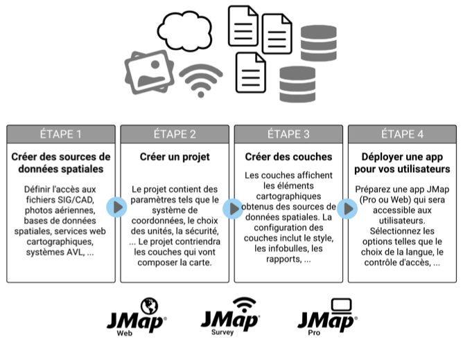
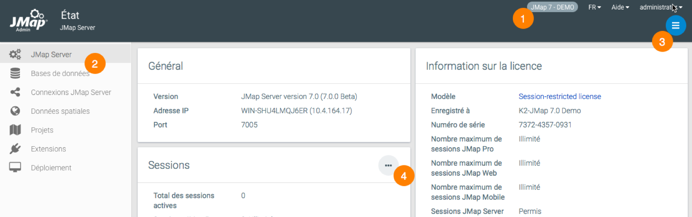
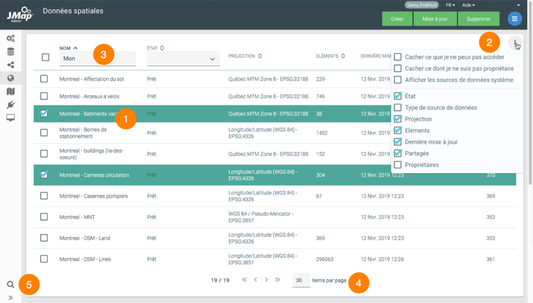
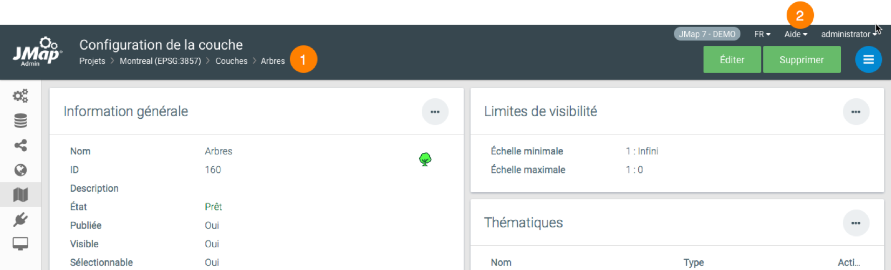
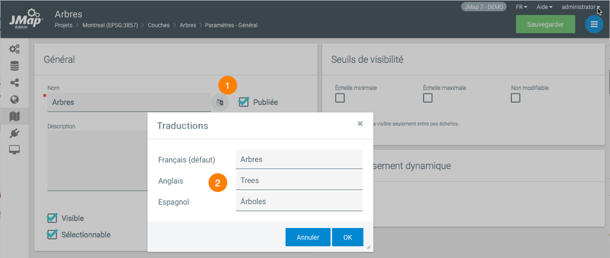
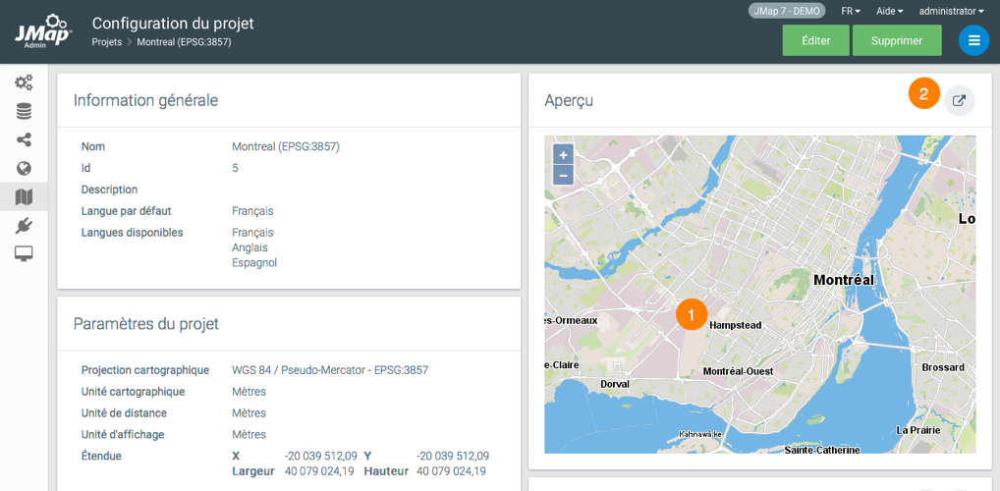

# Bienvenue à JMap 7 Istanbul

JMap est une plateforme d’intégration cartographique. Elle connecte rapidement tous les systèmes et consolide les données d'une organisation. L’ensemble de l’information est ensuite publié sur une carte. Cet accès en temps réel à toutes les données sur une même interface donne aux gestionnaires, aux analystes SIG et aux utilisateurs non techniques le pouvoir de prendre de meilleures décisions et d’agir rapidement.

A titre de plateforme d’intégration, JMap permet de solutionner les problématiques liées au manque d’interopérabilité rencontrées dans certaines organisations. Sa neutralité lui permet de se connecter à n'importe quel système ou environnement informatique sans perturber ce qui est déjà en place.

En tant que plateforme cartographique, JMap met à la disposition de ses utilisateurs une série d’outils SIG disponibles en applications bureau, web ou mobile.

Toute la gestion de JMap Server se fait à l'aide de l'application JMap Admin. Cette interface web permet aux administrateurs d'effectuer des tâches comme l'intégration de bases de données, la création de projets, la diffusion de cartes et la gestion de la sécurité.

Ce manuel traite de l'utilisation de JMap Admin pour l'administration d'un environnement JMap 7 Istanbul.

## Guide de démarrage rapide

Le guide suivant décrit les grandes étapes menant à la configuration et la publication d'une carte en utilisant JMap 7 Istanbul.

Assurez‑vous que JMap Server démarré. Si vous l'avez installé en tant que service sur Windows, vous devez le démarrer à partir de la fenêtre Services de Windows. Autrement, vous devez le démarrer en utilisant les exécutables dans JMAP_HOME/bin ou en utilisant les raccourcis créés lors de l'installation sur le serveur.

Pour ouvrir JMap Admin, vous pouvez utiliser le raccourci qui a été créé lors de l'installation dans le répertoire de base de l'installation, sur le serveur. Vous pouvez également ouvrir un navigateur Web et taper une adresse URL semblable à http://192.168.0.1:8080/jmapadmin. L'adresse IP et le numéro de port peuvent changer selon l'environnement d'installation et les paramètres choisis.

Une fois JMap Admin ouvert, on vous demandera un nom d'utilisateur et un mot de passe. À la suite de l'installation, le nom d'utilisateur par défaut est « administrator » et le champ Mot de passe est vide.

Dans JMap Admin, vous devrez suivre les étapes décrites ci-dessous afin de publier des données cartographiques.

Étape 1 ***—*** Création de sources de données spatiales

Cette étape nécessite que vous définissiez vos sources de données spatiales. Il peut s'agir de fichiers SIG, de serveurs de données spatiales, d'images satellites, etc. Vous indiquez ainsi à JMap l'endroit à partir duquel vos données doivent être lues.

Consultez la section [Création de sources de données spatiales]() pour plus de détails à ce sujet.

Étape 2 ***—*** Création d'un projet

Dans JMap, un projet contient des données sur les définitions des couches d'une carte, de même que des paramètres régissant le contrôle des accès (sécurité), les requêtes, les unités, etc. En créant un projet, vous définissez l'aspect visuel de votre carte et l'information qu'elle contiendra.

Consultez la section [Création de projets](05 Projets.md) pour plus de détails à ce sujet.

Étape 3 ***—*** Création de couches dans le projet

Cette étape consiste à créer les couches cartographiques pour votre nouveau projet. Chaque couche de votre carte est associée à une source de données spatiales. Pour chaque couche, vous devez définir le style (la façon dont les éléments des couches seront dessinés), les étiquettes, les thématiques, etc. Vous pouvez aussi définir le contrôle d'accès couche par couche. 

Consultez la section [Création de couches](06 Couches.md) pour plus de détails à ce sujet.

Étape 4 ***—*** Déploiement d'une application

Il s'agit de la dernière étape. Ici, vous publiez votre projet en utilisant le modèle d'application de votre choix. Chaque modèle d'application offre différents niveaux de fonctionnalité. Il existe des modèles d'applications de bureautique, pour le web et pour les appareils mobiles. Une fois votre application déployée, les utilisateurs peuvent s'en servir pour naviguer dans les données de votre carte.

Consultez la section [Déploiement d'applications JMap](09 Déploiement d'applications JMap.md) pour plus de détails à ce sujet.

## Interface utilisateur

Les captures d'écran ci-dessous présentent l'interface graphique de JMap Admin. Les différentes parties de l'interface sont décrites.

|  |  |
| ----- | ------------------------------------------------------------ |
| **1** | Vous pouvez spécifier le nom du serveur JMap.L'aide vous donne accès à ce manuel, aux manuels des extensions installées dans le serveur ainsi qu'à la Base de connaissances de K2 Geospatial. Vous pouvez sélectionner la langue d'affichage de JMap Admin. La langue choisie dans ce menu ainsi que la langue choisie dans l'interface de connexion est enregistrée par JMap qui l'affiche pas défaut lors des sessions subséquentes.  Le nom du compte d'utilisateur qui ouvre la session de JMap Admin. Vous pouvez changer le mot de passe du compte et vous déconnecter de la session. |
| **2** | La barre latérale donne accès aux sections principales de JMap Admin. |
| **3** | Le menu varie en fonction du contexte et permet d'ouvrir les sous-sections. |
| **4** | Des boutons raccourcis permettent d'atteindre rapidement une section en particulier. |

| |        |
| ----- | ------------------------------------------------------------ |
| **1** | Les listes vous permettent de sélectionner des items.  |
| **2** | Les options de la liste permettent de sélectionner les champs affichés dans la liste. |
| **3** | Des filtres pour certains champs permettent de filtrer le contenu de la liste. |
| **4** | Vous pouvez naviguer dans les pages de la liste ou modifier le nombre d'items par page. |
| **5** | L'outil de recherche permet de localiser des ressources dans JMap Admin par leur nom. |

|  |      |
| ----- | ------------------------------------------------------------ |
| **1** | Un fil d'Ariane vous permet de naviguer dans JMap Admin. |
| **2** | Le manuel de l'administrateur est accessible par le menu d'aide. |

|  | |
| ----- | ------------------------------------------------------------ |
| **1** | La présence de ce bouton indique la possibilité d'ajouter des traductions pour différentes langues que vous souhaitez supporter.    |
| **2** | Chaque ressource peut être traduite en plusieurs langues.    |

|  | |
| ----- | ------------------------------------------------------------ |
| **1** | Vous pouvez voir un aperçu de chaque projet en tout temps, à mesure que vous faites des changements.  |
| **2** | Vous pouvez ouvrir votre projet avec JMap Web ou JMap Pro sans quitter JMap Admin. |

  
